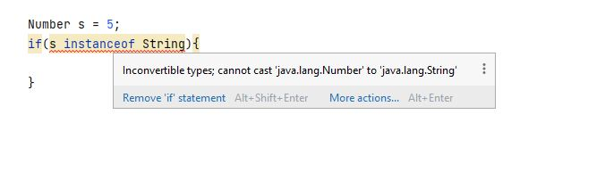

# Oracle-Certification Chapter 9-Advanced Class Design
### “You take the blue pill – the story ends, you wake up in your bed and believe whatever you want to believe. You take the red pill – you stay in Wonderland and I show you how deep the rabbit-hole goes.”
###### Morpheus
abstract + final (Not Sense)

    public abstract final class Tortoise {}  DOES NOT COMPILE
    public abstract final void walk();  DOES NOT COMPILE

abstract + private (Not Sense)

    private abstract void sing();  DOES NOT COMPILE
    protected abstract void sing(); DOES NOT COMPILE

abstract + static (Not Sense) [static method can not override]

    abstract static void swim();  DOES NOT COMPILE

interface can extend multiple interface.

    interface Nocturnal{}
    interface CanFly{}
    interface HasBigEyes extends Nocturnal,CanFly{}

concrete class can extend multiple interface.

    interface Climb{}
    interface CanBurrow{}
    public class FieldMouse implements Climb,CanBurrow{}

You cannot use private in the interface.

    private int count = 4;  DOES NOT COMPILE
    protected void step();  DOES NOT COMPILE

In interface, you should initialize variables.
    
    String distance;    DOES NOT COMPILE

Even though abstract classes and interfaces are both considered abstract types, only interfaces make use of implicit
    modifiers. This means that an abstract class and interface with similar declarations may have very different properties.

    abstract class Husky {
        abstract void play();
    }

    interface Poodle {
        void play();
    }

    class Webby extends Husky {
        void play() {}
    }

    class Georgette implements Poodle {
        void play() {}  DOES NOT COMPILE
    }

> The definition of play() in the Georgette class therefore reduces the visibility of a method from public to package-private,
     resulting in a compiler error.

    class Georgette implements Poodle {  
        public void play() {}     COMPILE
    }

if we have 2 abstract and 2 incompatible methods subclass can not compile

    interface LongEars {
        int softSkin();
    }
    interface LongNose {
        void softSkin();
    }
    interface Donkey extends LongEars, LongNose {               DOES NOT COMPILE
    }  
    public class Penguin implements LongEars, LongNose {        DOES NOT COMPILE
    }  DOES NOT COMPILE

 

With interfaces, the compiler has limited ability to enforce this rule because even though a reference type may not implement
an interface, one of its subclasses could.

Number abstract class so right side should be abstract

Number abstract class Integer final class so

## Interface Definition Rules 
1. _Interfaces cannot be instantiated._
2. All top-level types, including interfaces, _cannot be marked
protected or private._
3. Interfaces are assumed to be abstract and _cannot be marked
final._
4. Interfaces may include zero or more abstract methods.
5. An interface can extend _any number of interfaces._
6. An interface reference may be cast to any reference that
inherits the interface, although this may produce an exception
at runtime if the classes aren’t related.
7. The compiler will only report an unrelated type error for an
instanceof operation with an interface on the right side if the
reference on the left side is a final class that does not inherit
the interface.
8. An interface method with a body must be marked default,
private, static, or private static (covered when studying for
the 1Z0-816 exam).
The following are the five rules for abstract methods defined in
interfaces.

## Abstract Interface Method Rules
1. Abstract methods can be defined only in abstract classes or
    interfaces.
2. Abstract methods cannot be declared private or final.
3. Abstract methods must not provide a method
body/implementation in the abstract class in which is it
declared.
4. Implementing an abstract method in a subclass follows the
same rules for overriding a method, including covariant return
types, exception declarations, etc.
5. Interface methods without a body are assumed to be abstract
and public.
® Notice anything? The first four rules for abstract methods,
whether they be defined in abstract classes or interfaces, are
exactly the same! The only new rule you need to learn for
interfaces is the last one.
Finally, there are two rules to remember for interface variables.
    

## Interface Variables Rules
1. **Interface variables are assumed to be public, static, and final.**
2. **Because interface variables are marked final**, they must be
initialized with a value when they are declared.

ø There are four types of nested classes you will need to know about: member inner classes, local classes,
    anonymous classes, and static nested classes.

[«« Go Back ««](https://github.com/MedetHasanUgurlu/Oracle-Certification) 
