# Annotations
* What exactly is metadata? Metadata is data that provides
  information about other data. Imagine our zoo is having a sale
  on tickets. The attribute data includes the price, the expiration
  date, and the number of tickets purchased. In other words, the
  attribute data is the transactional information that makes up
  the ticket sale and its contents.
  On the other hand, the metadata includes the rules, properties,
  or relationships surrounding the ticket sales. Patrons must buy
  at least one ticket, as a sale of zero or negative tickets is silly.
  Maybe the zoo is having a problem with scalpers, so they add a
  rule that each person can buy a maximum of five tickets a day.
  These metadata rules describe information about the ticket sale
  but are not part of the ticket sale.
* r first rule about annotations: annotations
  function a lot like interfaces. In this example, annotations
  allow us to mark a class as a ZooAnimal without changing its
  inheritance structure.

* That brings us to our second rule about annotations:
annotations establish relationships that make it easier to
manage data about our application.
* *our third rule about annotations:
  an annotation ascribes custom information on the declaration
  where it is defined.
* There's one final rule about annotations you should be familiar
  with: annotations are optional metadata and by themselves
  do not do anything. This means you can take a project filled
  with thousands of annotations and remove all of them, and it
  will still compile and run, albeit with potentially different
  behavior at runtime.
* public @interface Exercise {}  The
  Exercise annotation is referred to as a marker annotation,
  since it does not contain any elements
* 
@Exercise() public class Cheetah {}
@Exercise public class Slot h {}
@Exercise
public class ZooEmployee {}
Oh no, we've mixed animals and zoo employees! That's
perfectly fine.

 
  
    public @interface Exercise {
      int hoursPerDay();
    }
*The syntax for the hoursPerDay() element may seem a little
strange at first. It looks a lot like an abstract method, although
we're calling it an element (or attribute). Remember,
annotations have their roots in interfaces. Behind the scenes,
the JVM is creating elements as interface methods and
annotations as implementations of these interfaces. Luckily,
you don't need to worry about those details; the compiler does
that for you.

* Remember, parentheses are optional
  only if no values are included.
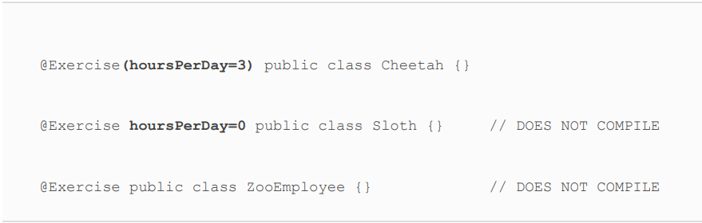

* For an element to be optional, rather than required, it must
  include a default value. Let's update our annotation to include
  an optional value.

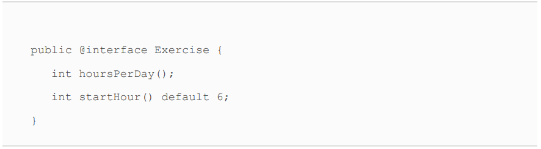
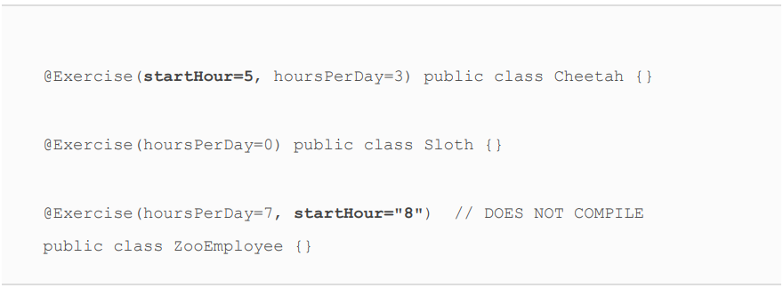
* The default value of an annotation cannot be just any
  value. Similar to case statement values, the default value
  of an annotation must be a non‐ null constant
  expression.
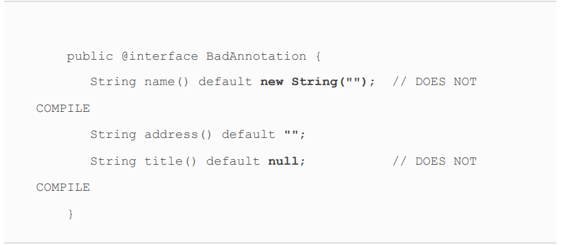
* The height() element does not compile. While primitive types
  like int and long are supported, wrapper classes like Integer
  and Long are not. The generalInfo() element also does not
  compile. The type String[] is supported, as it is an array of
  String values, but String[][] is not.
  The size() and exercise() elements both compile, with one
  being an enum and the other being an annotation. To set a
  default value for exercise(), we use the @Exercise annotation.
  Remember, this is the only way to create an annotation value.
  Unlike instantiating a class, the new keyword is never used to
  create an annotation.
  Finally, the friendlyBear() element does not compile. The type
  of friendlyBear() is Bear (not Class). Even if Bear were
  changed to an interface, the friendlyBear() element would still
  not compile since it is not one of the supported types.
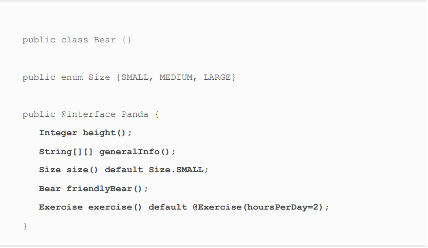
* Like abstract interface methods, annotation elements are
  implicitly abstract and public, whether you declare them that
  way or not.
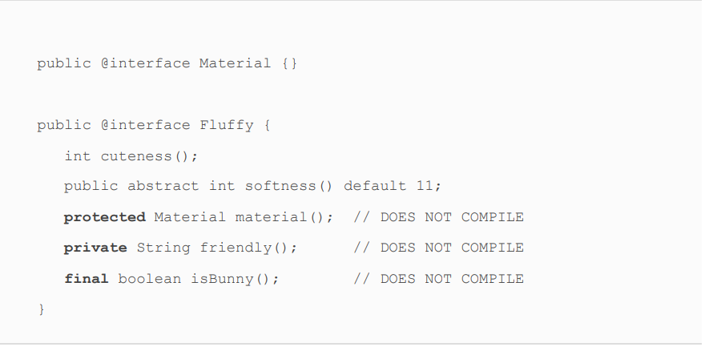
* Yep, just like interface variables, annotation variables are
  implicitly public, static, and final. These constant variables
  are not considered elements, though
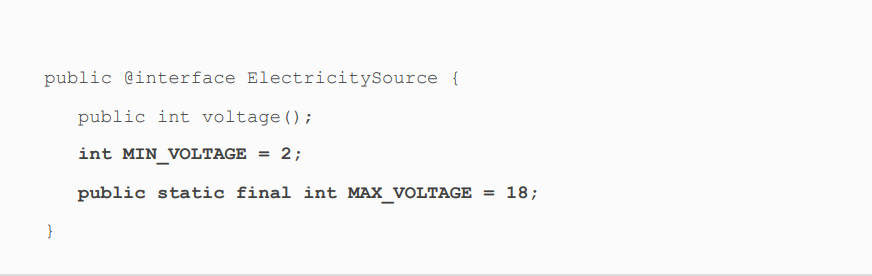
* @Alert. Remember, a marker annotation is one that does not
  contain any elements.
* The annotation declaration must contain an element named
  value(), which may be optional or required.

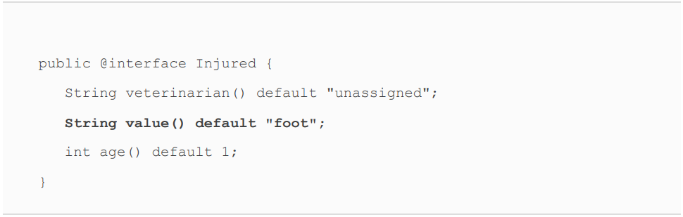
* Annotations support a shorthand notation for providing an
  array that contains a single element.
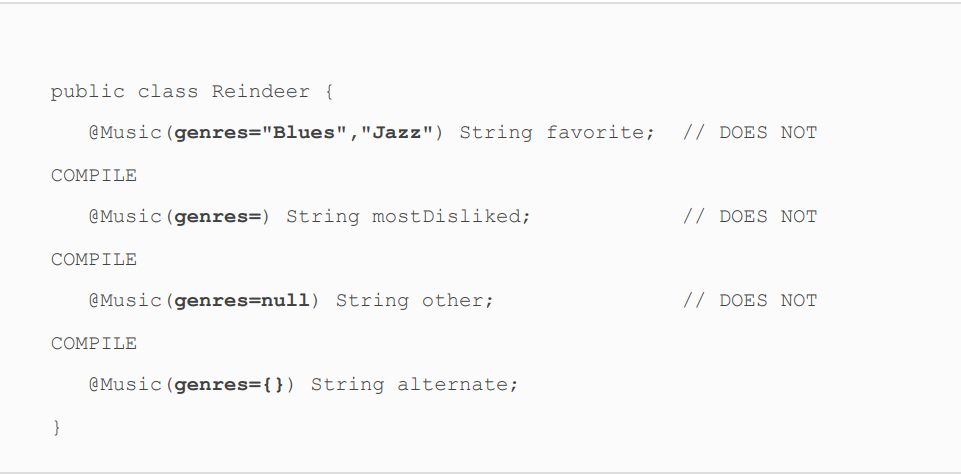
* It might not surprise you that we can combine both of our
    recent rules for shorthand notations.
* 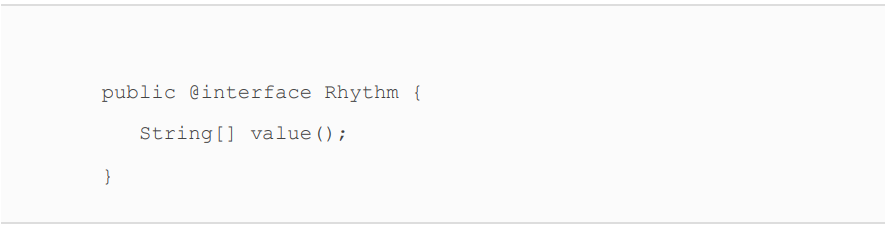
* 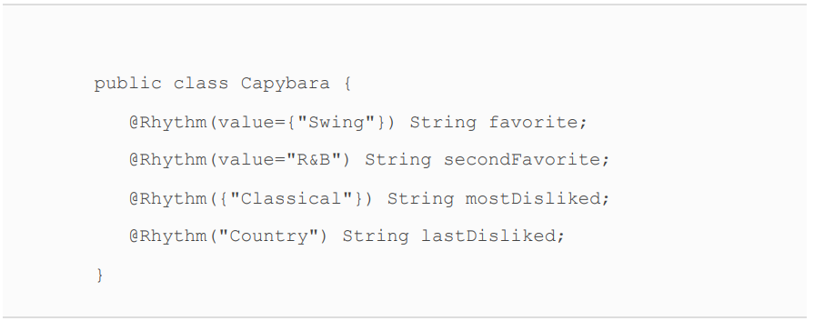
* Learning the ElementType Values
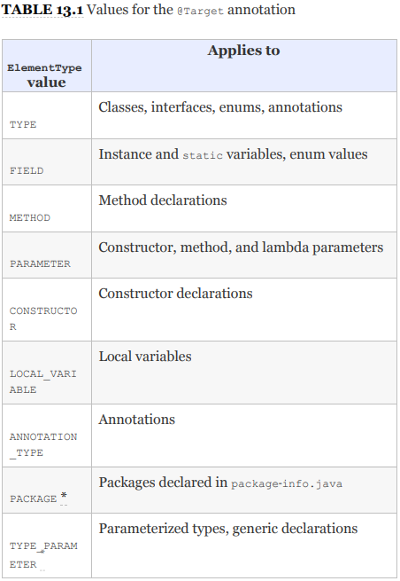
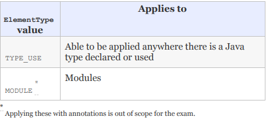
* Even though the java.lang package is imported
  automatically by the compiler, the java.lang.annotation
  package is not. Therefore, import statements are required
  for many of the examples in the remainder of this chapter.
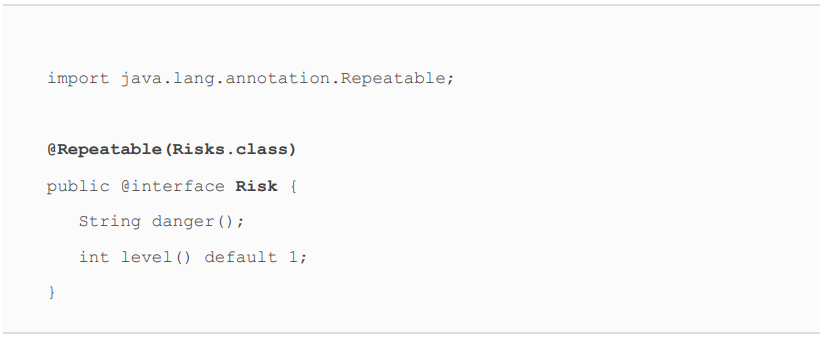
* Values for the @Retention annotation
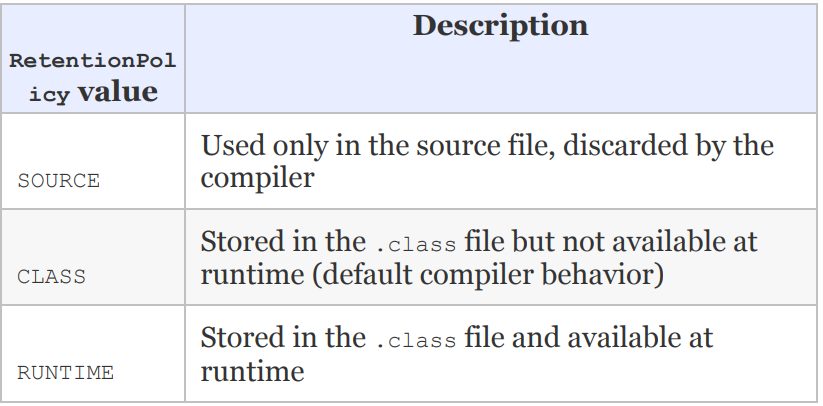
* In fact, you can generate Javadoc files for any class you write!
  Better yet, you can add additional metadata, including
  comments and annotations, that have no impact on your code
  but provide more detailed and user‐friendly Javadoc files.
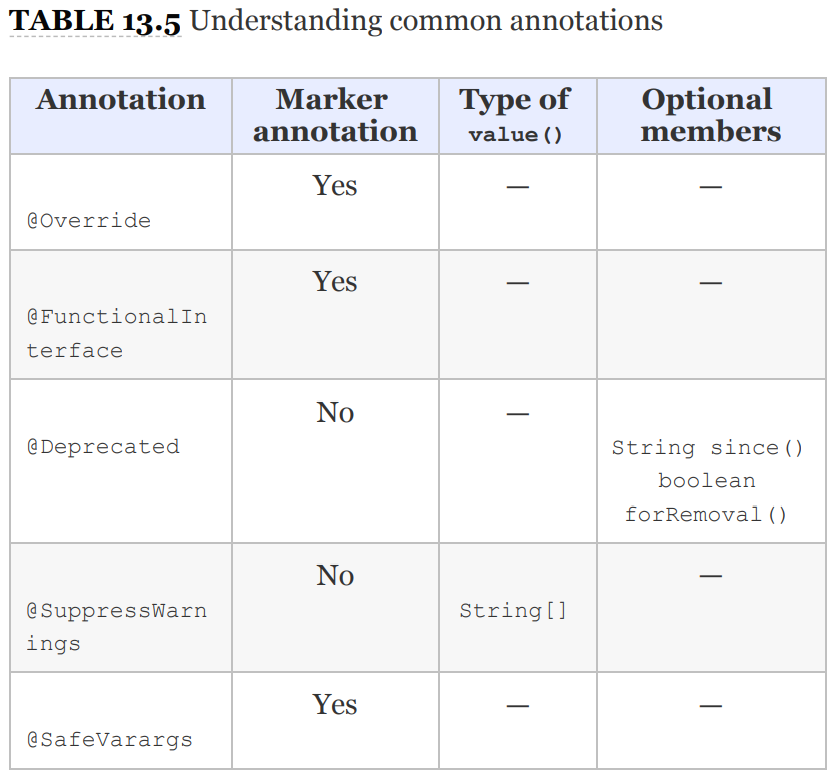
