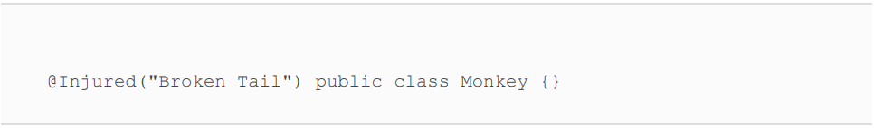
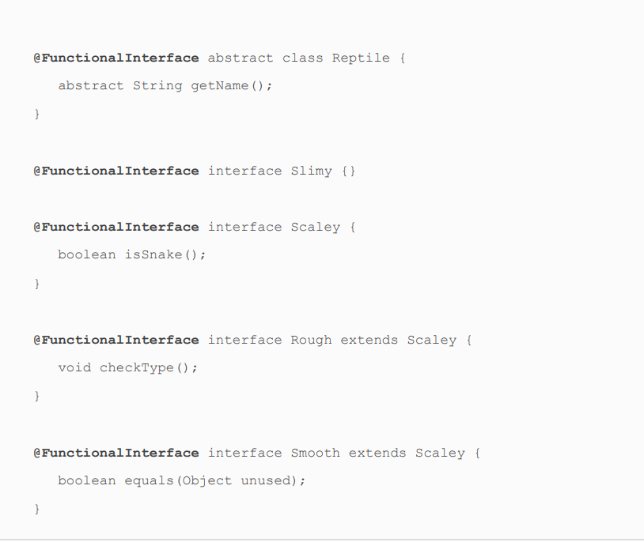

# Annotations
* _**Metadata**_ is data that provides information about other data. Imagine our zoo is having a sale
  on tickets. The attribute data includes the price, the expiration
  date, and the number of tickets purchased. In other words, the
  attribute data is the transactional information that makes up
  the ticket sale and its contents.

### Rule

1) Annotations function a lot like interfaces, annotations
  allow us to mark without changing its inheritance structure.
2) Annotations establish relationships that make it easier to
manage data about our application.
3) The Annotation ascribes custom information on the declaration
  where it is defined.
4) Annotations are optional metadata and by themselves
  do not do anything. This means you can take a project filled
  with thousands of annotations and remove all of them, and it
  will still compile and run, albeit with potentially different
  behavior at runtime.

* marker annotation, since it does not contain any elements

    public @interface Exercise {    
    }  
* We have mixed. That is fine.

    @Exercise() 
    public class Cheetah {}
    @Exercise 
    public class Sloth {}
    @Exercise
    public class ZooEmployee {}

* It looks a lot like an abstract method.Behind the scenes,
the JVM is creating elements as interface methods and
annotations as implementations of these interfaces. 
 

    public @interface Exercise {
      int hoursPerDay();
    }

Remember, parentheses are optional only if no values are included.

    @Exercise(hoursPerDay=3) 
    public class Cheetah{
    }

    @Exercise hoursPerDay=0 
    public class Cheetah{                     DOES NOT COMPILE
    }
    
    @Exercise                                 DOES NOT COMPILE
    public class Cheetah{
    }
  

> 

* For an element to be optional, rather than required, it must
  include a default value. Let's update our annotation to include
  an optional value.

> 
> 
* The default value of an annotation cannot be just any
  value. Similar to case statement values, the default value
  of an annotation must be a non‐ null constant
  expression.
> 
* The height() element does not compile. While primitive types
  like int and long are supported, wrapper classes like Integer
  and Long are not. The generalInfo() element also does not
  compile. The type String[] is supported, as it is an array of
  String values, but String[][] is not.
  The size() and exercise() elements both compile, with one
  being an enum and the other being an annotation. To set a
  default value for exercise(), we use the @Exercise annotation.
  Remember, this is the only way to create an annotation value.
  Unlike instantiating a class, the new keyword is never used to
  create an annotation.
  Finally, the friendlyBear() element does not compile. The type
  of friendlyBear() is Bear (not Class). Even if Bear were
  changed to an interface, the friendlyBear() element would still
  not compile since it is not one of the supported types.

* Like abstract interface methods, annotation elements are
  implicitly abstract and public, whether you declare them that
  way or not.

* Yep, just like interface variables, annotation variables are
  implicitly public, static, and final. These constant variables
  are not considered elements, though

* @Alert. Remember, a marker annotation is one that does not
  contain any elements.
* The annotation declaration must contain an element named
  value(), which may be optional or required.

* Annotations support a shorthand notation for providing an
  array that contains a single element.

* It might not surprise you that we can combine both of our
    recent rules for shorthand notations.
* 
* 
* Learning the ElementType Values

* Even though the java.lang package is imported
  automatically by the compiler, the java.lang.annotation
  package is not. Therefore, import statements are required
  for many of the examples in the remainder of this chapter.

* Values for the @Retention annotation

* In fact, you can generate Javadoc files for any class you write!
  Better yet, you can add additional metadata, including
  comments and annotations, that have no impact on your code
  but provide more detailed and user‐friendly Javadoc files.

* Javadoc has its own annotations that are used solely in
  generating data within a Javadoc file.

* Another marker annotation you should know for the exam is
  @Inherited. When this annotation is applied to a class,
  subclasses will inherit the annotation information found in the
  parent class.

* as it actually
  requires creating two annotations. The @Repeatable annotation
  is used when you want to specify an annotation more than once
  on a type.
  our first rule: without the @Repeatable annotation,
  an annotation can be applied only once. So, let's add the
  @Repeatable annotation.
* * as written, the Zoo class does not compile.

* The repeatable annotation must be declared with @Repeatable
  and contain a value that refers to the containing type
  annotation.
* The containing type annotation must include an element
  named value(), which is a primitive array of the repeatable
  annotation type.
<table>
  <tr>
    <th>Annotation</th>
    <th>Marker Annotation</th>
    <th>Type of value()</th>
    <th>Default compiler behavior (if annotation not present)</th>
  </tr>
  <tr>
    <td>@Target</td>
    <td>No</td>
    <td>Array of Element Type</td>
    <td>Annotation able to be applied to all locations except TYPE_USE and TYPE_PARAMETER</td>
  </tr>
  <tr>
    <td>@Retention</td>
    <td>No</td>
    <td>Retention Policy</td>
    <td>RetentionPolicy.CLASS</td>
  </tr>
  <tr>
    <td>@Documented</td>
    <td>Yes</td>
    <td>—</td>
    <td>Annotations are not included in the generated Javadoc.</td>
  </tr>
  <tr>
    <td>@Inherited</td>
    <td>Yes</td>
    <td>—</td>
    <td>Annotations in supertypes are not inherited.</td>
  </tr>
  <tr>
    <td>@Repeatable</td>
    <td>No</td>
    <td>Annotation</td>
    <td>Annotation can not be repeated.</td>
  </tr>

</table>

* The Reptile declaration does not compile, because the
  @FunctionalInterface annotation can be applied only to
  interfaces. The Slimy interface does not compile, because it
  does not contain any abstract methods. The Scaley interface
  compiles, as it contains exactly one abstract method.
  The Rough interface does not compile, because it contains two
  abstract methods, one of which it inherits from Scaley. Finally,
  the Smooth interface contains two abstract methods, although
  since one matches the signature of a method in
  java.lang.Object, it does compile.

* 

 
 
