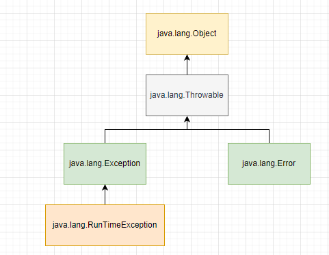

# Exception

***

* **Error** means something went so horribly wrong that your
  program should not attempt to recover from it. For example,
  the disk drive “disappeared” or the program ran out of
  memory. These are abnormal conditions that you aren’t likely
  to encounter and cannot recover from.
* **Checked Exceptions** that must be declared or
  handled by the application code where it is thrown. In Java,
  checked exceptions all inherit Exception but not
  **RuntimeException**. Checked exceptions tend to be more
  anticipated—for example, trying to read a file that doesn’t exist.
* An **unchecked exception** is any exception that does not need to
  be declared or handled by the application code where it is
  thrown. Unchecked exceptions are often referred to as runtime
  exceptions, although in Java, unchecked exceptions include any
  class that inherits RuntimeException or Error.

* e 5 can never be reached
  during runtime. The compiler recognizes this and reports an
  unreachable code error.
  The types of exceptions are important. Be sure to closely study
  everything in Table 10.1. Remember that a Throwable is either
  an Exception or an Error. You should not catch Throwable
* 
  directly in your code.\
### RUNTIME EXCEPTİON
1) ArithmeticException
2) ArrayIndexOutOfBoundsException
3) ClassCastException
4) NullPointerException
5) IllegalArgumentException
6) NumberFormatException

    try {
      throw new RuntimeException();
      throw new ArrayIndexOutOfBoundsException(); // DOES NOT   COMPILE
    } catch (Exception e) {
    }
* **ArithmeticException** Thrown when code attempts to divide by
  zero
  

    int answer = 11 / 0;
* **ArrayIndexOutOfBoundsException** You know by now that array indexes start with 0 and go up to 1
  less than the length of the array

      int[] countsOfMoose = new int[3];
      System.out.println(countsOfMoose[-1]);
* **ClassCastException**

    String type = "moose";
    Integer number = (Integer) type; // DOES NOT COMPILE

    String type = "moose";
    Object obj = type;
    Integer number = (Integer) obj;

### CHECKED EXCEPTION
1) IOException
2) FileNotFoundException

### ERROR
1) **ExceptionInInitializerError** Thrown when a static initializer
   throws an exception and does not handle it
2) **StackOverflowError** Thrown when a method calls itself too
   many times (This is called infinite recursion because the
   method typically calls itself without end.)
3) **NoClassDefFoundError** Thrown when a class that the code uses
   is available at compile time but not runtime

* spesific to global

    public void visit(String place){
      try {
        if(place.isEmpty()){
          throw new IllegalArgumentException(); 
      }
      }catch (Exception e){

        }catch (RuntimeException e){ DO NOT COMPILE
            
        }
  }

* Java provides another structure
  to handle this more gracefully called a multi-catch block. A
  multi-catch block allows multiple exception types to be caught
  by the same catch block

    public static void main(String[] args) {
      try {
        System.out.println(Integer.parseInt(args[1])); 
      } catch(ArrayIndexOutOfBoundsException | NumberFormatException e) {
        System.out.println("Missing or invalid input");
      }
    }
* Java intends multi-catch to be used for exceptions that aren’t
  related, and it prevents you from specifying redundant types in
  a multi-catch.

  
    try {
      throw new IOException();
    } catch (FileNotFoundException | IOException p) {} // DOES NOT COMPILE
* order does not matter for a multicatch block within a single catch expression.

* *Go slowly. It’s tricky*

    public String exceptions() {
      StringBuilder result = new StringBuilder();
      String v = null;
      try {
        try {
          result.append("before_");
          v.length();
          result.append("after_");
        } catch (NullPointerException e) {
            result.append("catch_");
            throw new RuntimeException();
        } finally {
          result.append("finally_");
          throw new Exception();
          }
      } catch (Exception e) {
        result.append("done");
      }
      return result.toString();
    }

**Result**\
before_catch_finally_done 

* The problem is that NoMoreCarrotsException is a checked
  exception. Checked exceptions must be handled or declared.
  The code would compile if you changed the main() method to

    
    class NoMoreCarrotsException extends Exception {
    }
    public class Bunny {
      public static void main(String[] args) {
        eatCarrot(); // DOES NOT COMPILE
      }
      private static void eatCarrot() throws NoMoreCarrotsException {
      }
    }

* You might have noticed that eatCarrot() didn’t actually throw
  an exception; it just declared that it could. This is enough for
  the compiler to require the caller to handle or declare the
  exception.

    public static void main(String[] args) throws NoMoreCarrotsException { 
      // declare exception
      eatCarrot();
    }
  
    public static void main(String[] args) {
      try {
        eatCarrot();
      } catch (NoMoreCarrotsException e ) { // handle exception
        System.out.print("sad rabbit");
      }
    }

* When a class overrides a method from a superclass
  or implements a method from an interface, it’s not allowed to
  add new checked exceptions to the method signature.

    class CanNotHopException extends Exception {
    }
    class Hopper {
      public void hop() { }
    }
    class Bunny extends Hopper {
      public void hop() throws CanNotHopException { } // DOES NOT COMPILE
    }

*An overridden method in a subclass is allowed to declare fewer
exceptions than the superclass or interface. This is legal
because callers are already handling them.

    class Hopper {
      public void hop() throws CanNotHopException { }
    }
    class Bunny extends Hopper {
      public void hop() {
      }
    }

*a class is allowed to declare a subclass of an
exception type. The idea is the same. The superclass or
interface has already taken care of a broader type.

    class Hopper {
      public void hop() throws Exception { }
    }
    class Bunny extends Hopper {  
      public void hop() throws CanNotHopException { }
    }

* Print Exception

    
    public static void main(String[] args) {
      try {
        hop();
      } catch (Exception e) {
        System.out.println(e);
        System.out.println(e.getMessage());
        e.printStackTrace();
      }
    }
    
    private static void hop() {
      throw new RuntimeException("cannot hop");
    }

**Result**\
java.lang.RuntimeException: cannot hop \
cannot hop\
java.lang.RuntimeException: cannot hop\
at Handling.hop(Handling.java:15)\
at Handling.main(Handling.java:7)\
