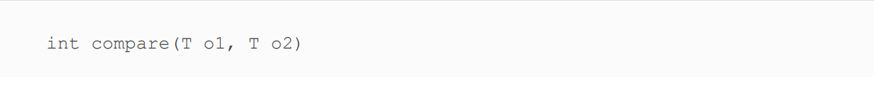

# Lambda and Functional Interface
***
 "One Way Out"
 ##### _*Kino*_ 
***
Deferred execution means
that code is specified now but will run later. In this case, later is
when the print() method calls it.
***
These two lines do the exact same thing
a -> a.canHop()
(Animal a) -> { return a.canHop(); }
****
Here’s a fun fact: s -> {} is a valid lambda. If there is no
code on the right side of the expression, you don’t need
the semicolon or return statement.
***

Lambdas work with interfaces that have only one abstract
method. These are called functional interfaces.

* Predicate

* Consumer

* Supplier

* Comparator

* Descending sort

    Comparator<String> strings = (s1, s2) -> s2.compareTo(s1);
    Comparator<String> moreStrings = (s1, s2) -> - s1.compareTo(s2);

****
How many syntax errors do you see in this method?

  ***
Method parameters and local variables are allowed to be
referenced if they are effectively final.
* works

* compile error due to setting variable lost their final attribute.

***

