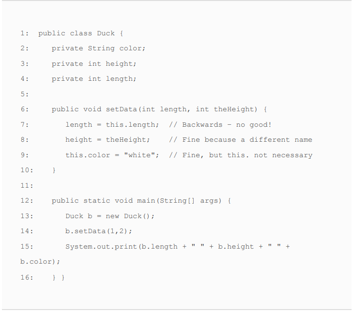

# Class Design
****
"I have spoken" - Ugnaught Kuill
****
* When one class inherits from a parent class, all public and protected
members are automatically available as part of the child class.
* Package-private members are available if the child class is in
  the same package as the parent class.
****

***
Like method parameters, constructor parameters can be any
valid class, array, or primitive type, including generics, but may
not include var. The following does not compile:

    class Bonobo {
        public Bonobo(var food) { // DOES NOT COMPILE
        }
    }
***
* Even though a print statement on line 4 doesn’t change any
  variables, it is still a Java statement and is not allowed to be
  inserted before the call to this(). The comment on line 5 is just
  fine. Comments aren’t considered statements and are allowed
  anywhere.

    public Hamster(int weight) {
        System.out.println("in constructor");
        // Set weight and default color
        this(weight, "brown"); // DOES NOT COMPILE
    }
***
* There is one more place they can be assigned a
value—the constructor. The constructor is part of the
initialization process, so it is allowed to assign final instance
variables in it. For the exam, you need to know one important
rule. By the time the constructor completes, all final instance
variables must be assigned a value.

  
    public class MouseHouse {
      private final int volume;
      private final String type;
      public MouseHouse() {
        this.volume = 10;
        type = "happy";
      }
    }
* THİS İS NO ARGS CONSTRUCTOR
 
    

    public class Car {
      private String name;
      private String surName;
      {
      name="Jesus";
      System.out.println("I am no args constructor.");
      }
    }

* We can assign a null value to final instance
  variables, so long as they are explicitly set.
****
* It prints ABC exactly once. Since the main() method is inside the
  Hippo class, the class will be initialized first, starting with the
  superclass and printing AB. Afterward, the main() method is
  executed, printing C. Even though the main() method creates
  three instances, the class is loaded only once.

    public class Animal {
      static {
      System.out.print("A");
      }
    }
    public class Hippo extends Animal {
      static {
        System.out.print("B");
      }
      public static void main(String[] grass) {
        System.out.print("C");
        new Hippo();
        new Hippo();
        new Hippo();
      }
    }
* Assuming the class isn’t referenced anywhere else, this
  program will likely print CAB, with the Hippo class not
  being loaded until it is needed inside the main() method.

  
    public class HippoFriend {
      public static void main(String[] grass) {
        System.out.print("C");
        new Hippo();
      }
    }

* Final değeri başta initialize etmeye gerek yok lakin static fieldi initialize etmek zorundasun. 

    public class Home {
      private final int room ;

      static {
        System.out.println("Home static");
      }
    {
      System.out.println("Home constructor");
      room =15;
    }

    public static void main(String[] args) {
      Home home = new Home();
      }
    }
**Result**

Home static \
Home constructor

    public class ZooTickets {
      private String name = "BestZoo";
      { 
        System.out.print(name+"-"); 
      }
      private static int COUNT = 0;
      static {
        System.out.print(COUNT+"-");
      }
      static {
        COUNT += 10; System.out.print(COUNT+"-");
      }
      public ZooTickets() {
        System.out.print("z-");
      }

      public static void main(String... patrons) {
        new ZooTickets();
      }
    }

**Result**
0-10-BestZoo-z \

**Order of Initialize**
1) Super class to child
2) static
3) main (if main placed different class main orders will be 2)
4) constructor

* Test

    class GiraffeFamily {
      static { 
        System.out.print("A");
      }
      {
        System.out.print("B");
      }
  
      public GiraffeFamily(String name) {
        this(1);
        System.out.print("C");
      }

      public GiraffeFamily() {
        System.out.print("D");
      }

      public GiraffeFamily(int stripes) {
        System.out.print("E");
      }
    }
    public class Okapi extends GiraffeFamily {
      static { 
        System.out.print("F");
      }

    public Okapi(int stripes) {
      super("sugar");
      System.out.print("G");
    }
    {
      System.out.print("H");
    }

    public static void main(String[] grass) {
      new Okapi(1);
      System.out.println();
      new Okapi(2);
      }
    }
**Result**\
AFBECHG \
BECHG

