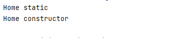
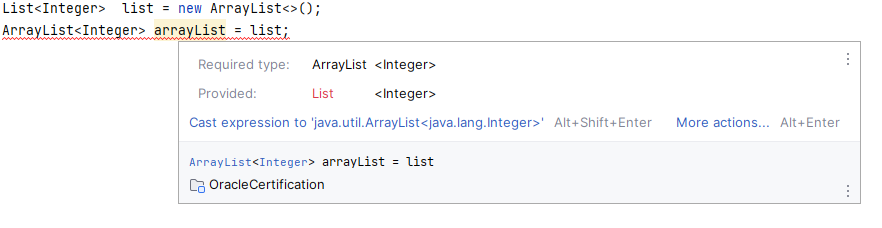

# Class Design
****
"I have spoken" - Ugnaught Kuill
****
* When one class inherits from a parent class, all public and protected
members are automatically available as part of the child class.
* Package-private members are available if the child class is in
  the same package as the parent class.
****

***
Like method parameters, constructor parameters can be any
valid class, array, or primitive type, including generics, but may
not include var. The following does not compile:

    class Bonobo {
        public Bonobo(var food) { // DOES NOT COMPILE
        }
    }
***
* Even though a print statement on line 4 doesn’t change any
  variables, it is still a Java statement and is not allowed to be
  inserted before the call to this(). The comment on line 5 is just
  fine. Comments aren’t considered statements and are allowed
  anywhere.

    public Hamster(int weight) {
        System.out.println("in constructor");
        // Set weight and default color
        this(weight, "brown"); // DOES NOT COMPILE
    }
