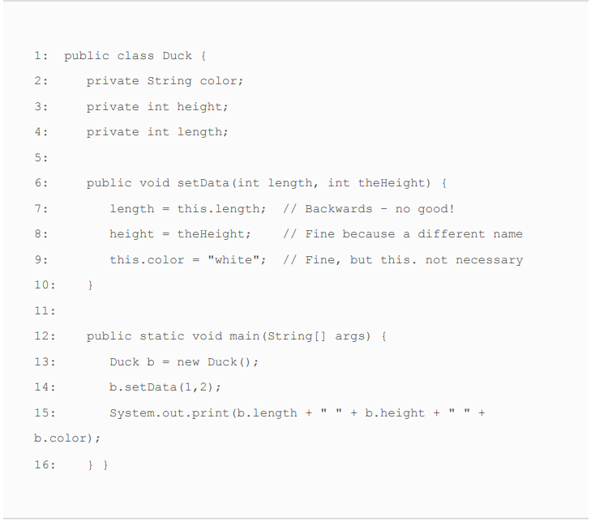

# Class Design
****
"I have spoken" - Ugnaught Kuill
****
* When one class inherits from a parent class, all public and protected
members are automatically available as part of the child class.
* Package-private members are available if the child class is in
  the same package as the parent class.
****

***
Like method parameters, constructor parameters can be any
valid class, array, or primitive type, including generics, but may
not include var. The following does not compile:
 

    class Bonobo {
        public Bonobo(var food) { // DOES NOT COMPILE
        }
    }

* Even though a print statement on line 4 doesn’t change any
  variables, it is still a Java statement and is not allowed to be
  inserted before the call to this(). The comment on line 5 is just
  fine. Comments aren’t considered statements and are allowed
  anywhere.
 

    public Hamster(int weight) {
        System.out.println("in constructor");
        // Set weight and default color
        this(weight, "brown"); // DOES NOT COMPILE
    }

* There is one more place they can be assigned a
value—the constructor. The constructor is part of the
initialization process, so it is allowed to assign final instance
variables in it. For the exam, you need to know one important
rule. By the time the constructor completes, all final instance
variables must be assigned a value.
 

  
    public class MouseHouse {
      private final int volume;
      private final String type;
      public MouseHouse() {
        this.volume = 10;
        type = "happy";
      }
    }

* THİS İS NO ARGS CONSTRUCTOR
 
    

  public class Car {
      private String name;
      private String surName;
      {
      name="Jesus";
      System.out.println("I am no args constructor.");
      }
    }

* We can assign a null value to final instance
  variables, so long as they are explicitly set.

* It prints ABC exactly once. Since the main() method is inside the
  Hippo class, the class will be initialized first, starting with the
  superclass and printing AB. Afterward, the main() method is
  executed, printing C. Even though the main() method creates
  three instances, the class is loaded only once.
 

    public class Animal {
      static {
      System.out.print("A");
      }
    }
    public class Hippo extends Animal {
      static {
        System.out.print("B");
      }
      public static void main(String[] grass) {
        System.out.print("C");
        new Hippo();
        new Hippo();
        new Hippo();
      }
    }

* Assuming the class isn’t referenced anywhere else, this
  program will likely print CAB, with the Hippo class not
  being loaded until it is needed inside the main() method.

 

    public class HippoFriend {
      public static void main(String[] grass) {
        System.out.print("C");
        new Hippo();
      }
    }

* Final değeri başta initialize etmeye gerek yok lakin static fieldi initialize etmek zorundasun.
   

    public class Home {
      private final int room ;

      static {
        System.out.println("Home static");
      }
    {
      System.out.println("Home constructor");
      room =15;
    }

    public static void main(String[] args) {
      Home home = new Home();
      }
    }
**Result**

Home static \
Home constructor

 
    public class ZooTickets {
      private String name = "BestZoo";
      { 
        System.out.print(name+"-"); 
      }
      private static int COUNT = 0;
      static {
        System.out.print(COUNT+"-");
      }
      static {
        COUNT += 10; System.out.print(COUNT+"-");
      }
      public ZooTickets() {
        System.out.print("z-");
      }

      public static void main(String... patrons) {
        new ZooTickets();
      }
    }

**Result** \
0-10-BestZoo-z 

**Order of Initialize**
1) Super class to child
2) static
3) main (if main placed different class main orders will be 2)
4) constructor

* Test

 

    class GiraffeFamily {
      static { 
        System.out.print("A");
      }
      {
        System.out.print("B");
      }
  
      public GiraffeFamily(String name) {
        this(1);
        System.out.print("C");
      }

      public GiraffeFamily() {
        System.out.print("D");
      }

      public GiraffeFamily(int stripes) {
        System.out.print("E");
      }
    }
    public class Okapi extends GiraffeFamily {
      static { 
        System.out.print("F");
      }

    public Okapi(int stripes) {
      super("sugar");
      System.out.print("G");
    }
    {
      System.out.print("H");
    }

    public static void main(String[] grass) {
      new Okapi(1);
      System.out.println();
      new Okapi(2);
      }
    }

**Result**\ 
AFBECHG \
BECHG

* The fly() method is overloaded in the subclass Eagle,
  since the signature changes from a no-argument method
  to a method with one int argument. Because the method
  is being overloaded and not overridden, the return type
  can be changed from void to int.
  The eat() method is overridden in the subclass Eagle,
  since the signature is the same as it is in the parent class
  Bird—they both take a single argument int. Because the
  method is being overridden, the return type of the method
  in the Eagle class must be compatible with the return type
  for the method in the Bird class. In this example, the
  return type int is not a subtype of void; therefore, the
  compiler will throw an exception on this method
  definition.
 

    public class Bird {
      public void fly() {
        System.out.println("Bird is flying");
      }
      public void eat(int food) {
        System.out.println("Bird is eating "+food+" units of food");
      }
    }

 

    public class Eagle extends Bird {
      public int fly(int height) {
        System.out.println("Bird is flying at "+height+" meters");
        return height;
      }
      public int eat(int food) { // DOES NOT COMPILE
        System.out.println("Bird is eating "+food+" units of food");
        return food;
      }
    }

* The third rule says that overriding a method cannot declare
  new checked exceptions or checked exceptions broader than
  the inherited method.

 

    public class Reptile {
      protected void sleepInShell() throws IOException {}
      protected void hideInShell() throws NumberFormatException {}
      protected void exitShell() throws FileNotFoundException {}
    }

 

    public class GalapagosTortoise extends Reptile {
      public void sleepInShell() throws FileNotFoundException {}
      public void hideInShell() throws IllegalArgumentException {}
      public void exitShell() throws IOException {} // DOES NOT COMPILE
    }

* The fourth and final rule around overriding a method is
  probably the most complicated, as it requires knowing the
  relationships between the return types. The overriding method
  must use a return type that is covariant with the return type of
  the inherited method.
 

      public class Rhino {
        protected CharSequence getName() {
          return "rhino";
        }
        protected String getColor() {
          return "grey, black, or white";
        }
      }
  
      class JavanRhino extends Rhino {
        public String getName() {
          return "javan rhino";
        }
        public CharSequence getColor() { // DOES NOT COMPILE
           return "grey";
        }
      }

String
implements the CharSequence interface, making String a
subtype of CharSequence. Therefore, the return type of
getName() in JavanRhino is covariant with the return type of
getName() in Rhino.

* you learned that you cannot overload methods by
changing the generic type due to type erasure. To review, only
one of the two methods is allowed in a class because type
erasure will reduce both sets of arguments to (List input).
 

    public class LongTailAnimal {
      protected void chew(List<Object> input) {}
      protected void chew(List<Double> input) {} // DOES NOT COMPILE
    }

* same reason, you also can’t overload a generic method
  in a parent class.
 
    

    public class LongTailAnimal {
      protected void chew(List<Object> input) {}
    }
    public class Anteater extends LongTailAnimal {
      protected void chew(List<Double> input) {} // DOES NOT COMPILE
    }
* They are considered
overloaded methods, not overridden methods, because the
signature is not the same. Type erasure does not change the
fact that one of the method arguments is a List and the other is
an ArrayList.
 
   
    public class LongTailAnimal {
      protected void chew(List<Object> input) {}
    }
    public class Anteater extends LongTailAnimal {
      protected void chew(ArrayList<Double> input) {}
    }
* generic wildcards
 

    void sing1(List<?> v) {} // unbounded wildcard
    void sing2(List<? super String> v) {} // lower bounded wildcard
    void sing3(List<? extends String> v) {} // upper bounded wildcard

* The Monkey class compiles because ArrayList is a subtype of
  List. The play() method in the Goat class does not compile,
  though. For the return types to be covariant, the generic type
  parameter must match. Even though String is a subtype of
  CharSequence, it does not exactly match the generic type defined
  in the Mammal class. Therefore, this is considered an invalid
  override.

 

    public class Mammal {
      public List<CharSequence> play() { ... }
      public CharSequence sleep() { ... }
    } 

    public class Monkey extends Mammal {
      public ArrayList<CharSequence> play() { ... }
    }

    public class Goat extends Mammal {
      public List<String> play() { ... } // DOES NOT COMPILE
      public String sleep() { ... }
    }

* method final, you forbid a child class from
  replacing this method. This rule is in place both when you
  override a method and when you hide a method. In other
  words, you cannot hide a static method in a child class if it is
  marked final in the parent class.

 

    public class Bird {
      public final boolean hasFeathers() {
        return true;
      }
      public final static void flyAway() {}
        }
      public class Penguin extends Bird {
        public final boolean hasFeathers() { // DOES NOT COMPILE
          return false;
        }
      public final static void flyAway() {} // DOES NOT COMPILE
      }

* Even
  though there is only one object created by the main() method,
  both variables exist independently of each other. The output
  changes depending on the reference variable used.

 

    class Carnivore {
      protected boolean hasFur = false;
    }
    public class Meerkat extends Carnivore {
      protected boolean hasFur = true;

    public static void main(String[] args) {
      Meerkat m = new Meerkat();
      Carnivore c = m;
      System.out.println(m.hasFur);
      System.out.println(c.hasFur);
      }
    }

**Result**\
true\
false
1. Casting a reference from a subtype to a supertype doesn’t
   require an explicit cast.
2. Casting a reference from a supertype to a subtype requires an
   explicit cast.
3. The compiler disallows casts to an unrelated class.
4. At runtime, an invalid cast of a reference to an unrelated type
   results in a ClassCastException being thrown.

 

    List<Integer>  list = new ArrayList<>(); //Implicit Cast
    ArrayList<Integer> arrayList = (ArrayList<Integer>) list; //Explicit Cast

* code will
  compile, it will throw a ClassCastException at runtime since
  the object being referenced is not an instance of the Capybara
  class.
 

    public class Rodent {
    }
    public class Capybara extends Rodent {
      public static void main(String[] args) {
        Rodent rodent = new Rodent();
        Capybara capybara = (Capybara)rodent; // ClassCastException
      }
    }

* It Can be used to check whether an object belongs to a particular class
  or interface and to prevent ClassCastExceptions at runtime.
 

    if(eagle instanceof Bird){
      System.out.println("Yeap");
    }

