# CONCURRENCY

**Multitask**: birçok process'in(işlem) aynı anda çalıştırılmasıdır. Oyun oynarken müzik dinlemek gibi.\
**Multithread**: bir process içinde bir çok çalışma ünitesi(thread) birlikte çalıştırmaktır. Wordde yazı yazarken yazdıklarımızın kontrol edilmesi. \
* Her process kendi memory space(heap) sahiptir. Processler birbirlerinin memory spacelerine(heap) erişemezler.
* Her thread processin oluşturduğu bellek alanına erişebilir ve ayrıca kendinin erişebileceği thread stack'i bulunur.

## THREAD OLUŞTURMA YONTEMLERI

    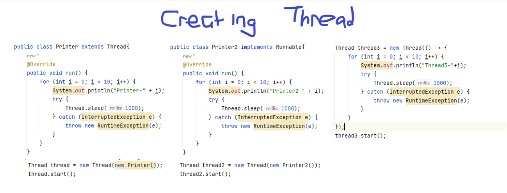

 

### synchronized

    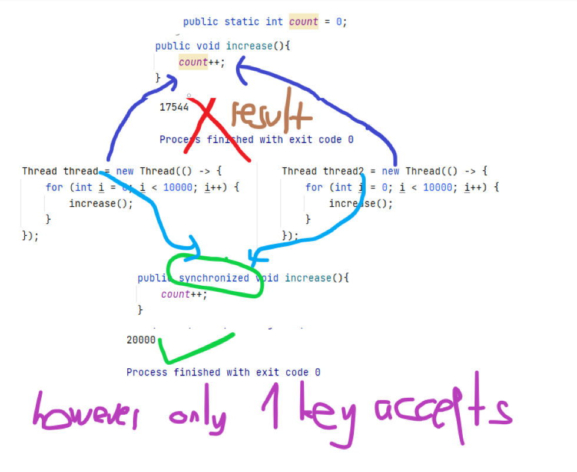

 

### using multiple lock
    public final Object lock = new Object();
    public final Object lock2 = new Object();

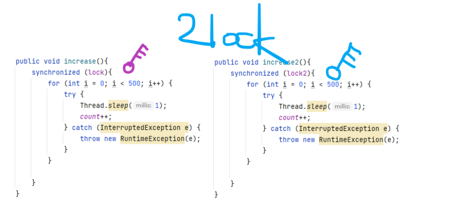

### Thread pool
ExecutorService threadlerin kaçar kaçar çalışacağını belirler. Bellekten kazanç sağlar. \
THreadlerin yönetilmesi için iyi bir servis. \
main() method is still an independent thread from the
ExecutorService.
> main() method is still an independent thread from the ExecutorService.

    ExecutorService executor = Executors.newFixedThreadPool(3);
    executor.submit(new Thread(...);
    executor.submit(new Thread(...);
    executor.submit(new Thread(...);
    executor.submit(new Thread(...);

    executor.shutdown();
> Only 3 executors will work another thread waits.

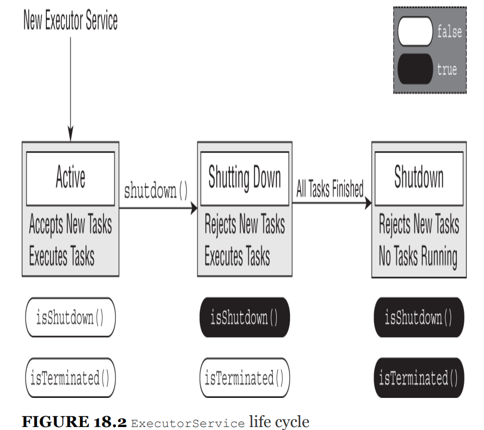

 

_executor.shutdown()_ does not actually stop any task however _**executor.shutdownNow()**_ stops when we called.

### submit vs execute

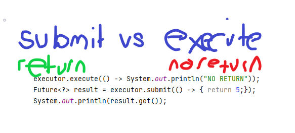

### wait and notify
>   wait() yellow light \
notify() green light

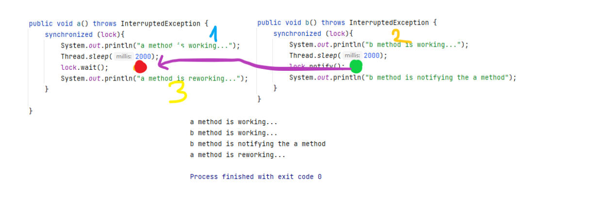

### deadlock

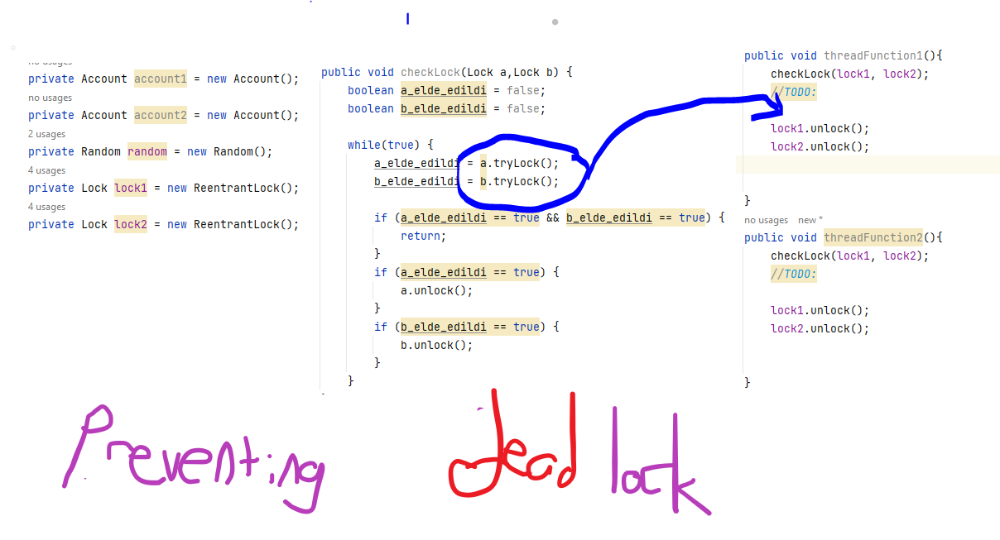

### semaphore
Semophere controls the amount of thread which uses methods.\
**semaphore.acquire()**: If amount is zero don't accept the threads.
**semaphore.release()**: increase the amount by adding 1.

    Semaphore semaphore = new Semaphore(3);
    

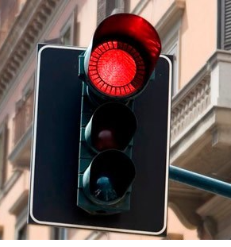
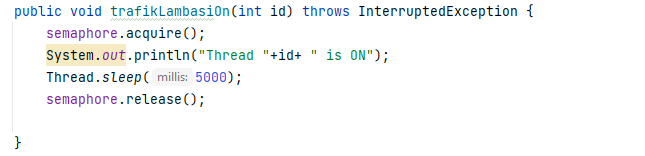

### Callable and Future
> return value, that's all.

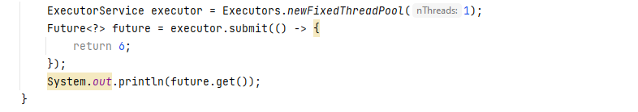
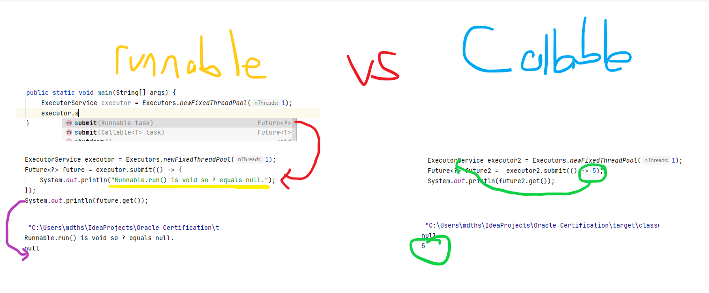

### invokeAll vs invokeAny
> invokeAll() returns Future list however invokeAny() returns only one value.

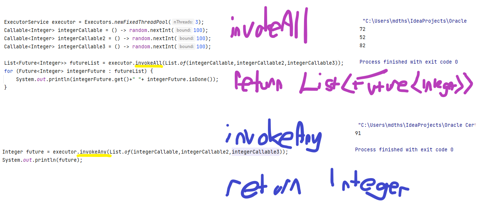

