# CONCURRENCY

**Multitask**: birçok process'in(işlem) aynı anda çalıştırılmasıdır. Oyun oynarken müzik dinlemek gibi.\
**Multithread**: bir process içinde bir çok çalışma ünitesi(thread) birlikte çalıştırmaktır. Wordde yazı yazarken yazdıklarımızın kontrol edilmesi. \
* Her process kendi memory space(heap) sahiptir. Processler birbirlerinin memory spacelerine(heap) erişemezler.
* Her thread processin oluşturduğu bellek alanına erişebilir ve ayrıca kendinin erişebileceği thread stack'i bulunur.

## THREAD OLUŞTURMA YONTEMLERI

    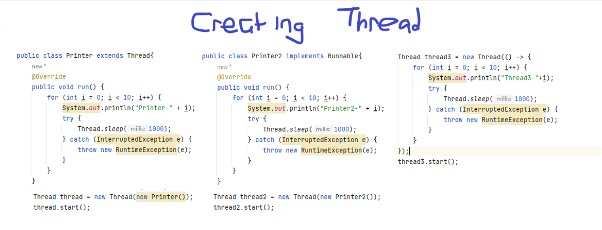

 

### synchronized

    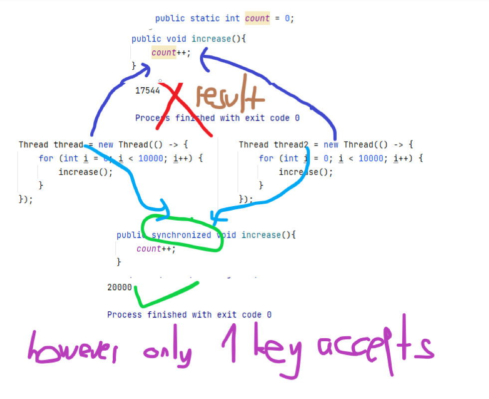

 

### using multiple lock
    public final Object lock = new Object();
    public final Object lock2 = new Object();

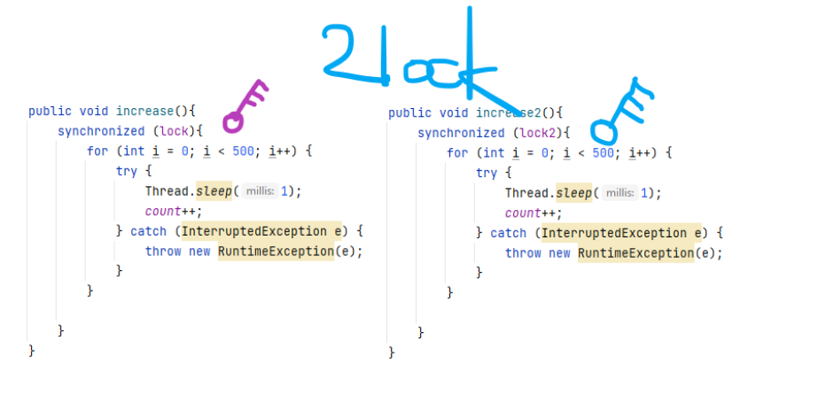

### Thread pool
ExecutorService threadlerin kaçar kaçar çalışacağını belirler. Bellekten kazanç sağlar. \
THreadlerin yönetilmesi için iyi bir servis. \
main() method is still an independent thread from the
ExecutorService.
> main() method is still an independent thread from the ExecutorService.

    ExecutorService executor = Executors.newFixedThreadPool(3);
    executor.submit(new Thread(...);
    executor.submit(new Thread(...);
    executor.submit(new Thread(...);
    executor.submit(new Thread(...);

    executor.shutdown();
> Only 3 executors will work another thread waits.

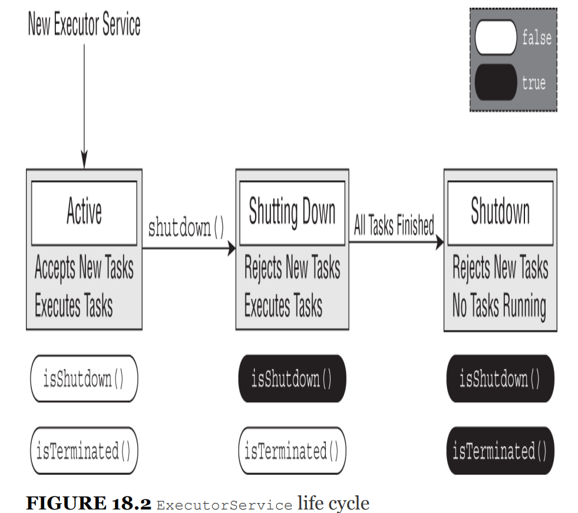

 

_executor.shutdown()_ does not actually stop any task however _**executor.shutdownNow()**_ stops when we called.

### submit vs execute

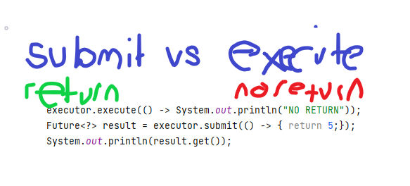

### wait and notify
>   wait() yellow light \
notify() green light

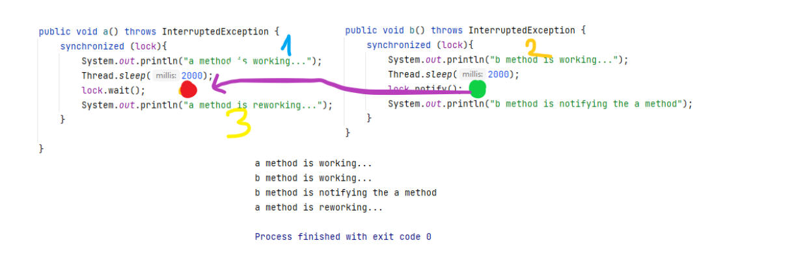

### deadlock

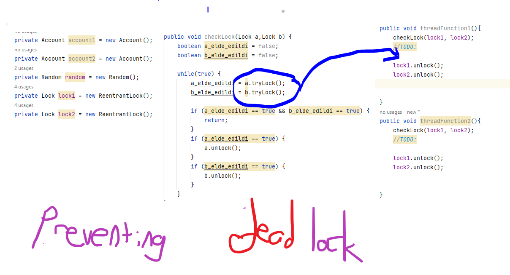

### semaphore
Semophere controls the amount of thread which uses methods.\
**semaphore.acquire()**: If amount is zero don't accept the threads.
**semaphore.release()**: increase the amount by adding 1.

    Semaphore semaphore = new Semaphore(3);
    

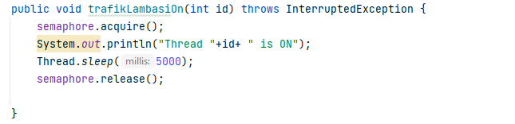

### Callable and Future
> return value, that's all.

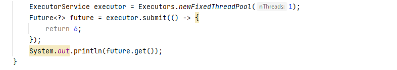
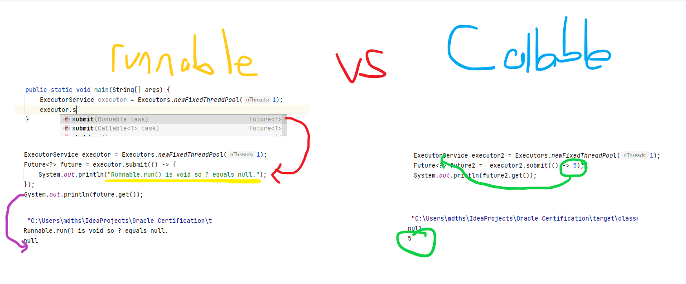

### invokeAll vs invokeAny
> invokeAll() returns Future list however invokeAny() returns only one value.

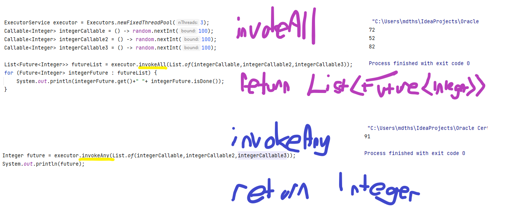

### ScheduledExecutorService schedule() vs scheduleAtFixedRateTime()
> The Only difference in between them is rerunning count, schedule() run one time after the given delay. 
>

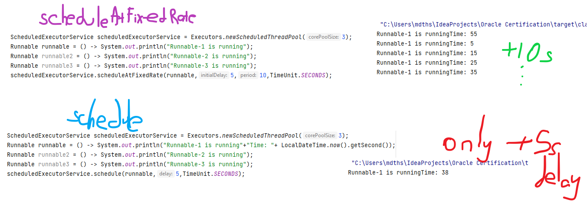

## Thread Safety

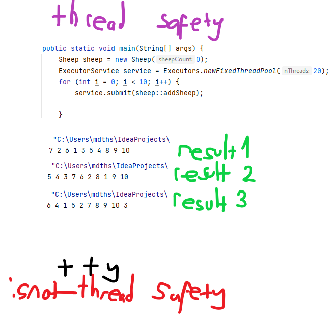

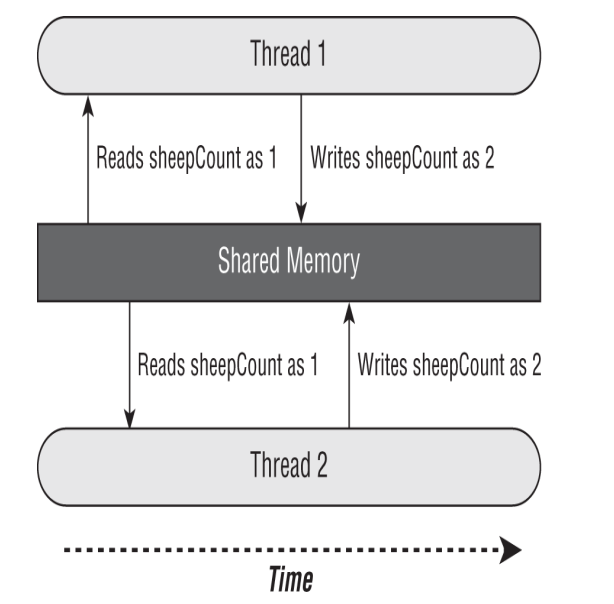

### Atomic Class
* AtomicBoolean 
* AtomicInteger
* AtomicLong

    private AtomicInteger sheepCount = new AtomicInteger(0);
    private void incrementAndReport() {
        System.out.print(sheepCount.incrementAndGet()+" ");
    }

### SYNCHRONIZING ON METHODS
> two methods are the same.

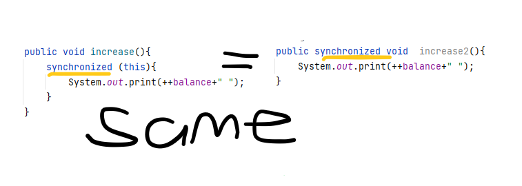

 

## UNDERSTANDING THE LOCK FRAMEWORK
### ReentrantLock

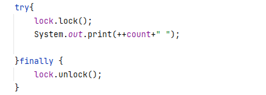

> tryLock() lock elde edilmişse true elde edilmemişse false döner.
> lock metodu anahtarı bekler try lock ise anlık anhatarın alınıp alınmadığını döner.

### Duplicate Lock Requests 

    Lock lock = new ReentrantLock();
    if(lock.tryLock()) {
        try {
            lock.lock();
            System.out.println("Lock obtained, entering protected code");
        } finally {
        lock.unlock();
        }
    }
> It is critical that you release a lock the same number of times it
is acquired. For calls with tryLock(), you need to call unlock()
only if the method returned true.

### ORCHESTRATING TASKS WITH A CYCLICBARRIER
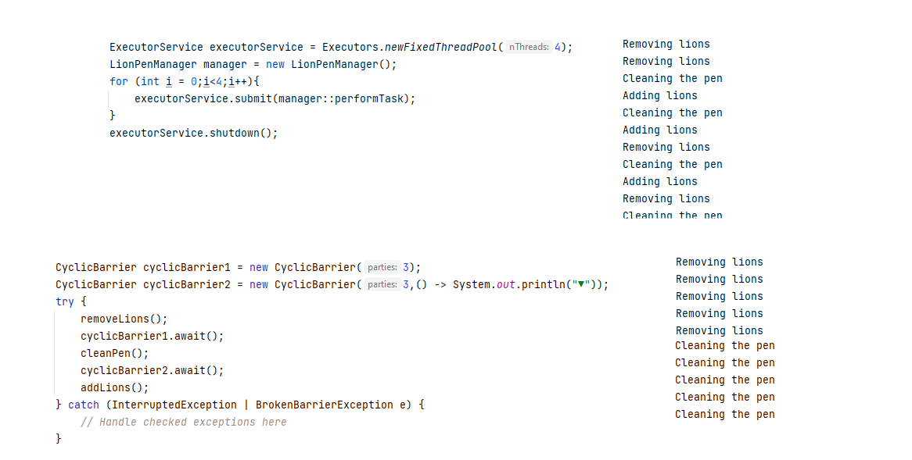

### Using Concurrent Collections

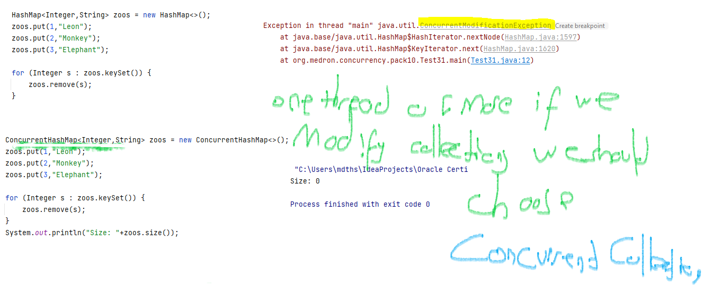

> Immutable objects can be accessed by any number of
threads and do not require synchronization. By definition,
they do not change, so there is no chance of a memory
consistency error.

<table>
  <th>Class Name</th>
  <th>Java Collection Framework Interface</th>  
  <th>Elements Ordered</th>
  <th>Sorted</th>
  <th>Blocking</th>
  <tr>
    <td>ConcurrentHashMap</td>
    <td>ConcurrentMap</td>
    <td>-</td>
    <td>-</td>
    <td>-</td>
  </tr>
  <tr>
    <td>ConcurrentLinkedQueue</td>
    <td>Queue</td>
    <td>+</td>
    <td>-</td>
    <td>-</td>
  </tr>
  <tr>
    <td>ConcurrentSkipListMap</td>
    <td>ConcurrentMap, SortedMap, NavigableMap</td>
    <td>+</td>
    <td>+</td>
    <td>-</td>
  </tr>
  <tr>
    <td>ConcurrentSkipListSet</td>
    <td>SortedSet, NavigableSet</td>
    <td>+</td>
    <td>+</td>
    <td>-</td>
  </tr>
  <tr>
    <td>CopyOnWriteArrayList</td>
    <td>List</td>
    <td>+</td>
    <td>-</td>
    <td>-</td>
  </tr>
  <tr>
    <td>CopyOnWriteArraySet</td>
    <td>Set</td>
    <td>-</td>
    <td>-</td>
    <td>-</td>
  </tr>
  <tr>
    <td>LinkedBlockingQueue</td>
    <td>BlockingQueue</td>
    <td>+</td>
    <td>-</td>
    <td>+</td>
  </tr>

  <caption>Concurrent collection classes</caption>
</table>

### CopyOnWriteArrayList
Bir listede iterasyon yaparken o listeye ayriyeten eleman eklediğimizde hata alırız. \
Bundan dolayı immutable olan CopyOnWriteArrayList kullanabiliriz.

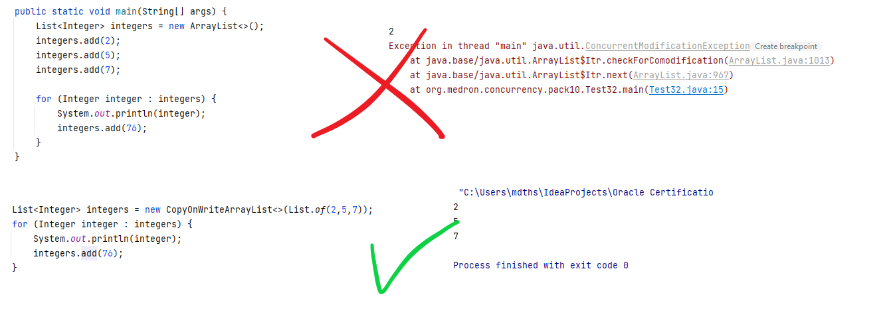

## Working with Parallel Streams
The number of threads available in a parallel stream is
proportional to the number of available CPUs in your
environment.

### Calling parallel() on an Existing Stream

    Stream<Integer> s1 = List.of(1,2).stream();
    Stream<Integer> s2 = s1.parallel();

### Calling parallelStream() on a Collection Object

    Stream<Integer> s3 = List.of(1,2).parallelStream();

### parallelStream() vs stream()

    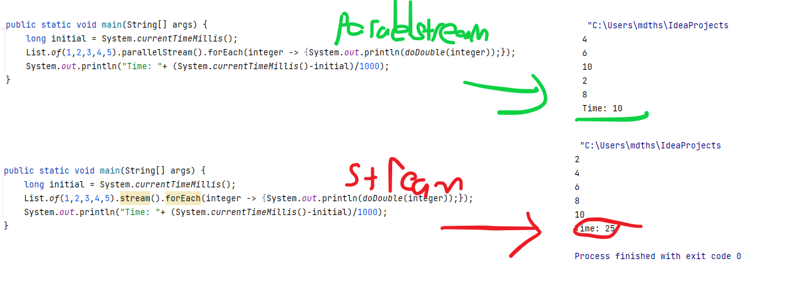

* as you can see, a result is not ordered we force to calculate ın order.
> Result same as stream not efficient.

### CREATING UNORDERED STREAMS

* Improve the performance if stream is not required to be ordered. Using unordered() with stream increases the performance.

    List.of(1,2,3,4,5,6).stream().unordered();

> On a serial stream, it prints Xwolf, but on a parallel stream the
result is XwXoXlXf. As part of the parallel process, the identity is
applied to multiple elements in the stream, resulting in very
unexpected data.

### Combining Results with collect()

    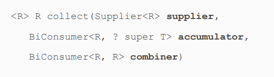

> Also, like reduce(), the accumulator and combiner operations
must be able to process results in any order. In this manner,
the three‐argument version of collect() can be performed as a
parallel reduction

    Stream<String> stream = Stream.of("w", "o", "l", "f").parallel();
    SortedSet<String> set = stream.collect(ConcurrentSkipListSet::new,
    Set::add,
    Set::addAll);
    System.out.println(set); // [f, l, o, w]

# AVOIDING STATEFUL OPERATIONS

    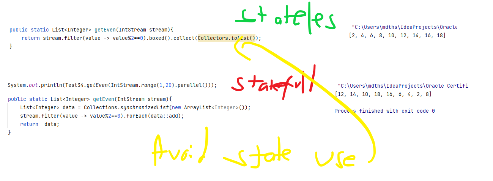

* This implementation removes the stateful operation and relies
  on the collector to assemble the elements. We could also use a
  concurrent collector to parallelize the building of the list. The
  goal is to write our code to allow for parallel processing and let
  the JVM handle the rest.

