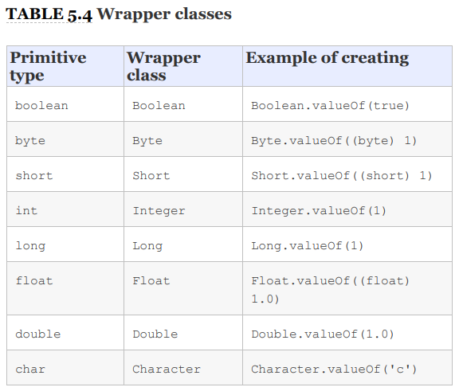

# Oracle-Certification Chapter 5-Core Java API
****

_“You take the blue pill – the story ends, you wake up in your bed and believe whatever you want to believe. You take the red pill – you stay in Wonderland and I show you how deep the rabbit-hole goes.”_
###### 'Morpheus'
*****    

1. If both operands are numeric, + means numeric addition.
2. If either operand is a String, + means concatenation.
3. The expression is evaluated left to right.    

 

    System.out.println(1 + 2); // 3
    System.out.println("a" + "b"); // ab
    System.out.println("a" + "b" + 3); // ab3
    System.out.println(1 + 2 + "c"); // 3c
    System.out.println("c" + 1 + 2); // c12
    
 

® Once a String object is created, it is not allowed to change. It
    cannot be made larger or smaller, and you cannot change one
    of the characters inside it.
 

    String string = "animals";
    System.out.println(string.substring(3)); // mals
    System.out.println(string.substring(string.indexOf('m'))); // mals
    System.out.println(string.substring(3, 4)); // m
    System.out.println(string.substring(3, 7)); // mals

    System.out.println(string.substring(3, 3)); // empty string
    System.out.println(string.substring(3, 2)); // throws exception
    System.out.println(string.substring(3, 8)); // throws exception

    
Unlike the String class, StringBuilder is not immutable.

    StringBuilder stringBuilder = new StringBuilder();
    for(char a = 'a';a<='z';a++){
        stringBuilder.append(a);
    }
    System.out.println(stringBuilder); //abcdefghijklmnopqrstuvwxyz

    Stringbuffer slower than StringBuilder so we should use instead of it.

    StringBuilder sb = new StringBuilder("abcdef");
    sb.delete(1, 3); // sb = adef
    sb.deleteCharAt(5); // throws an exception

    
» Replace method include delete firstly delete method called then set value.
    StringBuilder builder = new StringBuilder("pigeon dirty");
    builder.replace(3, 6, "sty");
    System.out.println(builder); // pigsty dirty

» Remember that Strings are immutable and literals are pooled.
    The JVM created only one literal in memory. x and y both point
    to the same location in memory; therefore, the statement
    outputs true. It gets even trickier

    String x = "Hello World";
    String z = " Hello World".trim();
    System.out.println(x == z); // false

» You can use intern adding string in pool. 

    String name = "Hello World";
    String name2 = new String("Hello World").intern();
    System.out.println(name == name2); // true

    
    String first = "rat" + 1; 
    String second = "r" + "a" + "t" + "1";
    String third = "r" + "a" + "t" + new String("1"); // We have String constructor so we have no longer compile-time constant.
    System.out.println(first == second); true
    System.out.println(first == second.intern()); true
    System.out.println(first == third); false
    System.out.println(first == third.intern()); true

    int[] a;
    int [] a;
    int []a;
    int a [];
    int a[];

    » arrays sort method works alpheticaly.
    String[] strings = { "10", "9", "100" };
    Arrays.sort(strings);
    for (String string : strings)
    System.out.print(string + " ");

    int[] ints = {1,2,3,5,0};
    Arrays.sort(ints);
    System.out.println(Arrays.toString(ints));

    int[] numbers = {2,4,6,8};
    System.out.println(Arrays.binarySearch(numbers, 2)); // 0
    System.out.println(Arrays.binarySearch(numbers, 4)); // 1
    System.out.println(Arrays.binarySearch(numbers, 1)); // -1
    System.out.println(Arrays.binarySearch(numbers, 3)); // -2  
    System.out.println(Arrays.binarySearch(numbers, 9)); // -5

* null is smaller than any other value.
* For numbers, normal numeric order applies.
* For strings, one is smaller if it is a prefix of another.
* For strings/characters, numbers are smaller than letters.
* For strings/characters, uppercase is smaller than lowercase.

 

    Arrays.compare(new int{1,2,3},new int{1,2,4}) //-1

    int[][] a;
    int a[][];
    int []a[];

    var list = new ArrayList<>();   COMPILE var is ArrayList<Object>
    var list = new ArrayList<>();
    list.add("a");
    for (String s: list) { } // DOES NOT COMPILE

* The wrapper classes are immutable and take advantage of some caching as well.

* There are also methods for converting a String to a primitive or
  wrapper class. You do need to know these methods. The parse
  methods, such as parseInt(), return a primitive, and the
  valueOf() method returns a wrapper class.
 

    int primitive = Integer.parseInt("123");
    Integer wrapper = Integer.valueOf("123");

* When we presented numeric primitives in Chapter 2, we
  mentioned they could not be used to store null values.
  One advantage of a wrapper class over a primitive is that
  because it’s an object, it can be used to store a null value.
  While null values aren’t particularly useful for numeric
  calculations, they are quite useful in data-based services.
  For example, if you are storing a user’s location data using
  (latitude,longitude), it would be a bad idea to store a
  missing point as (0,0) since that refers to an actual
  location off the coast of Africa where the user could
  theoretically be.
 

    String[] array = { "hawk", "robin" }; // [hawk, robin]
    List<String> list = Arrays.asList(array); // returns fixed size list
    System.out.println(list.size()); // 2
    list.set(1, "test"); // [hawk, test]
    array[0] = "new"; // [new, test]
    System.out.print(Arrays.toString(array));// [new, test]
    list.remove(1); // throws UnsupportedOperationException
* 

[«« Go Back ««](https://github.com/MedetHasanUgurlu/Oracle-Certification) 

