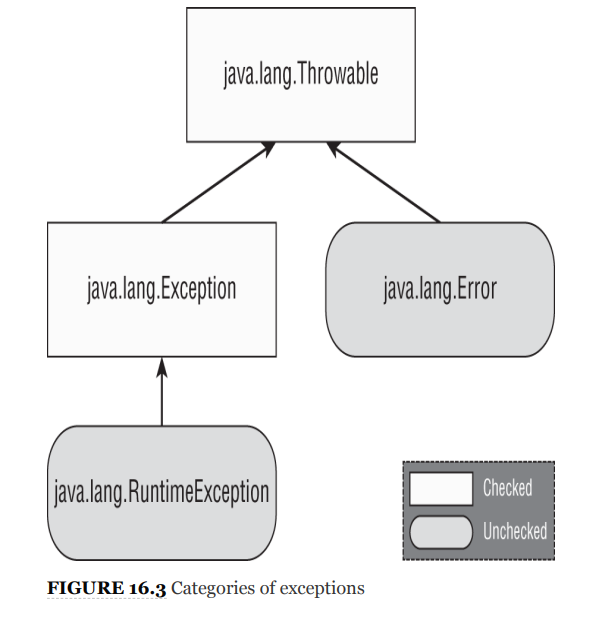
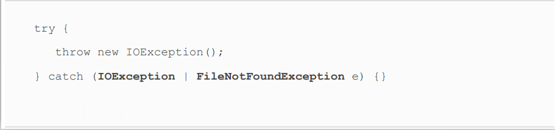
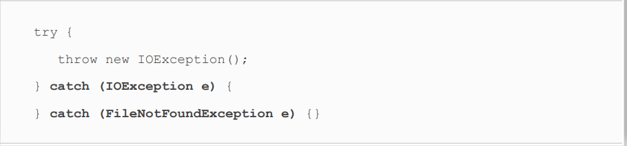
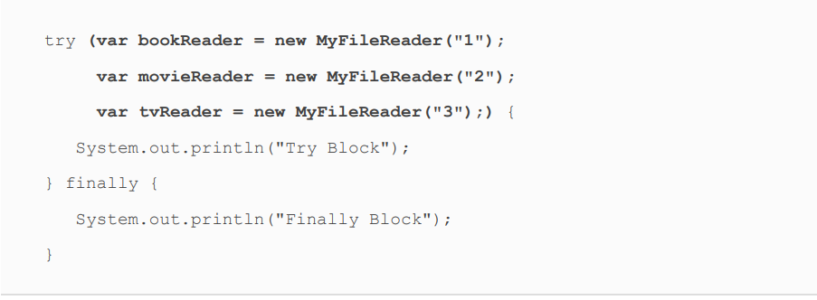
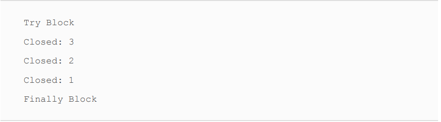
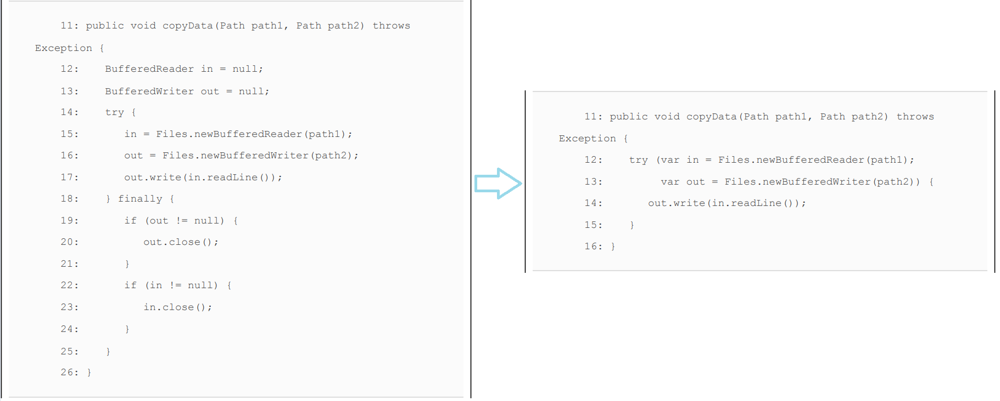
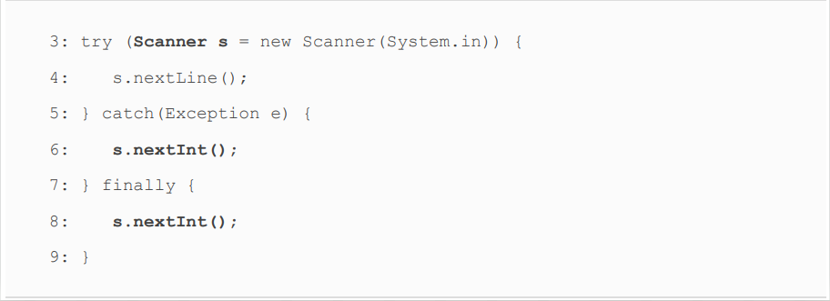

# Exceptions, Assertions, and Localization

<div align="center">
    
</div>


<div align="center">
  <table>
    <tr>
      <td>ArrayStoreException</td>
    </tr>
    <tr>
      <td>IllegalArgumentException</td>
    <tr>
      <td>MissingResourceException</td>
    </tr>
    <tr>
      <td>NumberFormatException</td>
    </tr>
    <tr>
      <td>ClassCastException</td>
    </tr>
    <tr>
      <td>IllegalStateException</td>
    </tr>
    <tr>
      <td>NullPointerException</td>
    </tr>
   <tr>
      <td>UnsupportedOperationException</td>
    </tr>
    <caption><span style="font-weight: bold"> Unchecked Exceptions</span></caption>
  </table>
</div>


 ```diff
- Why does the following not compile?
```
<div align="center">
    
</div>


<details>
<summary>Click for result</summary>

```
Since FileNotFoundException is a subclass of IOException,
listing both in a multi‐ catch expression is redundant, resulting
in a compilation error.
```
</details>


 ```diff
- Ordering of exceptions in consecutive catch blocks matters too. Why does the following not compile?
```
<div align="center">
    
</div>


<details>
<summary>Click for result</summary>

```
For the exam, remember that trying to catch a more specific
exception (after already catching a broader exception) results
in unreachable code and a compiler error.
```
</details>


### Constructing Try-With-Resources Statements

The first rule you should know is: try‐with‐
resources statements require resources that implement the
AutoCloseable interface
<br>

    try (String reptile = "lizard") {
    }

> String does not implement AutoCloseable so above code does not compile.

* NOTE: you will encounter
  resources that implement Closeable, rather than
  AutoCloseable. Since Closeable extends AutoCloseable,
  they are both supported in try‐with‐resources statements.
  The only difference between the two is that Closeable's
  close() method declares IOException, while
  AutoCloseable's close() method declares Exception.


    public class CustomFileReader implements AutoCloseable{
      private String tag;
      @Override
      public void close() throws Exception {
          System.out.println("Closed."+tag);
      }
    }

<br>
Main Code
<br>


      public static void main(String[] args) {
        try(CustomFileReader customFileReader = new CustomFileReader("Medron");) {
            System.out.println("Try Block");

        } catch (Exception e) {
            System.out.println("Catch Block");
        }finally {
            System.out.println("Finally Block");
        }
      }
<br>

**Result** \
Try Block \
Closed.Medron \
Finally Block 

> As you can see, the resources are closed at the end of the try
statement, before any catch or finally blocks are executed.
Behind the scenes, the JVM calls the close() method inside a
hidden finally block, which we can refer to as the implicit
finally block. The finally block that the programmer declared
can be referred to as the explicit finally block.
* **TIP**: In a try‐with‐resources statement, you need to remember
  that the resource will be closed at the completion of the
  try block, before any declared catch or finally blocks
  execute.

The second rule you should be familiar with is: a try‐with‐
resources statement can include multiple resources, which are
closed in the reverse order in which they are declared.

<div align="center">
    
</div>


When executed, this code prints the following:
<div align="center">
    
</div>


### Why You Should Be Using Try-With-Resources Statements
<div align="center">
    
</div>


 ```diff
- Ordering of exceptions in consecutive catch blocks matters too. Why does the following not compile?
```
<div align="center">
    
</div>


<details>
<summary>Click for result</summary>

```
The problem is that Scanner has gone out of scope at the end of
the try clause. Lines 6 and 8 do not have access to it. This is
actually a nice feature. You can't accidentally use an object that
has been closed.

```
</details>
  
### Learning The New Effectively Final Feature
Starting with Java 9, it is possible to use resources declared
prior to the try‐with‐resources statement, provided they are
marked final or effectively final. The syntax is just to use the
resource name in place of the resource declaration, separated
by a semicolon ( ;).
<br>

    public void relax() {
      final var bookReader = new MyFileReader("4");
      MyFileReader movieReader = new MyFileReader("5");
      try (bookReader;
        var tvReader = new MyFileReader("6");
        movieReader) {
        System.out.println("Try Block");
      } finally {
      System.out.println("Finally Block");
      }
    }
<br>

**Result**
Try Block \
Closed: 5 \
Closed: 6 \
Closed: 4 \
Finally Block 

* **TIP**: Variable in try(...) must be effectively final.
<br>


    var writer = Files.newBufferedWriter(path);
    try(writer) { 
      writer.append("Welcome to the zoo!");
    }
    writer = null;


<details>
<summary>Find the error.</summary>

```
Writer variable is not effectiveley final variable
```
</details>

### Validating Data With The Assert Statement

* Syntax of **_assert_**


    assert boolean_Expression 
    assert boolean_Expression: message

* when boolean expression is false, then AssertionError is thrown. Program does not catch Error!


**Invalid syntax** \
assert(1);\
assert x -> true;\
assert 1==2 ? "Accept" : "Error";\
assert.test(5> age);

#### Enabling Assertion
By default, JVM ignore assertion so we should enable by using _**-ea**_ or **_-enableassertions_**
> java -ea Rectangle
> java -ea:com.demos...


## CREATING DATES AND TIMES


    System.out.println(LocalDate.now());            ====> 2020-10-14
    System.out.println(LocalTime.now());            ====> 12:45:20.854
    System.out.println(LocalDateTime.now());        ====> 2020-10-14T12:45:20.854
    System.out.println(ZonedDateTime.now());        ====> 2020-10-14T12:45:20.854-04:00[America/New_York]

### Formatting dates and times

    LocalDate date = LocalDate.of(2020, Month.OCTOBER, 20);
    System.out.println(date.getDayOfWeek());        ====> TUESDAY
    System.out.println(date.getMonth());            ====> OCTOBER
    System.out.println(date.getYear());             ====> 2020
    System.out.println(date.getDayOfYear());        ====> 294

Java provides a class called DateTimeFormatter to display
standard formats.


    LocalDate date = LocalDate.of(2020, Month.OCTOBER, 20);
    LocalTime time = LocalTime.of(11, 12, 34);
    LocalDateTime dt = LocalDateTime.of(date, time);
    System.out.println(date.format(DateTimeFormatter.ISO_LOCAL_DATE)); 
    System.out.println(time.format(DateTimeFormatter.ISO_LOCAL_TIME));
    System.out.println(dt.format(DateTimeFormatter.ISO_LOCAL_DATE_TIME));
**Result** \
2020-10-20 \
11:12:34 \
2020-10-20T11:12:34

<div align="center">
  <table>
<th>Symbol(Month)</th>
<th>Abbreviation</th>
    <tr>
      <td>M</td>
      <td>1</td>
    </tr>
    <tr>
      <td>MM</td>
      <td>01</td>
    <tr>
      <td>MMM</td>
      <td>Jan</td>
    </tr>
    <tr>
      <td>MMMM</td>
      <td>January</td>
    </tr>
  </table>
</div>

    var dt = LocalDateTime.of(2020, Month.OCTOBER, 20, 6, 15, 30);
    var formatter1 = DateTimeFormatter.ofPattern("MM/dd/yyyy hh:mm:ss");
    System.out.println(dt.format(formatter1));
    var formatter2 = DateTimeFormatter.ofPattern("MM_yyyy_-_dd");
    System.out.println(dt.format(formatter2));
    var formatter3 = DateTimeFormatter.ofPattern("h:mm z");
    System.out.println(dt.format(formatter3));
**Result** \
10/20/2020 06:15:30 \
10_2020_-_20 \
Exception in thread "main" java.time.DateTimeException: \
Unable to extract ZoneId from temporal 2020-10-20T06:15:30


