# Generics and Collections
<div align="center">
<table>
<th>Functional Interface</th>
<th>Return Type</th>
<th>Method Name</th>
<th>Parameters</th>
<tr>
<td>Supplier &lt T&gt </td>
<td>T</td>
<td>get()</td>
<td>0</td>
</tr>

<tr>
<td>Consumer &lt T&gt </td>
<td>void</td>
<td>accept(T)</td>
<td>(T)</td>
</tr>

<tr>
<td>BiConsumer &lt T,U&gt </td>
<td>void</td>
<td>accept(T,U)</td>
<td>(T,U)</td>
</tr>
<tr>
<td>Predicate &lt T&gt </td>
<td>boolean</td>
<td>test(T)</td>
<td>(T)</td>
</tr>

<tr>
<td>BiPredicate &lt T&gt </td>
<td>boolean</td>
<td>test(T,U)</td>
<td>(T,U)</td>
</tr>

<tr>
<td>Function &lt T,R&gt </td>
<td>R</td>
<td>apply(T)</td>
<td>(T)</td>
</tr>
<tr>
<td>BiFunction &lt T,U,R&gt </td>
<td>R</td>
<td>apply(T,U)</td>
<td>(T,U)</td>
</tr>
<tr>
<td>UnaryOperator &lt T&gt </td>
<td>T</td>
<td>apply(T)</td>
<td>(T)</td>
</tr>


</table>
</div>

<br>

* Remember that :: is like a lambda, and it is used for
deferred execution with a functional interface.
* There are four formats for method references: 
  1) Static methods
  2) Instance methods on a particular instance 
  3) Instance methods on a parameter to be determined at runtime 
  4) Constructors 

### CALLING STATIC METHODS
* The Collections class has a static method that can be used for
  sorting.
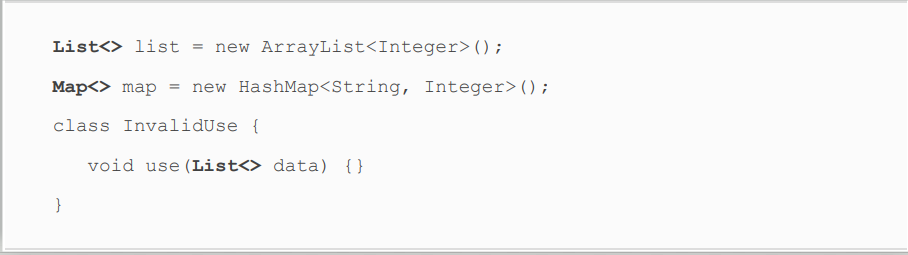
    

    List<Integer> list = new ArrayList<>();
    list.add(3);
    list.add(1);
    list.add(5);
    Consumer<List<Integer>> consumer = integers -> Collections.sort(integers);
    consumer.accept(list);
    list.stream().forEach(System.out::println);
###### Result
**1\
3\
5**


> we reference a method with one parameter, and
Java knows that it's like a lambda with one parameter.
Additionally, Java knows to pass that parameter to the method.

### CALLING INSTANCE METHODS ON A PARTICULAR OBJECT
* The String class has a startsWith() method that takes one
  parameter and returns a boolean. Conveniently, a Predicate is a
  functional interface that takes one parameter and returns a
  boolean.
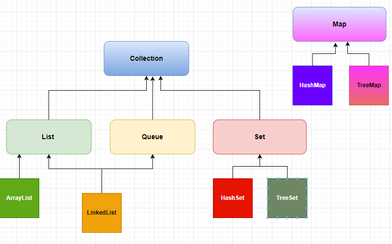


    String s = sc.nextLine();
    Predicate<String> predicate = s::startsWith;
    System.out.println(predicate.test("k"));

* A method reference doesn't have to take any parameters. In
  this example, we use a Supplier, which takes zero parameters
  and returns a value

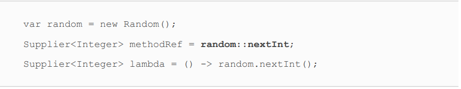


        Supplier<Integer> lambdaSupplier = () -> random.nextInt();
        Supplier<Integer> methodRef = random::nextInt;
        System.out.println(lambdaSupplier.get());
        System.out.println(methodRef.get());
###### Result
**-657562234\
-80164351**

> Since the methods on Random are instance methods, we call the
method reference on an instance of the Random class.

### CALLING INSTANCE METHODS ON A PARAMETER
* This time, we are going to call an instance method that doesn't
  take any parameters. The trick is that we will do so without
  knowing the instance in advance.
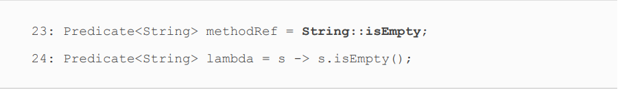

  
        Predicate<String> isEmptyLambda = s -> s.isEmpty();
        Predicate<String> isEmptyMethodRef = String::isEmpty;
        System.out.println(isEmptyMethodRef.test(""));
        System.out.println(isEmptyLambda.test(""));
        


###### Result
**true\
true**

> It looks like a static method, but it isn't. Instead, Java
knows that isEmpty() is an instance method that does not take
any parameters. Java uses the parameter supplied at runtime
as the instance on which the method is called.

* You can even combine the two types of instance method
  references. We are going to use a functional interface called a
  BiPredicate, which takes two parameters and returns a
  boolean.

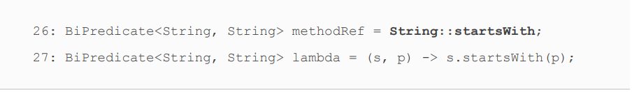

        BiPredicate<String,String> isStartWithLambda = (s, s2) -> s.startsWith(s2);
        BiPredicate<String,String> isStartWithMethod = String::startsWith;
        System.out.println(isStartWithLambda.test("Kale","L"));
        System.out.println(isStartWithMethod.test("Kale","L"));

###### Result
**false\
false**


> functional interface takes two parameters, Java has to
figure out what they represent. The first one will always be the
instance of the object for instance methods. Any others are to
be method parameters.

### CALLING CONSTRUCTORS
* A constructor reference is a special type of method reference
  that uses new instead of a method, and it instantiates an object.
  It is common for a constructor reference to use a Supplier

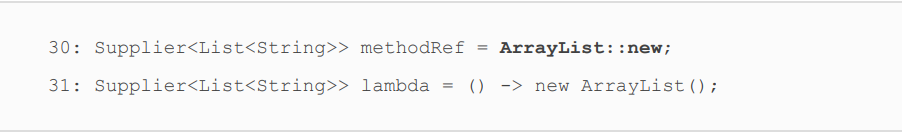

        Supplier<List<String>> getListByLambda = () -> new ArrayList<>();
        Supplier<List<String>> getListByMethodRef = ArrayList::new;

        List<String> lambaList = getListByLambda.get();
        lambaList.add("Mehmet");
        System.out.println(lambaList);

        List<String> methodList = getListByMethodRef.get();
        methodList.add("Metehan");
        System.out.println(methodList);

###### Result
**[Mehmet]\
[Metehan]**


> It expands like the method references you have seen so far. In
the previous example, the lambda doesn't have any parameters.


* Method references can be tricky.
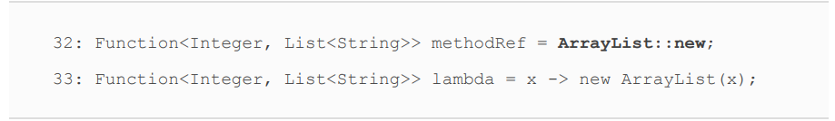


    

> This means you can't always determine which method can be
called by looking at the method reference. Instead, you have to
look at the context to see what parameters are used and if there
is a return type. In this example, Java sees that we are passing
an Integer parameter and calls the constructor of ArrayList
that takes a parameter.

<div align="center">
<table>
<th>Type</th>
<th>Before ::</th>
<th>After ::</th>
<th>Example</th>

<tr>
<td>Static methods </td>
<td>Class name</td>
<td>Method name</td>
<td>Collections::sort</td>
</tr>

<tr>
<td>Instance methods on a particular object</td>
<td>Instance variable name </td>
<td>Method name</td>
<td>str::startsWith</td>
</tr>

<tr>
<td>Instance methods on a parameter </td>
<td>Class name</td>
<td>Method name</td>
<td>String::isEmpty</td>
</tr>
<tr>
<td>Constructor</td>
<td>Class name</td>
<td>new</td>
<td>ArrayList::new</td>
</tr>


</table>
</div>

<br>


### Using Wrapper Classes
* With **_autoboxing_**, the compiler automatically converts a primitive to
  the corresponding wrapper. 
* Unsurprisingly, _**unboxing**_ is the
  process in which the compiler automatically converts a
  wrapper class back to a primitive.
<div align="center">
  <table>
    <th>Primitive type</th>
    <th>Wrapper class</th>
    <th>Example of initializing</th>

  <tr>
    <td>boolean</td>
    <td>Boolean</td>
    <td>Boolean.valueOf(true)</td>
  </tr>
  
  <tr>
    <td>byte</td>
    <td>Byte</td>
    <td>Byte.valueOf((byte) 1)</td>
  </tr>
  
  <tr>
    <td>short</td>
    <td>Short</td>
    <td>Short.valueOf((short) 1)</td>
  </tr>
  
  <tr>
    <td>int</td>
    <td>Integer</td>
    <td>Integer.valueOf(1)</td>
  </tr>
  
  <tr>
    <td>long</td>
    <td>Long</td>
    <td>Long.valueOf(1)</td>
  </tr>
  
  
  <tr>
    <td>float</td>
    <td>Float</td>
    <td>Float.valueOf((float)1.0)</td>
  </tr>
  
  <tr>
    <td>double</td>
    <td>Double</td>
    <td>Double.valueOf(1.0)</td>
  </tr>
  
  <tr>
    <td>char</td>
    <td>Character</td>
    <td>Character.valueOf('c')</td>
  </tr>


  </table>
</div>

<br>

* There are two tricks in the space of autoboxing and unboxing.
1) The first has to do with null values.

        List<Integer> integers = new ArrayList<>();
        integers.add(null);
        integers.add(2);
        integers.stream().forEach(System.out::println);
        int a = integers.get(0);

###### Result
**null\
2\
Exception in thread "main" java.lang.NullPointerException**

> We add a null to the list. This is legal because a null
reference can be assigned to any reference variable.
We try to unbox that null to an int primitive. This is a problem.
Java tries to get the int value of null. Since calling any method
on null gives a NullPointerException, that is just what we get.
Be careful when you see null in relation to autoboxing.

### WRAPPER CLASSES AND NULL
* Speaking of null, one advantage of a wrapper class over a
  primitive is that it can hold a null value. While null
  values aren't particularly useful for numeric calculations,
  they are quite useful in data‐based services. For example,
  if you are storing a user's location data using (latitude,
  longitude), it would be a bad idea to store a missing point
  as (0,0) since that refers to an actual location off the cost
  of Africa where the user could theoretically be.


**_What do you think this code outputs?_**


<details>
<summary>Click for result</summary>

```
It actually outputs [1]. Let's walk through why that is. On lines
24 through 26, we add three Integer objects to numbers. The
one on line 24 relies on autoboxing to do so, but it gets added
just fine. At this point, numbers contains [1, 3, 5].
Line 27 contains the second trick. The remove() method is
overloaded. One signature takes an int as the index of the
element to remove. The other takes an Object that should be
removed. On line 27, Java sees a matching signature for int, so
it doesn't need to autobox the call to the method. Now numbers
contains [1, 5]. Line 28 calls the other remove() method, and it
removes the matching object, which leaves us with just [1].
```
</details>


### Using the Diamond Operator
* In the past, we would write code using generics like


    List<Integer> list1 = new ArrayList<Integer>(); 

> Luckily, the diamond operator, <>, was added to the language.
  The diamond operator is a shorthand notation that allows you
  to omit the generic type from the right side of a statement when
  the type can be inferred. It is called the diamond operator
  because <> looks like a diamond.

    List<Integer> list1 = new ArrayList<>();


**_What do you think this code outputs?_**
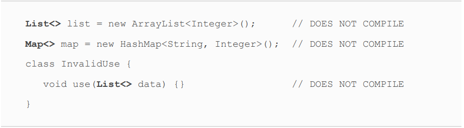
    
    List<> list = new ArrayList<Integer>();
    Map<> map = new HashMap<String, Integer>();


<details>
<summary>Click for result</summary>

```
DOES NOT COMPILE
The diamond operator cannot be used as the type in a variable
declaration. It can be used only on the right side of an
assignment operation.
```
</details>

### Using Lists, Sets, Maps, and Queues
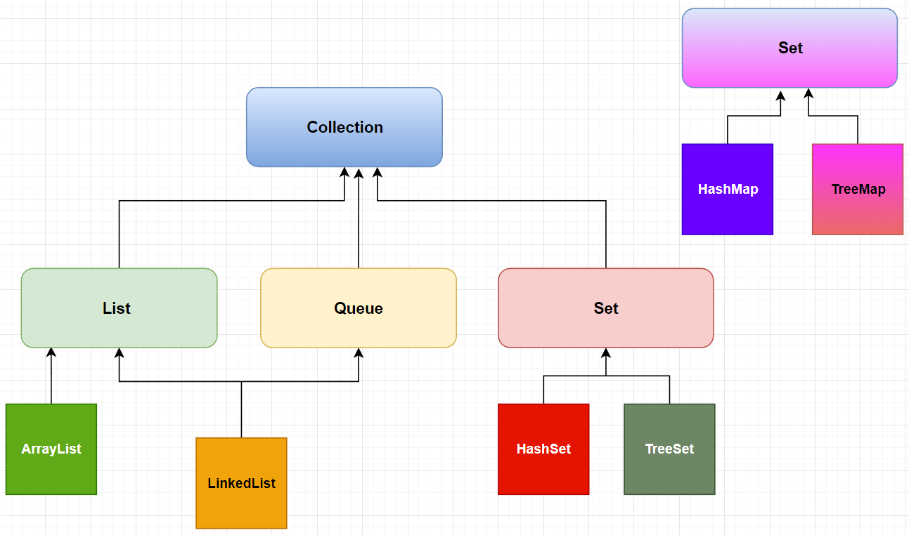

#### DELETING WHILE LOOPING
* Java does not allow removing elements from a list while
  using the enhanced for loop. 
<br>


    Collection<String> birds = new ArrayList<>();
    birds.add("hawk");
    birds.add("hawk");
    birds.add("hawk");
    for (String bird : birds) // ConcurrentModificationException
    birds.remove(bird);

#### removeIf()
* The removeIf() method removes all elements that match a
  condition.
<br>


    boolean removeIf(Predicate<? super E> filter)

* It uses a Predicate, which takes one parameter and returns a
  boolean.
<br>

        List<String> bags = new ArrayList<>();
        bags.add("Book");
        bags.add("Pencil");
        bags.add("Eraser");
        bags.add("Beans");
        bags.add("Ruler");
        bags.removeIf(s -> s.startsWith("B"));
        bags.forEach(System.out::println);

###### Result
**Pencil\
Eraser\
Ruler**

**_How would you replace with a method reference?_**
<details>
<summary>Click for result</summary>

```

Trick question—you can't. The removeIf() method takes a Predicate.
We can pass only one value with this method reference. Since
startsWith takes a literal, it needs to be specified “the long
way.”

```
</details>

**_Let's try one more example that does use a method reference._**

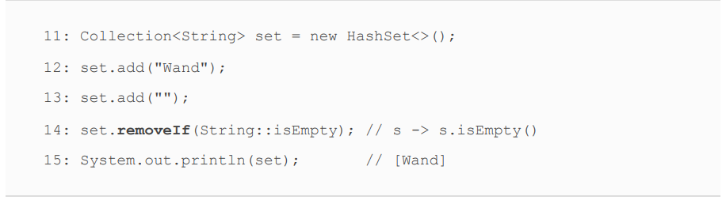
<details>
<summary>Click for result</summary>

```

we remove any empty String objects from the set.
The comment on that line shows the lambda equivalent of the
method reference. Line 15 shows that the removeIf() method
successfully removed one element from the list.”

```
</details>


### Comparing List Implementations
* The main benefit of an ArrayList is that you can look up any
element in constant time. Adding or removing an element is
slower than accessing an element. This makes an ArrayList a
good choice when you are reading more often than (or the same
amount as) writing to the ArrayList.
* A LinkedList is special because it implements both List and
Queue. It has all the methods of a List. It also has additional
methods to facilitate adding or removing from the beginning
and/or end of the list.
* The main benefits of a LinkedList are that you can access, add,
  and remove from the beginning and end of the list in constant
  time. The trade‐off is that dealing with an arbitrary index takes
  linear time. This makes a LinkedList a good choice when you'll
  be using it as Queue.
<br>

  

<div align="center">
  <table>
 <caption><span style="font-weight: bold">Factory methods to create a List</span></caption>
    <th>Method</th>
    <th>Description</th>
    <th>Can Add Elements?</th>
    <th>Can Replace Elements?</th>
    <th>Can Delete Elements?</th>

  <tr>
    <td>Arrays.asList(x)</td>
    <td>Returns fixed size list backed by an array.</td>
    <td><span style="color: red;font-weight: normal">No</span></td>
    <td><span style="font-weight: bold;color: greenyellow;">Yes</span></td>
    <td><span style="color: red;font-weight: normal">No</span></td>
  </tr>

  <tr>
    <td>List.of(x)</td>
    <td>Returns immutable list.</td>
    <td><span style="color: red;font-weight: normal">No</span></td>
    <td><span style="color: red;font-weight: normal">No</span></td>
    <td><span style="color: red;font-weight: normal">No</span></td>
  </tr>

  <tr>
    <td>List.copyOf(collection)</td>
    <td>Returns an immutable list with copy of original collection's values</td>
    <td><span style="color: red;font-weight: normal">No</span></td>
    <td><span style="color: red;font-weight: normal">No</span></td>
    <td><span style="color: red;font-weight: normal">No</span></td>
  </tr>

  </table>
</div>

<br>


<br>
<div>
  <table>
    <th>Method</th>
    <th>Description</th>
    <tr>
      <td><span style="font-weight: bolder">boolean add(E element)</span></td>
      <td>Adds element to end </td>
    </tr>
    <tr>
      <td><span style="font-weight: bolder">void add(int index,E element)</span></td>
      <td>Adds element at index and movers the rest</td>
    </tr>
    <tr>
      <td><span style="font-weight: bolder">E get(int index)</span></td>
      <td>Returns element at index</td>
    </tr>
    <tr>
      <td><span style="font-weight: bolder">E remove(int index)</span></td>
      <td>Removes an element at index and moves the rest toward the front</td>
    </tr>
    <tr>
      <td><span style="font-weight: bolder">void replaceAll(UnaryOperator&lt E&gt op)</span></td>
      <td>Replaces each element in the list with the result of the operator</td>
    </tr>
    <tr>
      <td><span style="font-weight: bolder">E set(int index, E e)</span></td>
      <td>Replaces element at index and returns original. Throws IndexOutOfBoundsException if the index is larger than the maximum one set</td>
    </tr>

 <caption><span style="font-weight: bold">List methods</span></caption>
  </table>

</div>

<br>

### Comparing Set Implementations
* A HashSet stores its elements in a hash table, which means the
  keys are a hash and the values are an Object. This means that it
  uses the hashCode() method of the objects to retrieve them
  more efficiently.
* A TreeSet stores its elements in a sorted tree structure. The
  main benefit is that the set is always in **sorted order**. The trade‐
  off is that adding and checking whether an element exists take
  longer than with a HashSet, especially as the tree grows larger.


### USING THE QUEUE INTERFACE
* Unless stated otherwise, a queue is assumed to be FIFO (first‐
  in, first‐out). Some queue implementations change this to use a
  different order. You can envision a FIFO queue as shown in
  Figure 14.5. The other format is LIFO (last‐in, first‐out), which
  is commonly referred to as a stack. In Java, though, both can
  be implemented with the Queue interface.

### Comparing Queue Implementations
* You saw LinkedList earlier in the List section. In addition to
  being a list, it is a double‐ended queue. A double‐ended queue
  is different from a regular queue in that you can insert and
  remove elements from both the front and back of the queue.
<div>
  <table>
    <th>Method</th>
    <th>Description</th>
    <th>Throws exception on failure</th>
    <tr>
      <td><span style="font-weight: bolder; font-family: Unispace">boolean add(E e)</span></td>
      <td>Adds an element to back of the queue and returns true or throws an exception</td>
      <td>Yes</td>
    </tr>
    <tr>
      <td><span style="font-weight: bolder; font-family: Unispace">E element()</span></td>
      <td>Returns next element or throws an exception if empty queue</td>
      <td>Yes</td>
    </tr>
    <tr>
      <td><span style="font-weight: bolder; font-family: Unispace">boolean offer(E e)</span></td>
      <td>Adds an element to back of the queue and returns whether successful</td>
      <td>No</td>
    </tr>
    <tr>
      <td><span style="font-weight: bolder; font-family: Unispace">E remove()</span></td>
      <td>Removes and returns next element or throws an exception if empty queue."</td>
      <td>Yes</td>
    </tr>
    <tr>
      <td><span style="font-weight: bolder; font-family: Unispace">E poll()</span></td>
      <td>Removes and returns next element or returns null if empty queue</td>
      <td>No</td>
    </tr>
    <tr>
      <td><span style="font-weight: bolder; font-family: Unispace">E peek()</span></td>
      <td>Returns next element or returns null if empty queue</td>
      <td>No</td>
    </tr>

 <caption><span style="font-weight: bold">List methods</span></caption>
  </table>

</div>

### USING THE MAP INTERFACE 
* You do need to know that TreeMap is
  sorted.

### MAP.OF() AND MAP.COPYOF()
* Just like List and Set, there is a helper method to create a
  Map. 
<br>


    Map.of("key1", "value1", "key2", "value2");
* Unlike List and Set, this is less than ideal. Suppose you
  miscount and leave out a value.
<br>


    Map.of("key1", "value1", "key2"); // INCORRECT
> This code compiles but throws an error at runtime.

    Map.ofEntries(Map.entry("key1", "value1"),Map.entry("key1", "value1"));
    Map.ofEntries(Map.entry("1","Kestane")).forEach((s, s2) -> System.out.println(s+" "+s2));


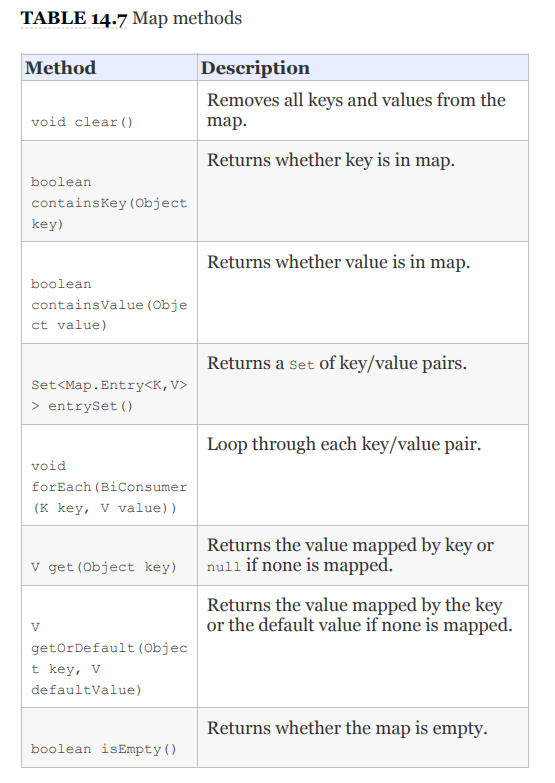

<div>
  <table>
    <th>Method</th>
    <th>Description</th>
    <th>Throws exception on failure</th>
    <tr>
      <td><span style="font-weight: bolder; font-family: Unispace">boolean add(E e)</span></td>
      <td>Adds an element to back of the queue and returns true or throws an exception</td>
    </tr>
    <tr>
      <td><span style="font-weight: bolder; font-family: Unispace">E element()</span></td>
      <td>Returns next element or throws an exception if empty queue</td>
      <td>Yes</td>
    </tr>
    <tr>
      <td><span style="font-weight: bolder; font-family: Unispace">boolean offer(E e)</span></td>
      <td>Adds an element to back of the queue and returns whether successful</td>
      <td>No</td>
    </tr>
    <tr>
      <td><span style="font-weight: bolder; font-family: Unispace">E remove()</span></td>
      <td>Removes and returns next element or throws an exception if empty queue."</td>
      <td>Yes</td>
    </tr>
    <tr>
      <td><span style="font-weight: bolder; font-family: Unispace">E poll()</span></td>
      <td>Removes and returns next element or returns null if empty queue</td>
      <td>No</td>
    </tr>
    <tr>
      <td><span style="font-weight: bolder; font-family: Unispace">E peek()</span></td>
      <td>Returns next element or returns null if empty queue</td>
      <td>No</td>
    </tr>

 <caption><span style="font-weight: bold">List methods</span></caption>
  </table>
</div>


