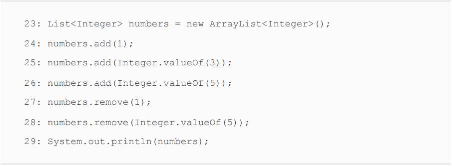

# Generics and Collections
<div align="center">
<table>
<th>Functional Interface</th>
<th>Return Type</th>
<th>Method Name</th>
<th>Parameters</th>
<tr>
<td>Supplier &lt T&gt </td>
<td>T</td>
<td>get()</td>
<td>0</td>
</tr>

<tr>
<td>Consumer &lt T&gt </td>
<td>void</td>
<td>accept(T)</td>
<td>(T)</td>
</tr>

<tr>
<td>BiConsumer &lt T,U&gt </td>
<td>void</td>
<td>accept(T,U)</td>
<td>(T,U)</td>
</tr>
<tr>
<td>Predicate &lt T&gt </td>
<td>boolean</td>
<td>test(T)</td>
<td>(T)</td>
</tr>

<tr>
<td>BiPredicate &lt T&gt </td>
<td>boolean</td>
<td>test(T,U)</td>
<td>(T,U)</td>
</tr>

<tr>
<td>Function &lt T,R&gt </td>
<td>R</td>
<td>apply(T)</td>
<td>(T)</td>
</tr>
<tr>
<td>BiFunction &lt T,U,R&gt </td>
<td>R</td>
<td>apply(T,U)</td>
<td>(T,U)</td>
</tr>
<tr>
<td>UnaryOperator &lt T&gt </td>
<td>T</td>
<td>apply(T)</td>
<td>(T)</td>
</tr>


</table>
</div>

<br>

* Remember that :: is like a lambda, and it is used for
deferred execution with a functional interface.
* There are four formats for method references: 
  1) Static methods
  2) Instance methods on a particular instance 
  3) Instance methods on a parameter to be determined at runtime 
  4) Constructors 

### CALLING STATIC METHODS
* The Collections class has a static method that can be used for
  sorting.

    

    List<Integer> list = new ArrayList<>();
    list.add(3);
    list.add(1);
    list.add(5);
    Consumer<List<Integer>> consumer = integers -> Collections.sort(integers);
    consumer.accept(list);
    list.stream().forEach(System.out::println);
###### Result
**1\
3\
5**


> we reference a method with one parameter, and
Java knows that it's like a lambda with one parameter.
Additionally, Java knows to pass that parameter to the method.

### CALLING INSTANCE METHODS ON A PARTICULAR OBJECT
* The String class has a startsWith() method that takes one
  parameter and returns a boolean. Conveniently, a Predicate is a
  functional interface that takes one parameter and returns a
  boolean.


    String s = sc.nextLine();
    Predicate<String> predicate = s::startsWith;
    System.out.println(predicate.test("k"));

* A method reference doesn't have to take any parameters. In
  this example, we use a Supplier, which takes zero parameters
  and returns a value


        Supplier<Integer> lambdaSupplier = () -> random.nextInt();
        Supplier<Integer> methodRef = random::nextInt;
        System.out.println(lambdaSupplier.get());
        System.out.println(methodRef.get());
###### Result
**-657562234\
-80164351**

> Since the methods on Random are instance methods, we call the
method reference on an instance of the Random class.

### CALLING INSTANCE METHODS ON A PARAMETER
* This time, we are going to call an instance method that doesn't
  take any parameters. The trick is that we will do so without
  knowing the instance in advance.


  
        Predicate<String> isEmptyLambda = s -> s.isEmpty();
        Predicate<String> isEmptyMethodRef = String::isEmpty;
        System.out.println(isEmptyMethodRef.test(""));
        System.out.println(isEmptyLambda.test(""));
        


###### Result
**true\
true**

> It looks like a static method, but it isn't. Instead, Java
knows that isEmpty() is an instance method that does not take
any parameters. Java uses the parameter supplied at runtime
as the instance on which the method is called.

* You can even combine the two types of instance method
  references. We are going to use a functional interface called a
  BiPredicate, which takes two parameters and returns a
  boolean.


        BiPredicate<String,String> isStartWithLambda = (s, s2) -> s.startsWith(s2);
        BiPredicate<String,String> isStartWithMethod = String::startsWith;
        System.out.println(isStartWithLambda.test("Kale","L"));
        System.out.println(isStartWithMethod.test("Kale","L"));

###### Result
**false\
false**


> functional interface takes two parameters, Java has to
figure out what they represent. The first one will always be the
instance of the object for instance methods. Any others are to
be method parameters.

### CALLING CONSTRUCTORS
* A constructor reference is a special type of method reference
  that uses new instead of a method, and it instantiates an object.
  It is common for a constructor reference to use a Supplier


        Supplier<List<String>> getListByLambda = () -> new ArrayList<>();
        Supplier<List<String>> getListByMethodRef = ArrayList::new;

        List<String> lambaList = getListByLambda.get();
        lambaList.add("Mehmet");
        System.out.println(lambaList);

        List<String> methodList = getListByMethodRef.get();
        methodList.add("Metehan");
        System.out.println(methodList);

###### Result
**[Mehmet]\
[Metehan]**


> It expands like the method references you have seen so far. In
the previous example, the lambda doesn't have any parameters.


* Method references can be tricky.


    

> This means you can't always determine which method can be
called by looking at the method reference. Instead, you have to
look at the context to see what parameters are used and if there
is a return type. In this example, Java sees that we are passing
an Integer parameter and calls the constructor of ArrayList
that takes a parameter.

<div align="center">
<table>
<th>Type</th>
<th>Before ::</th>
<th>After ::</th>
<th>Example</th>

<tr>
<td>Static methods </td>
<td>Class name</td>
<td>Method name</td>
<td>Collections::sort</td>
</tr>

<tr>
<td>Instance methods on a particular object</td>
<td>Instance variable name </td>
<td>Method name</td>
<td>str::startsWith</td>
</tr>

<tr>
<td>Instance methods on a parameter </td>
<td>Class name</td>
<td>Method name</td>
<td>String::isEmpty</td>
</tr>
<tr>
<td>Constructor</td>
<td>Class name</td>
<td>new</td>
<td>ArrayList::new</td>
</tr>


</table>
</div>

<br>


### Using Wrapper Classes
* With **_autoboxing_**, the compiler automatically converts a primitive to
  the corresponding wrapper. 
* Unsurprisingly, _**unboxing**_ is the
  process in which the compiler automatically converts a
  wrapper class back to a primitive.
<div align="center">
  <table>
    <th>Primitive type</th>
    <th>Wrapper class</th>
    <th>Example of initializing</th>

  <tr>
    <td>boolean</td>
    <td>Boolean</td>
    <td>Boolean.valueOf(true)</td>
  </tr>
  
  <tr>
    <td>byte</td>
    <td>Byte</td>
    <td>Byte.valueOf((byte) 1)</td>
  </tr>
  
  <tr>
    <td>short</td>
    <td>Short</td>
    <td>Short.valueOf((short) 1)</td>
  </tr>
  
  <tr>
    <td>int</td>
    <td>Integer</td>
    <td>Integer.valueOf(1)</td>
  </tr>
  
  <tr>
    <td>long</td>
    <td>Long</td>
    <td>Long.valueOf(1)</td>
  </tr>
  
  
  <tr>
    <td>float</td>
    <td>Float</td>
    <td>Float.valueOf((float)1.0)</td>
  </tr>
  
  <tr>
    <td>double</td>
    <td>Double</td>
    <td>Double.valueOf(1.0)</td>
  </tr>
  
  <tr>
    <td>char</td>
    <td>Character</td>
    <td>Character.valueOf('c')</td>
  </tr>


  </table>
</div>

<br>

* There are two tricks in the space of autoboxing and unboxing.
1) The first has to do with null values.

        List<Integer> integers = new ArrayList<>();
        integers.add(null);
        integers.add(2);
        integers.stream().forEach(System.out::println);
        int a = integers.get(0);

###### Result
**null\
2\
Exception in thread "main" java.lang.NullPointerException**

> We add a null to the list. This is legal because a null
reference can be assigned to any reference variable.
We try to unbox that null to an int primitive. This is a problem.
Java tries to get the int value of null. Since calling any method
on null gives a NullPointerException, that is just what we get.
Be careful when you see null in relation to autoboxing.

### WRAPPER CLASSES AND NULL
* Speaking of null, one advantage of a wrapper class over a
  primitive is that it can hold a null value. While null
  values aren't particularly useful for numeric calculations,
  they are quite useful in data‐based services. For example,
  if you are storing a user's location data using (latitude,
  longitude), it would be a bad idea to store a missing point
  as (0,0) since that refers to an actual location off the cost
  of Africa where the user could theoretically be.


**_What do you think this code outputs?_**


<details>
<summary>Click for result</summary>

```
It actually outputs [1]. Let's walk through why that is. On lines
24 through 26, we add three Integer objects to numbers. The
one on line 24 relies on autoboxing to do so, but it gets added
just fine. At this point, numbers contains [1, 3, 5].
Line 27 contains the second trick. The remove() method is
overloaded. One signature takes an int as the index of the
element to remove. The other takes an Object that should be
removed. On line 27, Java sees a matching signature for int, so
it doesn't need to autobox the call to the method. Now numbers
contains [1, 5]. Line 28 calls the other remove() method, and it
removes the matching object, which leaves us with just [1].
```
</details>


### Using the Diamond Operator


