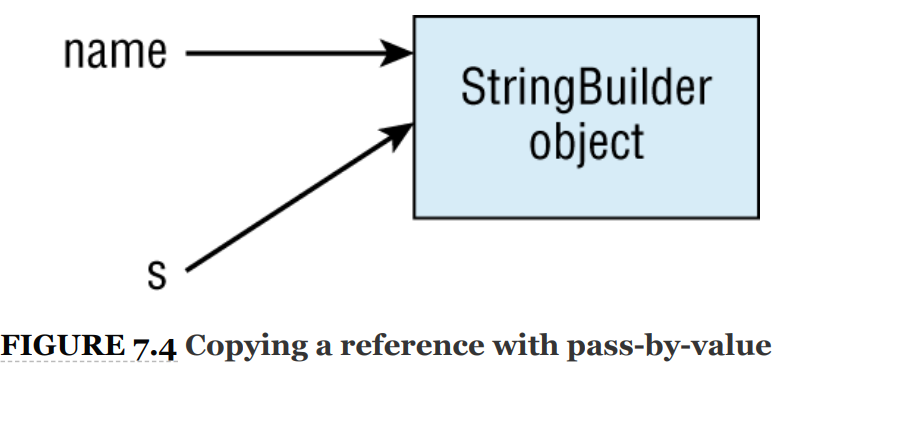
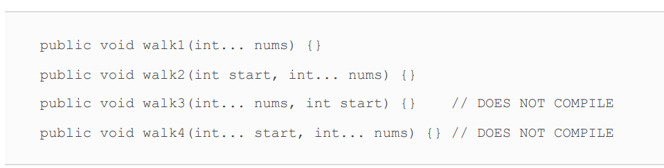
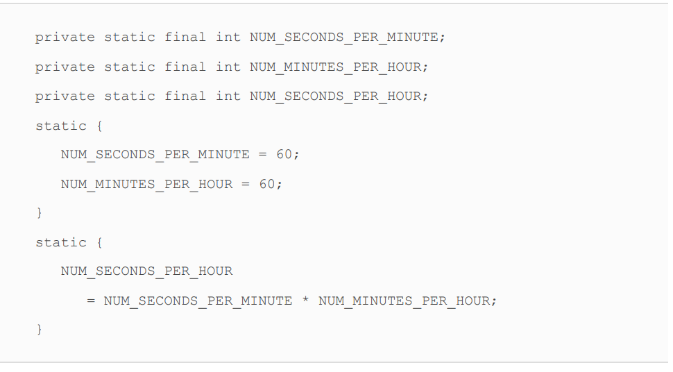
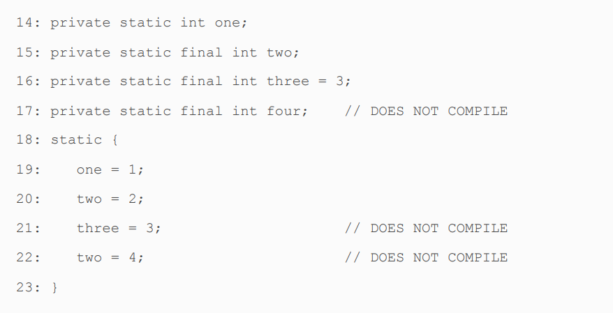
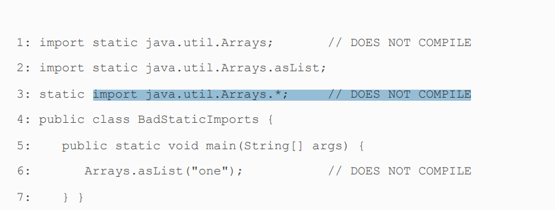
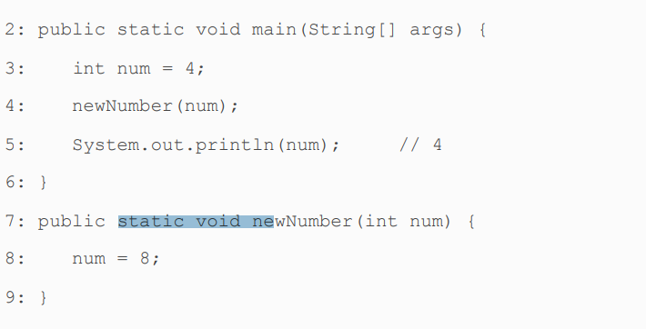

<br>

```html    
<span style="color: red">sadas</span>
<p style="font-family: Unispace">
public void walk1(int... nums){} <br>
public void walk1(int start,int... nums){} <br>
public void walk1(int... nums,int start){} <span style="color: red">DOES NOT COMPILE</span> <br>
public void walk1(int... start,int... nums){} <span style="color: red">DOES NOT COMPILE</span> <br>
</p>
```
> public void walk1(int... nums){} <br>
public void walk1(int start,int... nums){} <br>
public void walk1(int... nums,int start){} <span style="color: red">DOES NOT COMPILE</span> <br>
public void walk1(int... start,int... nums){} <span style="color: red">DOES NOT COMPILE</span> <br>

<br>


$$
\Gamma(z) = \int_0^\infty t^{z-1}e^{-t}dt\,.
$$

<br>

* VarArgs

  A varargs parameter must
  be the last element in a method’s parameter list. This means
  you are allowed to have only one varargs parameter per
  method.


<br>

<div style="padding: 25px;margin: 5px;background: linear-gradient(90deg, rgba(238,174,202,1) 0%, rgba(200,219,63,1) 100%)">
<p style="font-family: Unispace">
public void walk1(int... nums){} <br>
public void walk1(int start,int... nums){} <br>
public void walk1(int... nums,int start){} <span style="color: red">DOES NOT COMPILE</span> <br>
public void walk1(int... start,int... nums){} <span style="color: red">DOES NOT COMPILE</span> <br>
</p>


</div>
<br>

****
* private: Only accessible within the same class
* Default (package-private) access: private plus other classes in the same package
* protected: Default access plus child classes
* public: protected plus classes in the other packages


Remember to look at the reference type for a variable
when you see a static method or variable. The exam
creators will try to trick you into thinking a
NullPointerException is thrown because the variable
happens to be null. Don’t be fooled!

We hope you answered 5. There is only one count variable since
it is static. It is set to 4, then 6, and finally winds up as 5. All
the Koala variables are just distractions.
Koala.count = 4;
Koala koala1 = new Koala();
Koala koala2 = new Koala();
koala1.count = 6;
koala2.count = 5;
System.out.println(Koala.count);

The same thing happens for static methods. There is one
copy of the code. Parameters and local variables go on the
stack.



***

Line 1 tries to use a static import to import a class. Remember
that static imports are only for importing static members.
Regular imports are for importing a class. Line 3 tries to see
whether you are paying attention to the order of keywords. The
syntax is import static and not vice versa. Line 6 is sneaky.
The asList method is imported on line 2. However, the Arrays
class is not imported anywhere. This makes it okay to write
asList("one") but not Arrays.asList("one").


*/***
public void fly(int[] lengths) {}
public void fly(int... lengths) {} // DOES NOT COMPILE
rick question! Remember that Java treats varargs as if they
were an array. This means that the method signature is the
same for both methods. Since we are not allowed to overload
methods with the same parameter list, this code doesn’t
compile. Even though the code doesn’t look the same, it
compiles to the same parameter list.
***
You might be surprised to learn that these are not valid
overloads:
public void walk(List<String> strings) {}
public void walk(List<Integer> integers) {} // DOES NOT COMPILE
Java has a concept called type erasure where generics are used
only at compile time. That means the compiled code looks like
this:


[«« Go Back ««](https://github.com/MedetHasanUgurlu/Oracle-Certification) 