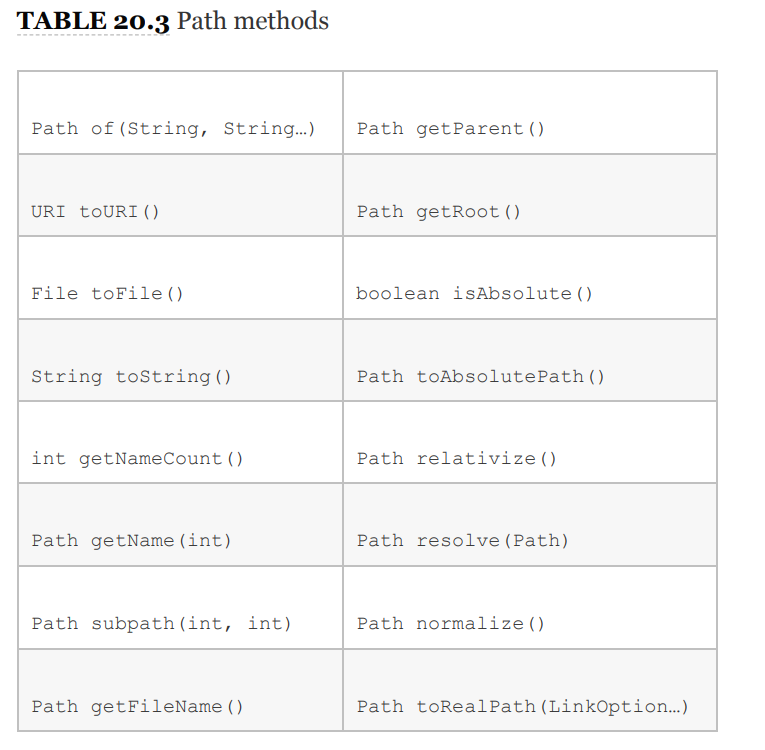
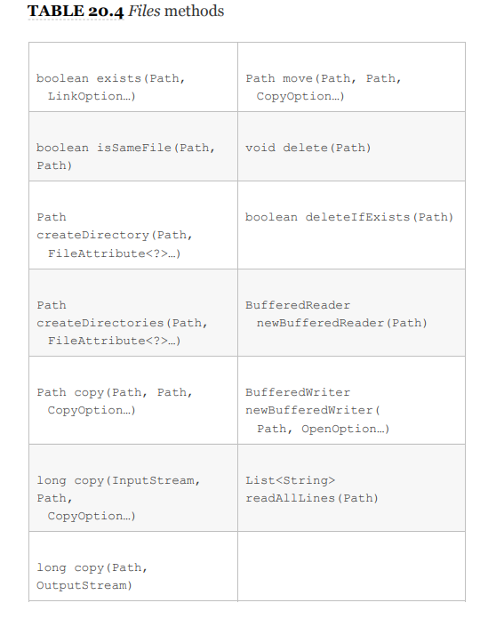
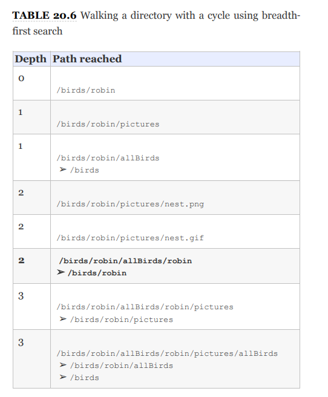

# NIO.2

we focus on the java.nio version 2 API, or NIO.2
for short, to interact with files. NIO.2 is an acronym that stands
for the second version of the **Non‐blocking Input/Output API**,
and it is sometimes referred to as the “**_New I/O._**”
## Introducing NIO.2

we mean that the preferred approach for working
with files and directories with newer software applications is to
use NIO.2, rather than java.io.File. As you'll soon see, the
NIO.2 provides many features and performance improvements
than the legacy class supported.

### INTRODUCING PATH
The cornerstone of NIO.2 is Path interface. It s replace of File.class.
They have similar properties; however, Path interface contains support for symbolic links.

A **symbolic link** is a special file within a file
system that serves as a reference or pointer to another file or
directory. For instance symbolic link from
/zoo/favorite to /zoo/cats/lion.

### CREATING PATH
Path is interface so can not create directly, we will use static-factory method to create a path objects.

#### Path.of()
    Path path = Path.of("pandas/cuddly.png"); RELATIVE PATH
    Path path2 = Path.of("c:\\zooinfo\\November\\employees.txt"); ABSOLUTE PATH
    Path path3 = Path.of("/home/zoodirectory"); ABSOLUTE PATH

#### Path.get()
    Path path1 = Paths.get("pandas/cuddly.png");
    Path path2 = Paths.get("c:\\zooinfo\\November\\employees.txt");
    Path path3 = Paths.get("/", "home", "zoodirectory");

#### Obtaining a Path with a URI Class

**A uniform resource identifier (URI)** is a string of
characters that identify a resource.

file:// for local file systems

http://, https://, and ftp:// for remote file systems.

#### Obtaining a Path from the FileSystem Class
FileSystems class creates instances of the abstract FileSystem class.
The FileSystem class includes methods for working with the file system directly.
In fact, both Paths.get() and Path.of() are actually shortcuts for this FileSystem

    Path path1 = FileSystems.getDefault().getPath("pandas/cuddly.png");
    Path path2 = FileSystems.getDefault().getPath("c:\\zooinfo\\November\\employees.txt");
    Path path3 = FileSystems.getDefault().getPath("/home/zoodirectory");

#### Obtaining a Path from the java.io.File Class

    File file = new File("husky.png");
    Path path = file.toPath();
    File backToFile = path.toFile();

These methods are available for convenience and also to help
facilitate integration between older and newer APIs.
### ABSOLUTE VS. RELATIVE PATHS

**Absolute:**
* /bird/parrot.png and /bird/../data/./info \
* c:/bird/parrot.png

**Relative**
* bird/parrot.png

### CONNECTING TO REMOTE FILE SYSTEMS
    
    FileSystem fileSystem = FileSystems.getFileSystem(new URI("http://www.selikoff.net"));
    Path path = fileSystem.getPath("duck.txt");

This code is useful when we need to construct Path objects
frequently for a remote file system. NIO.2 gives us the
power to connect to both local and remote file systems

### UNDERSTANDING COMMON NIO.2 FEATURES

#### Applying Path Symbols
Absolute and relative paths can contain path symbols. A path
symbol is a reserved series of characters that have special
meaning within some file systems.

#### Providing Optional Arguments

    Path path = Paths.get("schedule.xml");
    boolean exists = Files.exists(path, LinkOption.NOFOLLOW_LINKS);

## Interacting with Paths

Path instances are immutable. In the
following example, the Path operation on the second line is lost
since p is immutable.

    Path p = Path.of("whale");
    p.resolve("krill");
    System.out.println(p); // whale

Many of the methods available in the Path interface transform
the path value in some way and return a new Path object,
allowing the methods to be chained.

    Path.of("/zoo/../home").getParent().normalize().toAbsolutePath();

### VIEWING THE PATH WITH TOSTRING(), GETNAMECOUNT(), AND GETNAME()
The Path interface contains three methods to retrieve basic
information about the path representation.

    public String toString()
    public int getNameCount()
    public Path getName(int index)

The `getNameCount()` and `getName()` methods are often used in
conjunction to retrieve the number of elements in the path and
a reference to each element, respectively.

    Path path = Paths.get("/land/hippo/harry.happy");
    System.out.println("The Path Name is: " + path);
    for(int i=0; i<path.getNameCount(); i++) {
        System.out.println(" Element " + i + " is: " + path.getName(i));
    }
_**Result**_ \
_The Path Name is: /land/hippo/harry.happy\
Element 0 is: land\
Element 1 is: hippo\
Element 2 is: harry.happy_

Even though this is an absolute path, the root element is not
included in the list of names. As we said, these methods do not
consider the root as part of the path.

    var p = Path.of("/");
    System.out.print(p.getNameCount()); // 0
    System.out.print(p.getName(0)); // IllegalArgumentException

> Notice that if you try to call getName() with an invalid index, it
will throw an exception at runtime.

### CREATING A NEW PATH WITH SUBPATH()

The Path interface includes a method to select portions of a
path.

    public Path subpath(int beginIndex, int endIndex)

> The references are inclusive of the beginIndex, and exclusive of
the endIndex.

    var p = Paths.get("/mammal/omnivore/raccoon.image");
    System.out.println("Path is: " + p);
    for (int i = 0; i < p.getNameCount(); i++) {
        System.out.println(" Element " + i + " is: " + p.getName(i));
    }
    System.out.println();
    System.out.println("subpath(0,3): " + p.subpath(0, 3));
    System.out.println("subpath(1,2): " + p.subpath(1, 2));
    System.out.println("subpath(1,3): " + p.subpath(1, 3));

_**Result**_\
Path is: /mammal/omnivore/raccoon.image\
Element 0 is: mammal\
Element 1 is: omnivore\
Element 2 is: raccoon.image\
subpath(0,3): mammal/omnivore/raccoon.image\
subpath(1,2): omnivore\
subpath(1,3): omnivore/raccoon.image

    var q = p.subpath(0, 4); // IllegalArgumentException
    var x = p.subpath(1, 1); // IllegalArgumentException

> Like getNameCount() and getName(), subpath() is 0‐indexed and
does not include the root. Also like getName(), subpath() throws
an exception if invalid indices are provided.

### ACCESSING PATH ELEMENTS WITH GETFILENAME(), GETPARENT(), AND GETROOT()
    
    public Path getFileName()
    public Path getParent()
    public Path getRoot()

The `getFileName()` returns the Path element of the current file
or directory.\
`getParent()` returns the full path of the
containing directory.\
The getParent() returns null if operated
on the root path or at the top of a relative path.

    public void printPathInformation(Path path) {
        System.out.println("Filename is: " + path.getFileName());
        System.out.println(" Root is: " + path.getRoot());
        Path currentParent = path;
        while((currentParent = currentParent.getParent()) != null) {
            System.out.println(" Current parent is: " + currentParent);
        }
    }

**_Test_**\

    printPathInformation(Path.of("zoo"));
    printPathInformation(Path.of("/zoo/armadillo/shells.txt"));
    printPathInformation(Path.of("./armadillo/../shells.txt"));

**_Result_**\
_Filename is: zoo\
Root is: null\
Filename is: shells.txt\
Root is: /\
Current parent is: /zoo/armadillo\
Current parent is: /zoo\
Current parent is: /\
Filename is: shells.txt\
Root is: null\
Current parent is: ./armadillo/..\
Current parent is: ./armadillo\
Current parent is: ._

### CHECKING PATH TYPE WITH ISABSOLUTE() AND TOABSOLUTEPATH()

> The current working directory can be selected from
System.getProperty("user.dir"). This is the value that
toAbsolutePath() will use when applied to a relative path.

    var path1 = Paths.get("C:\\birds\\egret.txt");
    System.out.println("Path1 is Absolute? " + path1.isAbsolute());
    System.out.println("Absolute Path1: " + path1.toAbsolutePath());
    var path2 = Paths.get("birds/condor.txt");
    System.out.println("Path2 is Absolute? " + path2.isAbsolute());
    System.out.println("Absolute Path2 " + path2.toAbsolutePath());

assume the current working directory is /home/work.

**_Result_**\
Path1 is Absolute? true\
Absolute Path1: C:\birds\egret.txt\
Path2 is Absolute? false\
Absolute Path2 /home/work/birds/condor.txt

### JOINING PATHS WITH RESOLVE()

Suppose you want to concatenate paths in a similar manner as
we concatenate strings. The Path interface provides two
resolve() methods for doing just that.

    public Path resolve(Path other)
    public Path resolve(String other)

**Test**

    Path path1 = Path.of("/cats/../panther");
    Path path2 = Path.of("food");
    System.out.println(path1.resolve(path2));
_**Result**_\
/cats/../panther/food

### DERIVING A PATH WITH RELATIVIZE()
The Path interface includes a method for constructing the
relative path from one Path to another, often using path
symbols.

Using Relative

    var path1 = Path.of("fish.txt");
    var path2 = Path.of("friendly/birds.txt");
    System.out.println(path1.relativize(path2));
    System.out.println(path2.relativize(path1));

_**Result**_\
../friendly/birds.txt\
../../fish.txt

Using Absolute

    Path path3 = Paths.get("E:\\habitat");
    Path path4 = Paths.get("E:\\sanctuary\\raven\\poe.txt");
    System.out.println(path3.relativize(path4));
    System.out.println(path4.relativize(path3));

_**Result**_\
..\sanctuary\raven\poe.txt\
..\..\..\habitat\

    Path path1 = Paths.get("/primate/chimpanzee");
    Path path2 = Paths.get("bananas.txt");
    path1.relativize(path2); // IllegalArgumentException

> The relativize() method requires that both paths are absolute
or both relative and throws an exception if the types are mixed.

    Path path3 = Paths.get("c:\\primate\\chimpanzee");
    Path path4 = Paths.get("d:\\storage\\bananas.txt");
    path3.relativize(path4); // IllegalArgumentException

> On Windows‐based systems, it also requires that if absolute
paths are used, then both paths must have the same root
directory or drive a letter. 
 

### CLEANING UP A PATH WITH NORMALIZE()
Remember, the path symbol .. refers to the parent directory,
while the path symbol . refers to the current directory. We can
apply normalize() to some of our previous paths.

    var p1 = Path.of("./armadillo/../shells.txt");
    System.out.println(p1.normalize()); // shells.txt

    var p2 = Path.of("/cats/../panther/food");
    System.out.println(p2.normalize()); // /panther/food

    var p3 = Path.of("../../fish.txt");
    System.out.println(p3.normalize()); // ../../fish.txt

## Operating on Files and Directories

Most of the methods we covered in the Path interface operate
on theoretical paths, which are not required to exist within the
file system. What if you want to rename a directory, copy a file,
or read the contents of a file?
> Many of the names for the methods in the NIO.2 Files
class are a lot more straightforward than what you saw in
the java.io.File class. For example, the java.io.File
methods renameTo() and mkdir() have been changed to
move() and createDirectory(), respectively, in the Files
class.
### CHECKING FOR EXISTENCE WITH EXISTS()

The first example checks whether a file exists, while the second
example checks whether a directory exists.

    var b1 = Files.exists(Paths.get("/ostrich/feathers.png"));
    System.out.println("Path " + (b1 ? "Exists" : "Missing"));

    var b2 = Files.exists(Paths.get("/ostrich"));
    System.out.println("Path " + (b2 ? "Exists" : "Missing"));

### MAKING DIRECTORIES WITH CREATEDIRECTORY() AND CREATEDIRECTORIES()
The createDirectory() will create a directory and throw an
exception if it already exists or the paths leading up to the
directory do not exist.

The createDirectories() works just like the java.io.File
method mkdirs(), in that it creates the target directory along
with any nonexistent parent directories leading up to the path.

    Files.createDirectory(Path.of("/bison/field"));
    Files.createDirectories(Path.of("/bison/field/pasture/green"));

### COPYING FILES WITH COPY()
The NIO.2 Files class provides a method for copying files and
directories within the file system.

    Files.copy(Paths.get("/panda/bamboo.txt"), Paths.get("/panda-save/bamboo.txt"));
    Files.copy(Paths.get("/turtle"), Paths.get("/turtleCopy"));

> When directories are copied, the copy is shallow. A shallow
copy means that the files and subdirectories within the
directory are not copied. A deep copy means that the entire tree
is copied, including all of its content and subdirectories. 

### Copying and Replacing Files
if the target already exists, the copy() method will
throw an exception. You can change this behavior by providing
the StandardCopyOption enum value REPLACE_EXISTING to the
method. The following method call will overwrite the movie.txt
file if it already exists.

    Files.copy(Paths.get("book.txt"), Paths.get("movie.txt"), StandardCopyOption.REPLACE_EXISTING);

### Copying Files with I/O Streams
The Files class includes two copy() methods that operate with
I/O streams.

    public static long copy(InputStream in, Path target,CopyOption… options) throws IOException
    public static long copy(Path source, OutputStream out) throws IOException

The first method reads the contents of a stream and writes the
output to a file. The second method reads the contents of a file
and writes the output to a stream. They are quite convenient if
you need to quickly read/write data from/to disk.

    try (var is = new FileInputStream("source-data.txt")) {
    // Write stream data to a file
        Files.copy(is, Paths.get("/mammals/wolf.txt"));
    }
    Files.copy(Paths.get("/fish/clown.xsl"), System.out);

### Copying Files into a Directory

    var file = Paths.get("food.txt");
    var directory = Paths.get("/enclosure");
    Files.copy(file, directory);

_**Result**_\
throws an exception

> The command tries to create a new file, named /enclosure. Since
the path /enclosure already exists, an exception is thrown at
runtime. \
> if the directory did not exist, then it would
create a new file with the contents of food.txt, but it would be
called /enclosure.

**_Correct Way_**

    var file = Paths.get("food.txt");
    var directory = Paths.get("/enclosure/food.txt");
    Files.copy(file, directory);

> You also define directory using the resolve() method we saw
earlier, which saves you from having to write the filename
twice.

    var directory = Paths.get("/enclosure").resolve(file.getFileName());

### MOVING OR RENAMING PATHS WITH MOVE()

The Files class provides a useful method for moving or
renaming files and directories.

    public static Path move(Path source, Path target, CopyOption… options) throws IOException

Sample Code

    Files.move(Path.of("c:\\zoo"), Path.of("c:\\zoo-new"));
    Files.move(Path.of("c:\\user\\addresses.txt"),
    Path.of("c:\\zoo-new\\addresses2.txt"));

The first example renames the zoo directory to a zoo‐new
directory, keeping all of the original contents from the source
directory. The second example moves the addresses.txt file
from the directory user to the directory zoo‐new, and it renames
it to addresses2.txt.

### Similarities between move() and copy()
ike copy(), move() requires REPLACE_EXISTING to overwrite the
target if it exists, else it will throw an exception.\
copy(), move() will not put a file in a directory if the source is a
file and the target is a directory. Instead, it will create a new file
with the name of the directory.

### Performing an Atomic Move
**An atomic move** is one in which a file is moved within the file
system as a single indivisible operation. If the file system does not support this
feature, an AtomicMoveNotSupportedException will be thrown.

    Files.move(Path.of("mouse.txt"), Path.of("gerbil.txt"),StandardCopyOption.ATOMIC_MOVE);

### delete() AND deleteIfExist()
    public static void delete(Path path) throws IOException
    public static boolean deleteIfExists(Path path) throws IOException

The `delete()` method throws an exception if the path
does not exist, while the deleteIfExists() method returns true
if the delete was successful, and false otherwise.

    Files.delete(Paths.get("/vulture/feathers.txt"));
    Files.deleteIfExists(Paths.get("/pigeon"));

### newBufferedReader and newBufferedWriter()
NIO.2 includes two convenient methods for working with I/O
streams.

    public static BufferedReader newBufferedReader(Path path) throws IOException
    public static BufferedWriter newBufferedWriter(Path path,OpenOption… options) throws IOException

`newBufferedReader()`, reads the file specified at the Path location using a BufferedReader object.

    var path = Path.of("/animals/gopher.txt");
    try (var reader = Files.newBufferedReader(path)) {
        String currentLine = null;
        while((currentLine = reader.readLine()) != null)
        System.out.println(currentLine);
    }

`newBufferedWriter()`, writes to a file specified at the Path location using a BufferedWriter.

    var list = new ArrayList<String>();
    list.add("Smokey");
    list.add("Yogi");
    var path = Path.of("/animals/bear.txt");
    try (var writer = Files.newBufferedWriter(path)) {
        for(var line : list) {
            writer.write(line);
            writer.newLine();
        }
    }

### readAllLines()
The Files class includes a convenient method for turning the lines of a file into a List.

    public static List<String> readAllLines(Path path) throws IOException

var path = Path.of("/animals/gopher.txt");
final List<String> lines = Files.readAllLines(path);
lines.forEach(System.out::println);

> List<String> storing all the contents of the file in memory at once. If the file is significantly
large, then you may trigger an OutOfMemoryError trying to load
all of it into memory.

> All of these methods except exists() declare IOException.

## Managing File Attributes
A file
attribute is data about a file within the system, such as its size
and visibility, that is not part of the file contents.

### DISCOVERING FILE ATTRIBUTES

### isDirectory(), isSymbolicLink(), and isRegularFile()

Java defines a **_regular file_** as one that can contain
content, as opposed to a symbolic link, directory, resource, or
other nonregular file that may be present in some operating
systems. 

    System.out.print(Files.isDirectory(Paths.get("/canine/fur.jpg")));
    System.out.print(Files.isSymbolicLink(Paths.get("/canine/coyote")));
    System.out.print(Files.isRegularFile(Paths.get("/canine/types.txt")));

### isHidden(), isReadable(), isWritable(), and isExecutable()

    System.out.print(Files.isHidden(Paths.get("/walrus.txt")));
    System.out.print(Files.isReadable(Paths.get("/seal/baby.png")));
    System.out.print(Files.isWritable(Paths.get("dolphin.txt")));
    System.out.print(Files.isExecutable(Paths.get("whale.png")));

### size()
The size returned by this method represents the conceptual size
of the data, and this may differ from the actual size on the
persistent storage device.

    System.out.print(Files.size(Paths.get("/zoo/animals.txt")));

### Understanding Attribute and View Types

<table>
<thead style="font-weight: bold">The attributes and view types</thead>
<th>Attributes interface</th>
<th>View interface</th>
<th>Description</th>
<tr>
    <td>BasicFileAttribute</td>
    <td>BasicFileAttributeView</td>
    <td>Basic set ıf attributes supported by all file systems.</td>
</tr>
<tr>
    <td>DosFileAttributes</td>
    <td>DosFileAttributeView</td>
    <td>Basic set of attributes along with those supported by DOS/Windows-based systems</td>
</tr>
<tr>
    <td>PosixFileAttributes</td>
    <td>PosixFileAttributeView</td>
    <td>Basic set of attributes along with those supported by POSIX sytems, such as UNIX, Linux, Mac, etc.</td>
</tr>
</table>

## Applying Functional Programming
The Files class includes
some incredibly useful Stream API methods that operate on
files, directories, and directory trees.

### LISTING DIRECTORY CONTENTS
Files method lists the contents of a directory.

    public static Stream<Path> list(Path dir) throws IOException

The `Files.list()` is similar to the java.io.File method
`listFiles()`, except that it returns a `Stream<Path>` rather than a
`File[]`. _Since streams use lazy evaluation, this means the
method will load each path element as needed, rather than the
entire directory at once._

    try (Stream<Path> s = Files.list(Path.of("/home"))) {
    s.forEach(System.out::println);
    }

> Files.copy() method and showed that it only
performed a shallow copy of a directory. We can use the
Files.list() to perform a deep copy.

    public void copyPath(Path source, Path target) {
        try {
            Files.copy(source, target);
            if(Files.isDirectory(source))
                try (Stream<Path> s = Files.list(source)) {
                    s.forEach(p -> copyPath(p,target.resolve(p.getFileName())));
            }
        } catch(IOException e) {
        // Handle exception
        }
    }

### TRAVERSING A DIRECTORY TREE
Traversing a directory, also referred to as walking a directory
tree, is the process by which you start with a parent directory
and iterate over all of its descendants until some condition is
met or there are no more elements over which to iterate.

### Selecting a Search Strategy

There are two common strategies associated with walking a
directory tree: a **depth‐first search** and a **breadth‐first search.**

_A depth‐first search_ traverses the structure from the root to an
arbitrary leaf and then navigates back up toward the root,
traversing fully down any paths it skipped along the way.

_The search depth_ is the distance from the root to current node. To
prevent endless searching, Java includes a search depth that is
used to limit how many levels (or hops) from the root the
search is allowed to go.

> For the exam, you don't have to understand the details of each
search strategy that Java employs; you just need to be aware
that the NIO.2 Streams API methods use depth‐first searching
with a depth limit, which can be optionally changed.

### walk()
That's enough background information; let's get to more Steam
API methods. The Files class includes two methods for walking
the directory tree using a depth‐first search.

    public static Stream<Path> walk(Path start, FileVisitOption… options) throws IOException
    public static Stream<Path> walk(Path start, int maxDepth, FileVisitOption… options) throws IOException

The first
`walk()` method relies on a default maximum depth of
`Integer.MAX_VALUE`, while the overloaded version allows the
user to set a maximum depth. This is useful in cases where the
file system might be large and we know the information we are
looking for is near the root.

    private long getSize(Path p) {
        try {
            return Files.size(p);
        } catch (IOException e) {
            // Handle exception
        }
        return 0L;
    }

    public long getPathSize(Path source) throws IOException {
        try (var s = Files.walk(source)) {
            return s.parallel().filter(p -> !Files.isDirectory(p)).mapToLong(this::getSize).sum();
        }
    }

> The getSize() helper method is needed because Files.size()
declares IOException, and we'd rather not put a try/ catch
block inside a lambda expression.

    var size = getPathSize(Path.of("/fox/data"));
    System.out.format("Total Size: %.2f megabytes", (size/1000000.0));

_**Result**_\
Total Directory Tree Size: 15.30 megabytes

### Applying a Depth Limit

    try (var s = Files.walk(source, 5)) {...

### Avoiding Circular Paths
Many of our earlier NIO.2 methods traverse symbolic links by
default, with a `NOFOLLOW_LINKS` used to disable this behavior.
The walk() method is different in that it does not follow
symbolic links by default and requires the `FOLLOW_LINKS` option
to be enabled. We can alter our `getPathSize()` method to
enable following symbolic links by adding the _FileVisitOption_.

    try (var s = Files.walk(source, FileVisitOption.FOLLOW_LINKS)) {
    ...
> When traversing a directory tree, your program needs to be
careful of symbolic links if enabled. For example, if our process
comes across a symbolic link that points to the root directory of
the file system, then every file in the system would be searched!

Let's say we had a directory tree as shown
in picture with the symbolic link `/birds/robin/allBirds`
that points to `/birds`.

**What happens if we try to traverse this tree and follow all
symbolic links, starting with `/birds/robin`?**

After walking a distance of 1 from the start, we hit the symbolic
link `/birds/robin/allBirds` and go back to the top of the
directory tree /birds. That's OK because we haven't visited
`/birds` yet, so there's no cycle yet!\
Unfortunately, at depth 2, we encounter a cycle. We've already
visited the `/birds/robin directory` on our first step, and now
we're encountering it again. If the process continues, we'll be
doomed to visit the directory over and over again.

### find()
In the previous example, we applied a filter to the Stream<Path>
object to filter the results, although NIO.2 provides a more
convenient method.

    public static Stream<Path> find(Path start,int maxDepth,BiPredicate<Path,BasicFileAttributes> matcher,FileVisitOption… options) throws IOException

> The `find()` method behaves in a similar manner as the `walk()`
method, except that it takes a BiPredicate to filter the data. It
also requires a depth limit be set. Like `walk()`, `find()` also
supports the `FOLLOW_LINK` option.

    Path path = Paths.get("/bigcats");
    long minSize = 1_000;
    try (var s = Files.find(path, 10,(p, a) -> a.isRegularFile() && p.toString().endsWith(".java") && a.size() > minSize)) {
        s.forEach(System.out::println);
    }
### lines()

we presented `Files.readAllLines()` and
commented that using it to read a very large file could result in
an OutOfMemoryError problem. Luckily, NIO.2 solves this
problem with a Stream API method.

    public static Stream<String> lines(Path path) throws IOException

> The contents of the file are read and processed lazily, which
means that only a small portion of the file is stored in memory
at any given time.

    Path path = Paths.get("/fish/sharks.log");
    try (var s = Files.lines(path)) {
        s.forEach(System.out::println);
    }
we can leverage other stream methods for a more powerful example.

    Path path = Paths.get("/fish/sharks.log");
    try (var s = Files.lines(path)) {
        s.filter(f -> f.startsWith("WARN:")).map(f -> f.substring(5)).forEach(System.out::println);
    }

**_INPUT_**\
_INFO:Server starting\
DEBUG:Processes available = 10\
WARN:No database could be detected\
DEBUG:Processes available reset to 0\
WARN:Performing manual recovery\
INFO:Server successfully started_

**_RESULT_**\
No database could be detected\
Performing manual recovery

### Files.readAllLines() vs Files.readLines()
    Files.readAllLines(Paths.get("birds.txt")).forEach(System.out::println);
    Files.lines(Paths.get("birds.txt")).forEach(System.out::println);
The first line reads the entire file into memory and
performs a print operation on the result, while the second
line lazily processes each line and prints it as it is read.
The advantage of the second code snippet is that it does
not require the entire file to be stored in memory at any
time.

    Files.readAllLines(Paths.get("birds.txt")).filter(s -> s.length()> 2).forEach(System.out::println); //DOES NOT COMPILE
> The `readAllLines()` method returns a List, not a Stream,
so the `filter()` method is not available.

## Comparing Legacy java.io.File and NIO.2
In this table, file refers to an instance of the
java.io.File class, while path and otherPath refer to instances
of the NIO.2 Path interface.

