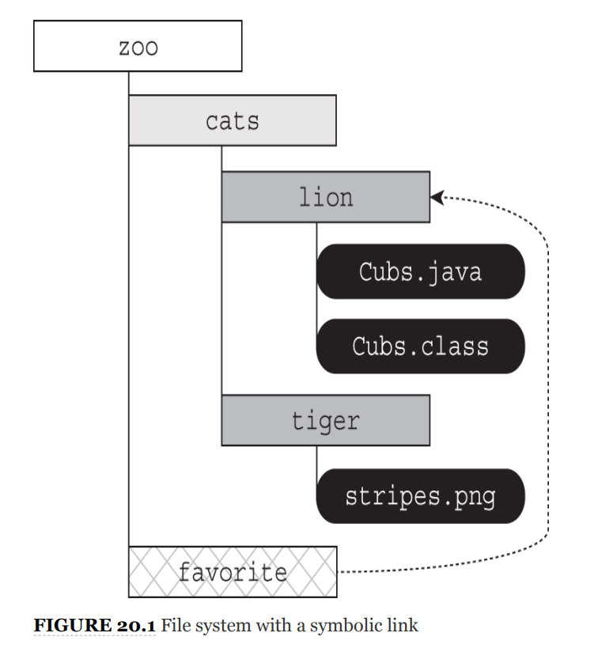
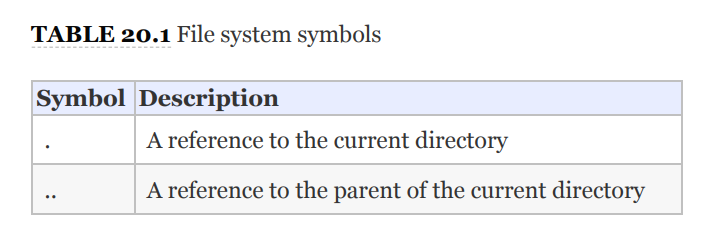
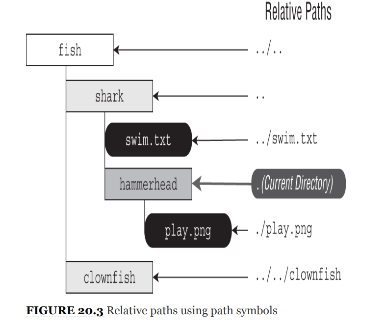

# NIO.2

we focus on the java.nio version 2 API, or NIO.2
for short, to interact with files. NIO.2 is an acronym that stands
for the second version of the **Non‐blocking Input/Output API**,
and it is sometimes referred to as the “**_New I/O._**”
## Introducing NIO.2

we mean that the preferred approach for working
with files and directories with newer software applications is to
use NIO.2, rather than java.io.File. As you'll soon see, the
NIO.2 provides many features and performance improvements
than the legacy class supported.

### INTRODUCING PATH
The cornerstone of NIO.2 is Path interface. It s replace of File.class.
They have similar properties; however, Path interface contains support for symbolic links.

A **symbolic link** is a special file within a file
system that serves as a reference or pointer to another file or
directory. For instance symbolic link from
/zoo/favorite to /zoo/cats/lion.

### CREATING PATH
Path is interface so can not create directly, we will use static-factory method to create a path objects.

#### Path.of()
    Path path = Path.of("pandas/cuddly.png"); RELATIVE PATH
    Path path2 = Path.of("c:\\zooinfo\\November\\employees.txt"); ABSOLUTE PATH
    Path path3 = Path.of("/home/zoodirectory"); ABSOLUTE PATH

#### Path.get()
    Path path1 = Paths.get("pandas/cuddly.png");
    Path path2 = Paths.get("c:\\zooinfo\\November\\employees.txt");
    Path path3 = Paths.get("/", "home", "zoodirectory");

#### Obtaining a Path with a URI Class

**A uniform resource identifier (URI)** is a string of
characters that identify a resource.

file:// for local file systems

http://, https://, and ftp:// for remote file systems.

#### Obtaining a Path from the FileSystem Class
FileSystems class creates instances of the abstract FileSystem class.
The FileSystem class includes methods for working with the file system directly.
In fact, both Paths.get() and Path.of() are actually shortcuts for this FileSystem

    Path path1 = FileSystems.getDefault().getPath("pandas/cuddly.png");
    Path path2 = FileSystems.getDefault().getPath("c:\\zooinfo\\November\\employees.txt");
    Path path3 = FileSystems.getDefault().getPath("/home/zoodirectory");

#### Obtaining a Path from the java.io.File Class

    File file = new File("husky.png");
    Path path = file.toPath();
    File backToFile = path.toFile();

These methods are available for convenience and also to help
facilitate integration between older and newer APIs.
### ABSOLUTE VS. RELATIVE PATHS

**Absolute:**
* /bird/parrot.png and /bird/../data/./info \
* c:/bird/parrot.png

**Relative**
* bird/parrot.png

### CONNECTING TO REMOTE FILE SYSTEMS
    
    FileSystem fileSystem = FileSystems.getFileSystem(new URI("http://www.selikoff.net"));
    Path path = fileSystem.getPath("duck.txt");

This code is useful when we need to construct Path objects
frequently for a remote file system. NIO.2 gives us the
power to connect to both local and remote file systems

### UNDERSTANDING COMMON NIO.2 FEATURES

#### Applying Path Symbols
Absolute and relative paths can contain path symbols. A path
symbol is a reserved series of characters that have special
meaning within some file systems.

#### Providing Optional Arguments

    Path path = Paths.get("schedule.xml");
    boolean exists = Files.exists(path, LinkOption.NOFOLLOW_LINKS);

## Interacting with Paths

Path instances are immutable. In the
following example, the Path operation on the second line is lost
since p is immutable.

    Path p = Path.of("whale");
    p.resolve("krill");
    System.out.println(p); // whale

Many of the methods available in the Path interface transform
the path value in some way and return a new Path object,
allowing the methods to be chained.

    Path.of("/zoo/../home").getParent().normalize().toAbsolutePath();

### VIEWING THE PATH WITH TOSTRING(), GETNAMECOUNT(), AND GETNAME()
The Path interface contains three methods to retrieve basic
information about the path representation.

    public String toString()
    public int getNameCount()
    public Path getName(int index)

The `getNameCount()` and `getName()` methods are often used in
conjunction to retrieve the number of elements in the path and
a reference to each element, respectively.

    Path path = Paths.get("/land/hippo/harry.happy");
    System.out.println("The Path Name is: " + path);
    for(int i=0; i<path.getNameCount(); i++) {
        System.out.println(" Element " + i + " is: " + path.getName(i));
    }
_**Result**_ \
_The Path Name is: /land/hippo/harry.happy\
Element 0 is: land\
Element 1 is: hippo\
Element 2 is: harry.happy_

Even though this is an absolute path, the root element is not
included in the list of names. As we said, these methods do not
consider the root as part of the path.

    var p = Path.of("/");
    System.out.print(p.getNameCount()); // 0
    System.out.print(p.getName(0)); // IllegalArgumentException

> Notice that if you try to call getName() with an invalid index, it
will throw an exception at runtime.

### CREATING A NEW PATH WITH SUBPATH()

The Path interface includes a method to select portions of a
path.

    public Path subpath(int beginIndex, int endIndex)

> The references are inclusive of the beginIndex, and exclusive of
the endIndex.

    var p = Paths.get("/mammal/omnivore/raccoon.image");
    System.out.println("Path is: " + p);
    for (int i = 0; i < p.getNameCount(); i++) {
        System.out.println(" Element " + i + " is: " + p.getName(i));
    }
    System.out.println();
    System.out.println("subpath(0,3): " + p.subpath(0, 3));
    System.out.println("subpath(1,2): " + p.subpath(1, 2));
    System.out.println("subpath(1,3): " + p.subpath(1, 3));

_**Result**_\
Path is: /mammal/omnivore/raccoon.image\
Element 0 is: mammal\
Element 1 is: omnivore\
Element 2 is: raccoon.image\
subpath(0,3): mammal/omnivore/raccoon.image\
subpath(1,2): omnivore\
subpath(1,3): omnivore/raccoon.image

    var q = p.subpath(0, 4); // IllegalArgumentException
    var x = p.subpath(1, 1); // IllegalArgumentException

> Like getNameCount() and getName(), subpath() is 0‐indexed and
does not include the root. Also like getName(), subpath() throws
an exception if invalid indices are provided.

