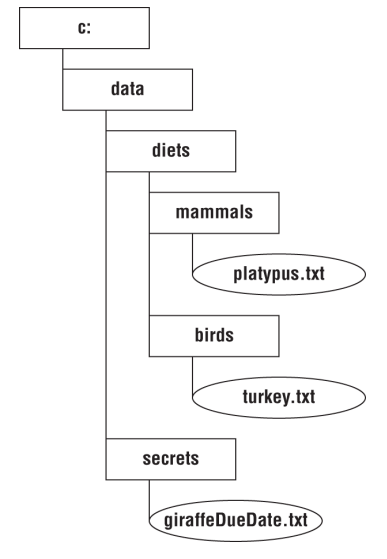

# Security

## Designing a Secure Object

Java provides us with many tools to protect the objects that we
create. In this section, we will look at access control,
extensibility, validation, and creating immutable objects. All of
these techniques can protect your objects from Hacker Harry.

### LIMITING ACCESSIBILITY
    package animals.security;
        public class ComboLocks {
            public Map<String, String> combos;
    }
A key security principle is to limit access as much as possible. Think of it as “need to know”
for objects. This is called the _principle of least privilege_.\
It would be better to make the combos object private and write a method to provide the
necessary functionality.

    package animals.security;

    public class ComboLocks {
        private Map<String, String> combos;
        public boolean isComboValid(String animal, String combo) {
            var correctCombo = combos.get(animal);
            return combo.equals(correctCombo);
        }
    }
    

This is far better; we don't expose the combinations map to any
classes outside the ComboLocks class. For example, package‐
private is better than public, and private is better than
package‐private.

> If your application is using modules, you can do even better by only
exporting the security packages to the specific modules that
should have access.
    
    exports animals.security to zoo.staff;

### RESTRICTING EXTENSIBILITY

Suppose you are working on a class that uses ComboLocks.

    public class GrasshopperCage {
        public static void openLock(ComboLocks comboLocks, String combo) {
            if (comboLocks.isComboValid("grasshopper", combo)){
                System.out.println("Open!");
            }
        }
    }

Ideally, the first variable passed to this method is an instance of
the `ComboLocks` class. However, Hacker Harry is hard at work
and has created this subclass of `ComboLocks`.

    public class EvilComboLocks extends ComboLocks {

        public boolean isComboValid(String animal, String combo) {
            var valid = super.isComboValid(animal, combo);
            if (valid) {
                // email the password to Hacker Harry
            }
        return valid;
        }
    }

Marking a sensitive class as **`final`** prevents any subclasses.

    public final class ComboLocks {

        private Map<String, String> combos;
        // instantiate combos object
        public boolean isComboValid(String animal, String combo) {
            var correctCombo = combos.get(animal);
            return combo.equals(correctCombo);
        }
    }

### CREATING IMMUTABLE OBJECTS
An immutable object is one that cannot change
state after it is created.

Immutable objects are helpful when
writing **secure code** because you don't have to worry about the
values changing.
They also simplify code when dealing with
**concurrency**.

`String`, `List.of()`, `Set.of()`, and `Map.of()`. All three of these methods return
immutable types.

Strategy for making a class immutable.
1. Mark the class as final.
2. Mark all the instance variables private.
3. Don't define any setter methods and make fields final. 
4. Don't allow referenced mutable objects to be modified. DON'T EXPOSE MUTABLE OBJECT WITH USING GETTER
5. Use a constructor to set all properties of the object, making a copy if needed.

    import java.util.*;
    
    public final class Animal {
        private final ArrayList<String> favoriteFoods;
    
        public Animal() {
            this.favoriteFoods = new ArrayList<String>();
            this.favoriteFoods.add("Apples");
        }
        public List<String> getFavoriteFoods() {
            return favoriteFoods;
        }
    }

Hacker Harry is tricky, though. He decides to send us a favoriteFood
object but keep his own secret reference to it, which he can
modify directly.

        var favorites = new ArrayList<String>();
        favorites.add("Apples");
        Animal animal = new Animal(favorites);
        System.out.println(animal.getFavoriteFoodsCount());
        favorites.clear();
        System.out.println(animal.getFavoriteFoodsCount());

**_Result_**\
1\
0

It seems like
Animal is not immutable anymore, since its contents can change
after it is created. The solution is to use a _**copy constructor**_ to
make a copy of the list object containing the same elements.

    public Animal(ArrayList<String> favoriteFoods){
        this.favoriteFoods = new ArrayList<>(favoriteFoods);
    }
**_Result_**\
1\
1

### CLONING OBJECTS

Java has a `Cloneable` interface that you can implement if you
want classes to be able to call the `clone()` method on your
object. This helps with making defensive copies.

    this.favoriteFoods = (ArrayList) favoriteFoods.clone();

## Introducing Injection and Input Validation

### PREVENTING INJECTION WITH A PREPAREDSTATEMENT
WAITING FOR JDBC SECTION

### INVALIDATING INVALID INPUT WITH VALIDATION
SQL injection isn't the only type of injection. Command
injection is another type that uses operating system commands
to do something unexpected.

    Console console = System.console();
    String dirName = console.readLine();
    Path path = Paths.get("c:/data/diets/" + dirName);
    try (Stream<Path> stream = Files.walk(path)) {
        stream.filter(p -> p.toString().endsWith(".txt")).forEach(System.out::println);
    }

We tested it by typing in mammals and got the expected output.

_**Result**_ \
c:/data/diets/mammals/Platypus.txt

Then Hacker Harry came along and typed .. as the directory
name.

**_Input_** \
c:/data/diets/../secrets/giraffeDueDate.txt\
c:/data/diets/../diets/mammals/Platypus.txt\
c:/data/diets/../diets/birds/turkey.txt

Oh, no! Hacker Harry knows we are expecting a baby giraffe
just from the filenames. We were not intending for him to see
the secrets directory.

We will use a whitelist that
allows us to specify which values are allowed.

    Console console = System.console();
        String dirName = console.readLine();
        if (dirName.equals("mammal") || dirName.equals("birds")) {
            Path path = Paths.get("c:/data/diets/" + dirName);
            try (Stream<Path> stream = Files.walk(path)) {
                stream.filter(p -> p.toString().endsWith(".txt")).forEach(System.out::println);
        }
    }

## Working with Confidential Information

When working on a project, you will often encounter
confidential or sensitive data. Sometimes there are even laws
that mandate proper handling of data

he is careful what methods she calls in these sensitive contexts
to ensure confidential information doesn't escape. Such
sensitive contexts include the following:
Writing to a log file
Printing an exception or stack trace
System.out and System.err messages
Writing to data files

### PROTECTING DATA IN MEMORY
If application crashes, it may generate a dump file. That
contains values of everything in memory.

> When calling the `readPassword()` on Console, it returns a` char[]`
instead of a `String`. This is safer for two reasons.
1. It is not stored as a String, so Java won't place it in the String
   pool, where it could exist in memory long after the code that
   used it is run.
2. You can null out the value of the array element rather than
   waiting for the garbage collector to do it.\
 

      Console console = System.console();
      char[] password = console.readPassword();
      Arrays.fill(password, 'x');
 

      LocalDate dateOfBirth = getDateOfBirth();
      // use date of birth
      dateOfBirth = null;

> When the sensitive data cannot be overwritten, it is good
practice to set confidential data to null when you're done using
it. If the data can be garbage collected, you don't have to worry
about it being exposed later.

### LIMITING FILE ACCESS

    grant {
        permission java.io.FilePermission
        "C:\\water\\fish.txt",
        "read";
    };

This policy gives the programmer permission to read, but not
update, the fish.txt file. 

## Serializing and Deserializing Objects

Imagine we are storing data in an Employee record. We want to
write this data to a file and read this data back into memory,
but we want to do so without writing any potentially sensitive
data to disk.

>  Java skips calling the constructor
when deserializing an object. This means it is important not to
rely on the constructor for custom validation logic.

    import java.io.*;
    public class Employee implements Serializable {
        private String name;
        private int age;
        // Constructors/getters/setters
    }

### SPECIFYING WHICH FIELDS TO SERIALIZE

Our zoo has decided that employee age information is sensitive
and shouldn't be written to disk.

you can specify fields to be serialized in an array.

    private static final ObjectStreamField[] serialPersistentFields = { new ObjectStreamField("name", String.class) };

You can think of serialPersistentFields as the opposite of
transient. The former is a whitelist of fields that should be
serialized, while the latter is a blacklist of fields that should not.

### CUSTOMIZING THE SERIALIZATION PROCESS
Security may demand custom serialization. In our case, we got
a new requirement to add the Social Security number to our
object.

Unlike age, we do need to
serialize this information. However, we don't want to store the
Social Security number in plain text, so we need to write some
custom code.

    import java.io.*;
    public class Employee implements Serializable {
        private String name;
        private String ssn;
        private int age;
        
        // Constructors/getters/setters
        private static final ObjectStreamField[] serialPersistentFields = { new ObjectStreamField("name", String.class), new ObjectStreamField("ssn", String.class) };
        
        private static String encrypt(String input) {
            // Implementation omitted
        }
        private static String decrypt(String input) {
            // Implementation omitted
        }
        
        private void writeObject(ObjectOutputStream s) throws Exception {
            ObjectOutputStream.PutField fields = s.putFields();
            fields.put("name", name);
            fields.put("ssn", encrypt(ssn));
            s.writeFields();
        }
        private void readObject(ObjectInputStream s) throws Exception {
            ObjectInputStream.GetField fields = s.readFields();
            this.name = (String)fields.get("name", null);
            this.ssn = decrypt((String)fields.get("ssn", null));
        }
    }

### PRE/POST-SERIALIZATION PROCESSING

Suppose our zoo employee application is having a problem with
duplicate records being created for each employee. They decide
that they want to maintain a list of all employees in memory
and only create users as needed. Furthermore, each employee's
name is guaranteed to be unique. Unlikely in practice we know,
but this is a special zoo!
From what you learned about concurrent collections and factory methods, we can accomplish
this with a private constructor and factory method.

    import java.io.*;
    import java.util.Map;
    import java.util.concurrent.ConcurrentHashMap;
    
    public Employee{
      private int id;
      private String name;
      private Employee(){
      }
      
      private static Map<String,Emplpyee> pool = new ConcurrentHashMap<>();
      
      public synchronized static Employee(String name){
          if(pool.get(name)== null){ 
              Employee e  = new Employee();
              e.setName(name);
              pool.put(name,e);
              return e;
          }
          return pool.get(name);
          
      }
   }

### readResolve()
When someone reads the data
from the disk, it deserializes it into a new object, not the one in
memory pool. This could result in two users holding different
versions of the Employee in memory!

Enter the readResolve() method. When this method is present,
it is run after the readObject() method and is capable of
replacing the reference of the object returned by
deserialization.

 

      import java.io.*;
      import java.util.Map;
      import java.util.concurrent.ConcurrentHashMap;
      public class Employee implements Serializable {
         …
         public synchronized Object readResolve() throws ObjectStreamException {
            var existingEmployee = pool.get(name);
            if(pool.get(name) == null) {
               // New employee not in memory
               pool.put(name, this);
               return this;
            } else {
               // Existing user already in memory
               existingEmployee.name = this.name;
               existingEmployee.ssn = this.ssn;
               return existingEmployee;
             }
         }
      }
> Notice that we added the `synchronized` modifier to this method.
Java allows any method modifiers (except `static`) for the
`readResolve()` method including any access modifier. This rule
applies to `writeReplace()`, which is up next.

### writeReplace()

      import java.io.*;
         import java.util.Map;
         import java.util.concurrent.ConcurrentHashMap;
         public class Employee implements Serializable {
         …
         public Object writeReplace() throws ObjectStreamException {
         var e = pool.get(name);
         return e != null ? e : this;
         }
      }

<h4> Methods for serialization and deserialization</h4>
<table>
<th>Return Type</th>
<th>Method</th>
<th>Parameters</th>
<th>Description</th>
<tr>
<td>Object</td>
<td>writeReplace()</td>
<td>None</td>
<td>Allows replacement of object before serialization</td>
</tr>

<tr>
<td>void</td>
<td>writeObject()</td>
<td>ObjectInputStream</td>
<td>Serializes optionally using PutField</td>
</tr>

<tr>
<td>void</td>
<td>readObject()</td>
<td>ObjectOutputStream</td>
<td>Deserializes optionally using GetField</td>
</tr>

<tr>
<td>Object</td>
<td>readResolve()</td>
<td>None</td>
<td>Allows replacement of object after deserializetion</td>
</tr>

</table>

## Constructing Sensitive Objects

Let us have a simple FoodOrder class.

      public class FoodOrder {
         private String item;
         private int count;
      
          public FoodOrder(String item, int count) {
              setItem(item);
              setCount(count);
          }
      
          public static int total(List<FoodOrder> orders) {
              return orders.stream()
                      .mapToInt(FoodOrder::getCount)
                      .sum();
          }
      
          public String getItem() {
              return item;
          }
          public void setItem(String item) {
              this.item = item;
          }
          public int getCount() {
              return count;
          }
          public void setCount(int count) {
              this.count = count;
          }
      }

Hacker Harry extend the his class to our class then change code.

      public class HackerHarryFoodOrder extends FoodOrder{
          public HackerHarryFoodOrder(String item, int count) {
              super(item, count);
          }
      
          @Override
          public int getCount() {
              return super.getCount();
          }
      
          @Override
          public void setCount(int count) {
              super.setCount(0);
          }
      }

As you can see, count always will be 0, so we should prevent these.
1. MAKING METHODS FINAL
2. MAKING CLASSES FINAL
3. MAKING THE CONSTRUCTOR PRIVATE

### HOW TO PROTECT THE SOURCE CODE

Since this chapter is about Java SE applications, the
person running your program will have access to the code.
More specifically, they will have the bytecode ( .class)
files, typically bundled in a JAR file. With the bytecode,
Hacker Harry can decompile your code and get source
code. It's not as well written as the code you wrote, but it
has equivalent information.

Some people compile their projects with obfuscation tools
to try to hide implementation details. **Obfuscation** is the
automated process of rewriting source code that
purposely makes it more difficult to read. For example, if
you try to view JavaScript on a website, entire methods or
classes may be on a single line with variable names like
aaa, bbb, ccc, and so on. It's harder to know what a
method does if it's named `gpiomjrqw()`.

## Preventing Denial of Service Attacks
A **denial of service (DoS)** attack is when a hacker makes one or
more requests with the intent of disrupting legitimate requests.
Most denial of service attacks require multiple requests to
bring down their targets. Some attacks send a very large
request that can even bring down the application in one shot.
In this book, we will focus on denial of service attacks.

Unless otherwise specified, a denial of service attack comes
from one machine. It may make many requests, but they have
the same origin. By contrast, a **distributed denial of service
(DDoS)** attack is a denial of service attack that comes from
many sources at once.

### LEAKING RESOURCES

One way that Hacker Harry can mount a denial of service
attack is to take advantage of poorly written code. This simple
method counts the number of lines in a file using NIO.2
methods.

      public long countLines(Path path) throws IOException {
         return Files.lines(path).count();
      }
the method opens a file system resource and never closes it,
there is a resource leak. After Hacker Harry calls the method
enough times, the program crashes because there are no more
file handles available.

a fixes the code by using the _try‐with‐resources statement_

      public long countLines(Path path) throws IOException {
         try (var stream = Files.lines(path)) {
            return stream.count();
         }
      }

### READING VERY LARGE RESOURCES

Another source of a denial of service attacks is very large
resources. Suppose we have a simple method that reads a file
into memory, does some transformations on it, and writes it to
a new file.

      public void transform(Path in, Path out) throws IOException {
         var list = Files.readAllLines(in);
         list.removeIf(s -> s.trim().isBlank());
         Files.write(out, list);
      }

wever, on an extremely
large file, your program could run out of memory and crash.
Hacker Harry strikes again! To prevent this problem, you can
check the size of the file before reading it.

### INCLUDING POTENTIALLY LARGE RESOURCES

An **inclusion attack** is when multiple files or components are
embedded within a single file. Any file that you didn't create is
suspect. Some types can appear smaller than they really are.
For example, some types of images can have a “**_zip bomb_**”
where the file is heavily compressed on disk. When you try to
read it in, the file uses much more space than you thought.

Extensible Markup Language (XML) files can have the same
problem. One attack is called the “_billion laughs attack_” where
the file gets expanded exponentially.

> The reason these files can become unexpectedly large is that
they can include other entities. This means something that is 1
KB can become exponentially larger if it is included enough
times.

### OVERFLOWING NUMBERS

