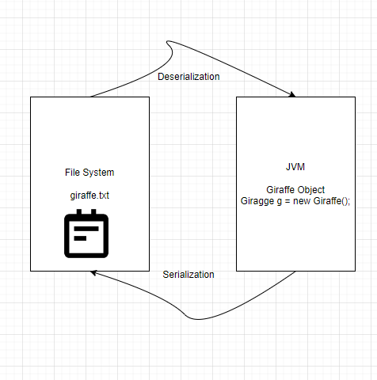
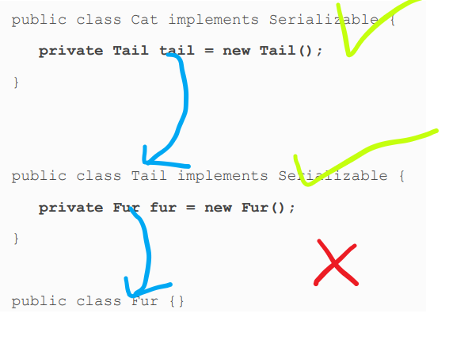

# I/O
Next, the root directory is the topmost directory in the file
system, from which all files and directories inherit. In
Windows, it is denoted with a drive name such as c:\, while on
Linux it is denoted with a single forward slash, /.

    File file = new File("C:\\Users\\mdths\\IdeaProjects\\Oracle Certification\\src\\main\\java\\org\\medron\\ıo\\pack\\test.txt");

### Byte Stream vs Character Stream

    <table>
        <th>Byte Stream</th>
        <th>Character Stream</th>
        <tr>
            <td>1,0</td>
            <td>text, data</td>    
        </tr>
        <tr>
            <td>InputStream,OutputStream</td>
            <td>Reader,Writer</td>    
        </tr>
    </table>

### CHARACTER ENCODING

    Charset usAsciiCharset = Charset.forName("US-ASCII");
    Charset utf8Charset = Charset.forName("UTF-8");
    Charset utf16Charset = Charset.forName("UTF-16");

### Low-Level vs. High-Level Streams

* High-Level stream wraps the low-level stream.

    BufferedReader bufferedReader = new BufferedReader(new FileReader(new File("C:\\Users\\mdths\\IdeaProjects\\Oracle Certification\\src\\main\\java\\org\\medron\\ıo\\pack\\test.txt")));

    try (var ois = new ObjectInputStream(new BufferedInputStream(new FileInputStream("zoo-data.txt")))) {
        System.out.print(ois.readObject());
    }

    new BufferedInputStream(new FileReader("z.txt")); // DOES NOT COMPILE (Stream and Reader mixed.) \
    new BufferedWriter(new FileOutputStream("z.txt")); // DOES NOT COMPILE (Stream and Reader mixed.)\
    new ObjectInputStream(new FileOutputStream("z.txt")); // DOES NOT COMPILE (InputStream and OutputStream mixed) \
    new BufferedInputStream(new InputStream()); // (can not create instance from interface) DOES NOT COMPILE

## READING AND WRITING DATA

InputStream, OutputStream, Writer and Reader

    public int read() throws IOException
    public void write(int b) throws IOException

> In both examples, ‐1 is used to indicate the end of the stream.

    void copyStream(InputStream in, OutputStream out) throws IOException{
        int b;
        while ((b = in.read()) != -1) {
            out.write(b);
        }
    }

    void copyStream(Reader in, Writer out) throws IOException {
        int b;
        while ((b = in.read()) != -1) {
            out.write(b);
        }
    }

### CLOSING THE STREAM
Using close() method is enough. However, we prefer using try with resource.

    try( FileOutputStream fileWriter = new FileOutputStream(file)){
        fileWriter.write(bytes);
    }
    

    

### mark() and reset()

    public void readData(InputStream is) throws IOException {
    System.out.print((char) is.read()); // L
    if (is.markSupported()) {
    is.mark(100); // Marks up to 100 bytes
    System.out.print((char) is.read()); // I
    System.out.print((char) is.read()); // O
    is.reset(); // Resets stream to position before I
    }
    System.out.print((char) is.read()); // I
    System.out.print((char) is.read()); // O
    System.out.print((char) is.read()); // N
    }

## WHY USE THE BUFFERED CLASSES?

    void copyFileWithBuffer(File src, File dest) throws IOException {
        try (var in = new BufferedInputStream(new FileInputStream(src));
             var out = new BufferedOutputStream(new FileOutputStream(dest))) {
            var buffer = new byte[1024];
            int lengthRead;

            while ((lengthRead = in.read(buffer))> 0) {
                out.write(buffer, 0, lengthRead);
            out.flush();
            }
        }
    }

## Concrete Class

    <table>
        <th>Stream Class</th>
        <th>Method Name</th>
        <th>Description</th>
        <tr>
            <td>All streams</td>
            <td>void close()</td>
            <td>Closes stream and releases resources</td> 
        </tr>
        <tr>
            <td>All input streams</td>
            <td>int read()</td>
            <td>Reads a single byte or returns ‐1 if no bytes were available</td> 
        </tr>
        <tr>
            <td>InputStream</td>
            <td>int read(byte[] b)</td>
            <td>Reads values into a buffer.Returns number of bytes read</td> 
        </tr>
        <tr>
            <td>Reader</td>
            <td>int read(char[] c)</td>
            <td>Reads values into a buffer.Returns number of bytes read</td> 
        </tr>
        <tr>
            <td>InputStream</td>
            <td>int read(byte[] b,int offset,int length)</td>
            <td>Reads up to length values into a buffer starting from position offset. Returns number of bytes read </td> 
        </tr>
        <tr>
            <td>Reader</td>
            <td>int read(char[] c,int offset,int length)</td>
            <td>Reads up to length values into a buffer starting from position offset. Returns number of bytes read </td> 
        </tr>
    </table>

## BUFFERING CHARACTER DATA

    void copyTextFileWithBuffer(File src, File dest) throws IOException {

        try (var reader = new BufferedReader(new FileReader(src));
             var writer = new BufferedWriter(new FileWriter(dest))) {

            String s;
            while ((s = reader.readLine()) != null) {
                writer.write(s);
                writer.newLine();
            }
        }
    }

## SERIALIZING DATA

**Serialization** is the process of converting an in‐memory object to a byte stream.\
**Deserialization** is the process of converting from a byte stream into an object.

> Any field that is marked **_transient_** will not be saved to a stream when the class is serialized.

### SERIALVERSIONUID

     private static final long serialVersionUID = 1L;

A static serialVersionUID variable in every class that implements Serializable. The version is stored with each object as part of serialization.
Then, every time the class structure changes, this value is updated or incremented.

Generally, we use transient for password. We don't want to include password in stream.

### How to Make a Class-Serializable
* The class must be marked Serializable.
* Every instance member of the class is serializable, marked
transient, or has a null value at the time of serialization.

### Storing Data with ObjectOutputStream and ObjectInputStream
The ObjectInputStream class is used to deserialize an object
from a stream, while the ObjectOutputStream is used to serialize
an object to a stream. They are high‐level streams that operate
on existing streams.

    public ObjectInputStream(InputStream in) throws IOException
    public ObjectOutputStream(OutputStream out) throws IOException

for exam, you should know this method.

    // ObjectInputStream
    public Object readObject() throws IOException, ClassNotFoundException
    // ObjectOutputStream
    public void writeObject(Object obj) throws IOException

Serialize the gorillas.

    void saveToFile(List<Gorilla> gorillas, File file) throws Exception {

        try(ObjectOutputStream outputStream = new ObjectOutputStream(new BufferedOutputStream(new FileOutputStream(file)))){
            for(Gorilla gorilla: gorillas){
                outputStream.writeObject(gorilla);
            }
        }
    }

Deserialize the gorillas.

    List<Gorilla> readFromFile(File file) throws Exception {
        List<Gorilla> gorillas = new ArrayList<>();
        try(ObjectInputStream objectInputStream = new ObjectInputStream(new BufferedInputStream(new FileInputStream(file)))){
            while (true){
                var object = objectInputStream.readObject();
                if(object instanceof Gorilla){
                    gorillas.add((Gorilla) object);
                }
            }
        }catch (EOFException e){
            e.printStackTrace();
        }
        return gorillas;
    }

Test

    var gorillas = new ArrayList<Gorilla>();
    gorillas.add(new Gorilla("Grodd", 5, false));
    gorillas.add(new Gorilla("Ishmael", 8, true));
    File dataFile = new File("gorilla.data");
    saveToFile(gorillas, dataFile);
    var gorillasFromDisk = readFromFile(dataFile);
    System.out.print(gorillasFromDisk);

Result\
[[name=Grodd, age=5, friendly=false],[name=Ishmael, age=8, friendly=true]]

### PRINTING DATA
PrintStream and PrintWriter are high‐level output print
streams classes that are useful for writing text data to a stream.

The print stream classes have the distinction of being the only
I/O stream classes we cover that do not have corresponding
input stream classes. And unlike other OutputStream classes,
PrintStream does not have Output in its name.

    public PrintStream(OutputStream out)
    public PrintWriter(Writer out)

> It may surprise you that you've been regularly using a
PrintStream throughout this book. Both System.out and
System.err are PrintStream objects. Likewise, System.in,
often useful for reading user input, is an InputStream.
We'll be covering all three of these objects in the next part
of this chapter on user interactions.
> 
> 

#### print()
). The print
stream classes include numerous overloaded versions of
print(), which take everything from primitives and String
values, to objects.

The following sets of print/ write code are equivalent.

    try (PrintWriter out = new PrintWriter("zoo.log")) {
        out.write(String.valueOf(5)); // Writer method
        out.print(5); // PrintWriter method

        var a = new Chimpanzee();
        out.write(a==null ? "null": a.toString()); // Writer method
        out.print(a); // PrintWriter method
    }

#### println()
The println() methods are especially helpful, as the line break
character is dependent on the operating system. For example,
in some systems a line feed symbol, \n, signifies a line break,
whereas other systems use a carriage return symbol followed
by a line feed symbol, \r\n, to signify a line break.

#### format()
Each print stream class
includes a format() method, which includes an overloaded
version that takes a Locale.

    // PrintStream
    public PrintStream format(String format, Object args…)
    public PrintStream format(Locale loc, String format, Object args…)
    // PrintWriter
    public PrintWriter format(String format, Object args…)
    public PrintWriter format(Locale loc, String format, Object args…)

Example

    String name = "Lindsey";
    int orderId = 5;
    
    System.out.format("Hello "+name+", order "+orderId+" is ready");
    System.out.format("Hello %s, order %d is ready", name, orderId);

**Result**\
Hello Lindsey, order 5 is ready

<table>
<thead>Common print stream format() symbols</thead>
<th>Symbol</th>
<th>Description</th>
<tr>
<td>%s</td>
<td>Applies to any type, commonly String values</td>
</tr>
<tr>
<td>%f</td>
<td>Applies to floating‐point values like float and double</td>
</tr>
<tr>
<td>%d</td>
<td>Applies to integer values like int and long</td>
</tr>
<tr>
<td>%n</td>
<td>Inserts a line break using the system‐dependent line separator</td>
</tr>
</table>

    String name = "James";
    double score = 90.25;
    int total = 100;
    System.out.format("%s:%n Score: %f out of %d", name, score, total);

**Result**\
James:\
   Score: 90.250000 out of 100

> Mixing data types may cause exceptions at runtime.

    System.out.format("Food: %d tons", 2.0); //IllegalFormatConversionException
##### USING FORMAT() WITH FLAGS

In the previous example, the floating‐point number was printed as 90.250000.\
By default, %f displays exactly six digits past the decimal.
. If you want to display only one digit after the
decimal, you could use %.1f instead of %f.

    System.out.format("%s:%n Score: %.1f out of %d", name, score, total);
**Result**\
James:\
Score: 90.3 out of 100

> Method relies on rounding, rather than truncating when shortening numbers.

The format() method also supports two additional
features. You can specify the total length of output by
using a number before the decimal symbol. By default, the
method will fill the empty space with blank spaces. You
can also fill the empty space with zeros, by placing a single
zero before the decimal symbol.

      var pi = 3.14159265359;
      System.out.format("[%f]",pi); // [3.141593]
      System.out.format("[%12.8f]",pi); // [ 3.14159265]
      System.out.format("[%012f]",pi); // [00003.141593]
      System.out.format("[%12.2f]",pi); // [ 3.14]
      System.out.format("[%.3f]",pi); // [3.142]