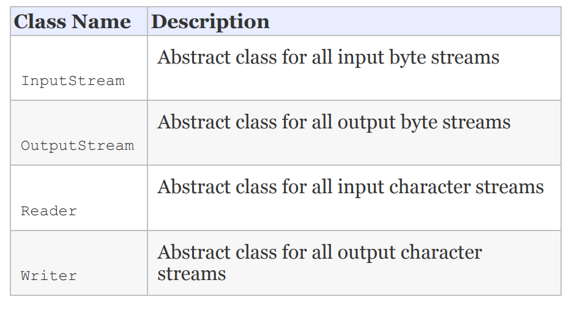
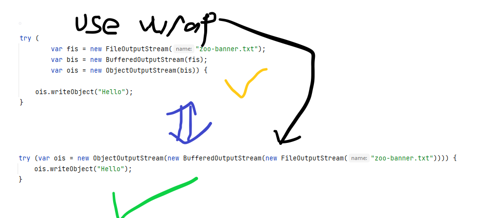

# I/O
Next, the root directory is the topmost directory in the file
system, from which all files and directories inherit. In
Windows, it is denoted with a drive name such as c:\, while on
Linux it is denoted with a single forward slash, /.

    File file = new File("C:\\Users\\mdths\\IdeaProjects\\Oracle Certification\\src\\main\\java\\org\\medron\\ıo\\pack\\test.txt");

### Byte Stream vs Character Stream

    <table>
        <th>Byte Stream</th>
        <th>Character Stream</th>
        <tr>
            <td>1,0</td>
            <td>text, data</td>    
        </tr>
        <tr>
            <td>InputStream,OutputStream</td>
            <td>Reader,Writer</td>    
        </tr>
    </table>

### CHARACTER ENCODING

    Charset usAsciiCharset = Charset.forName("US-ASCII");
    Charset utf8Charset = Charset.forName("UTF-8");
    Charset utf16Charset = Charset.forName("UTF-16");

### Low-Level vs. High-Level Streams

* High-Level stream wraps the low-level stream.

    BufferedReader bufferedReader = new BufferedReader(new FileReader(new File("C:\\Users\\mdths\\IdeaProjects\\Oracle Certification\\src\\main\\java\\org\\medron\\ıo\\pack\\test.txt")));

    try (var ois = new ObjectInputStream(new BufferedInputStream(new FileInputStream("zoo-data.txt")))) {
        System.out.print(ois.readObject());
    }

    new BufferedInputStream(new FileReader("z.txt")); // DOES NOT COMPILE (Stream and Reader mixed.) \
    new BufferedWriter(new FileOutputStream("z.txt")); // DOES NOT COMPILE (Stream and Reader mixed.)\
    new ObjectInputStream(new FileOutputStream("z.txt")); // DOES NOT COMPILE (InputStream and OutputStream mixed) \
    new BufferedInputStream(new InputStream()); // (can not create instance from interface) DOES NOT COMPILE

## READING AND WRITING DATA

InputStream, OutputStream, Writer and Reader

    public int read() throws IOException
    public void write(int b) throws IOException

> In both examples, ‐1 is used to indicate the end of the stream.

    void copyStream(InputStream in, OutputStream out) throws IOException{
        int b;
        while ((b = in.read()) != -1) {
            out.write(b);
        }
    }

    void copyStream(Reader in, Writer out) throws IOException {
        int b;
        while ((b = in.read()) != -1) {
            out.write(b);
        }
    }

### CLOSING THE STREAM
Using close() method is enough. However, we prefer using try with resource.

    try( FileOutputStream fileWriter = new FileOutputStream(file)){
        fileWriter.write(bytes);
    }
    

    

### mark() and reset()

    public void readData(InputStream is) throws IOException {
    System.out.print((char) is.read()); // L
    if (is.markSupported()) {
    is.mark(100); // Marks up to 100 bytes
    System.out.print((char) is.read()); // I
    System.out.print((char) is.read()); // O
    is.reset(); // Resets stream to position before I
    }
    System.out.print((char) is.read()); // I
    System.out.print((char) is.read()); // O
    System.out.print((char) is.read()); // N
    }

## WHY USE THE BUFFERED CLASSES?

    void copyFileWithBuffer(File src, File dest) throws IOException {
        try (var in = new BufferedInputStream(new FileInputStream(src));
             var out = new BufferedOutputStream(new FileOutputStream(dest))) {
            var buffer = new byte[1024];
            int lengthRead;

            while ((lengthRead = in.read(buffer))> 0) {
                out.write(buffer, 0, lengthRead);
            out.flush();
            }
        }
    }

## Concrete Class

    <table>
        <th>Stream Class</th>
        <th>Method Name</th>
        <th>Description</th>
        <tr>
            <td>All streams</td>
            <td>void close()</td>
            <td>Closes stream and releases resources</td> 
        </tr>
        <tr>
            <td>All input streams</td>
            <td>int read()</td>
            <td>Reads a single byte or returns ‐1 if no bytes were available</td> 
        </tr>
        <tr>
            <td>InputStream</td>
            <td>int read(byte[] b)</td>
            <td>Reads values into a buffer.Returns number of bytes read</td> 
        </tr>
        <tr>
            <td>Reader</td>
            <td>int read(char[] c)</td>
            <td>Reads values into a buffer.Returns number of bytes read</td> 
        </tr>
        <tr>
            <td>InputStream</td>
            <td>int read(byte[] b,int offset,int length)</td>
            <td>Reads up to length values into a buffer starting from position offset. Returns number of bytes read </td> 
        </tr>
        <tr>
            <td>Reader</td>
            <td>int read(char[] c,int offset,int length)</td>
            <td>Reads up to length values into a buffer starting from position offset. Returns number of bytes read </td> 
        </tr>
    </table>

## BUFFERING CHARACTER DATA

    void copyTextFileWithBuffer(File src, File dest) throws IOException {

        try (var reader = new BufferedReader(new FileReader(src));
             var writer = new BufferedWriter(new FileWriter(dest))) {

            String s;
            while ((s = reader.readLine()) != null) {
                writer.write(s);
                writer.newLine();
            }
        }
    }

## SERIALIZING DATA

**Serialization** is the process of converting an in‐memory object to a byte stream.\
**Deserialization** is the process of converting from a byte stream into an object.

